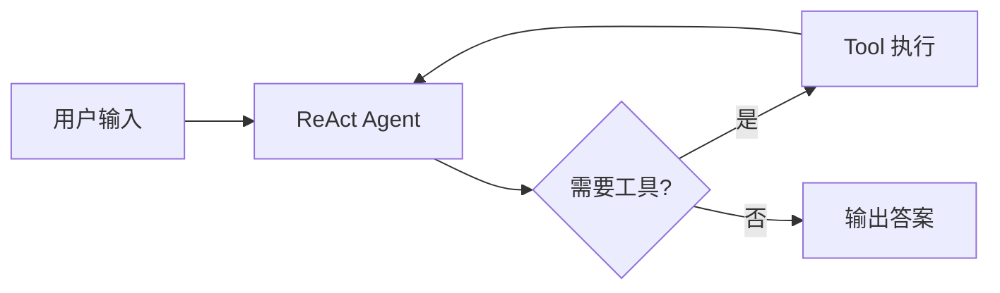

# 写作方法论

> 本文件定义全书统一的写作规范、章节结构、源码解读方法与示例设计原则。
> 目标：让 30 章内容**风格统一、深度一致、可读性强**。

---

## 一、整体写作原则

### 1.1 三层递进
每个核心概念按以下顺序展开，**不跳步**：
1. **是什么（What）**：用 1–2 句话给出定义，不超过 100 字
2. **为什么（Why）**：讲清设计动机和要解决的问题
3. **怎么做（How）**：给方案、代码、对比
4. **源码（Source）**：必要时读源码理解实现
5. **权衡（Trade-off）**：列出优缺点和适用场景

### 1.2 「二八原则」
- 80% 的篇幅讲**核心抽象和设计思想**（一次理解终身受益）
- 20% 的篇幅讲**API 使用和配置**（以代码示例为主，避免长篇罗列）

### 1.3 避免的内容
- 框架 API 手册式罗列（直接看官方文档即可）
- 大量截图 IDE 配置
- 重复的"Hello World"
- 脱离代码的纯理论

### 1.4 必要的「盐」
每章必须包含：
- 1–2 个**真实业务场景**（不是玩具例子）
- 1–2 处**反直觉的踩坑提醒**（"避坑"小贴士）
- 1 个**业界案例**（如「某公司如何用 RAG 解决 XX 问题」）

---

## 二、章节统一结构

每章 8000–12000 字，按以下结构组织：

```
1. 引入（500–800 字）
   - 一个真实问题或场景
   - 本章要回答的 3 个核心问题

2. 核心概念（2000–3000 字）
   - 概念定义 + 图示
   - 与相关概念对比

3. 原理与源码（3000–4000 字）
   - 内部机制（架构图 / 时序图）
   - 关键代码片段 + 解读
   - 至少 1 处「源码解读」框

4. 实战示例（2000–3000 字）
   - 3–5 个递进式代码示例
   - 每个示例先有「目标 → 设计 → 代码 → 运行 → 解读」

5. 进阶与陷阱（500–1000 字）
   - 性能、安全、可维护性提示
   - 「避坑」列表

6. 小结与思考（300–500 字）
   - 本章 3–5 个 takeaway
   - 3–5 道思考题（标注难度 ★/★★/★★★）
   - 1 道动手题（推荐 GitHub 仓库）
```

---

## 三、源码解读方法论

源码解读是本书的核心特色，**必须遵循以下规范**。

### 3.1 选源标准
- 优先选择**核心抽象文件**（如 `RunnableSequence`、`StateGraph`）
- 选择**不超过 300 行**的模块，避免读者迷失
- 优先 LangChain/LlamaIndex 等**结构清晰、注释良好**的项目

### 3.2 解读流程
按以下 4 步法：

```
Step 1：定位
- 给出文件路径、类名、行号
- 例：langchain-core/runnables/base.py:RunnableSequence:280

Step 2：抽象
- 一句话讲清这层抽象要解决什么问题
- 画出与上下游的关系

Step 3：拆解
- 把代码分成 3–5 个小段
- 每段用「📌」框标注 1–2 句解读

Step 4：影响
- 这层设计带来了哪些能力
- 有什么 trade-off
```

### 3.3 源码解读框模板

```markdown
> 📖 **源码解读：`RunnableSequence.invoke`**
> 文件：`libs/core/langchain_core/runnables/base.py`
> 行号：L280–L320
>
> **抽象目标**：把多个 `Runnable` 串成 pipeline，保持 LCEL 表达力。
>
> **关键代码**：
> ```python
> def invoke(self, input, config=None, **kwargs):
>     for step in self.steps:
>         input = step.invoke(input, config, **kwargs)
>     return input
> ```
>
> **设计权衡**：
> - ✅ 简单清晰，组合性强
> - ⚠️ 同步阻塞，async 必须显式调 `ainvoke`
> - 💡 真实的实现更复杂，包含了 callback 注入和错误处理
```

### 3.4 源码阅读深度
不要把整个文件贴出来。**目标是让读者理解 20% 的关键代码解决 80% 的问题**。

### 3.5 配套示例
每个源码解读后，必须有一个**简化版实现**（不超过 50 行）让读者手动复现，验证理解。

---

## 四、示例设计原则

### 4.1 示例分类
- **基础示例**（10–30 行）：演示单个 API 用法
- **组合示例**（50–100 行）：演示多个组件协作
- **实战示例**（100–300 行）：解决一个具体业务问题
- **架构示例**（项目级）：见 Part 6

### 4.2 示例设计 4 要素
1. **真实场景**：不用 `dog = Animal("旺财")` 这种空例子
2. **可运行**：所有代码必须能在 GitHub 仓库跑通
3. **渐进式**：每个示例在前一个基础上扩展
4. **有输出**：运行结果截图或文字描述，便于读者验证

### 4.3 业务场景库
为保证示例真实，建立场景池，每章从中挑选 1–2 个：

| 场景 | 描述 | 适合章节 |
|---|---|---|
| 金融分析 | 财报分析、研报生成 | Ch3 Prompt, Ch14 ReAct |
| 客服助手 | 多轮对话、订单查询 | Ch7 Memory, Ch14 ReAct |
| 企业 RAG | 内部文档问答 | Ch5/6 RAG, Ch26 |
| 代码助手 | 单元测试生成、Code Review | Ch17 Reflection |
| 研究助手 | 资料调研、报告写作 | Ch16 Multi-Agent, Ch27 |
| 数据分析 | SQL 生成、可视化 | Ch4 Tool Use, Ch15 Plan-Execute |
| 文档处理 | 合同抽取、表格解析 | Ch11 LlamaIndex, Ch22 Security |
| DevOps Agent | 监控告警、日志分析 | Ch20 HA, Ch24 Gateway |

### 4.4 代码规范
- Python 3.11+ 语法（`match`、`type | None`）
- 关键函数加 type hints
- 复杂逻辑配 1–2 行注释（**不写废话注释**）
- 避免过度工程（不要 demo 写成生产代码）

---

## 五、图表规范

### 5.1 必须配图的章节
- 介绍新概念时：**架构图 / 组件图**
- 讲解源码时：**类图 / 时序图**
- 讲解算法时：**流程图**
- 讲解对比时：**表格**

### 5.2 图表风格
- 统一使用 **Mermaid** 或 **PlantUML**（文本化、可维护）
- 颜色不超过 4 种（黑、灰、蓝、绿/红强调）
- 每张图配 50–100 字的「图说」

### 5.3 Mermaid 示例



---

## 六、思考题与动手题

### 6.1 思考题分层
- ★（基础）：巩固本章概念
- ★★（进阶）：对比、迁移、应用
- ★★★（挑战）：综合、设计、源码级

### 6.2 动手题设计
每章末尾 1 道动手题，要求：
- 在 GitHub 仓库对应目录提交
- 配套 README 说明设计思路
- 配套单元测试

### 6.3 范例

```markdown
**思考 1 ★**：在 Ch4 中我们看到 `BaseTool` 用 `args_schema` 描述参数，请思考：
为什么不用 Python 函数签名（`inspect`）自动推断，而是要求显式 Pydantic schema？

**思考 2 ★★**：如果把 ReAct 的「Action」步骤替换成「Plan」，会有什么 trade-off？

**思考 3 ★★★**：阅读 LangGraph `Pregel` 执行模型源码，理解它如何处理
「图中的环」与「分布式执行」的关系。

**动手题**：基于 Ch4 的「个人助理 Agent」，扩展支持「邮件发送」工具，
并为它添加「敏感词过滤」和「发送前确认」机制。
```

---

## 七、语言与风格

### 7.1 文风
- **简洁、主动、具体**：避免「我们可以」「这可能」「一般而言」
- **示例优先**：能用代码说清的不用长句
- **适度幽默**：可以加 1–2 个业内梗，但不过度

### 7.2 术语规范
| 中文 | 英文 | 说明 |
|---|---|---|
| 智能体 | Agent | 全文统一 |
| 检索增强生成 | RAG | 首次出现给全称 |
| 大语言模型 | LLM | 首次出现给全称 |
| 工具 | Tool | 不混用「插件」「Function」 |
| 提示词 | Prompt | |
| 上下文 | Context | |
| 思维链 | Chain-of-Thought | |

### 7.3 不使用的表达
- ❌ 「小白也能学会」「从入门到精通」
- ❌ 「让我们一起来看看…」
- ❌ 「首先 / 其次 / 最后 / 总之」等机械连接词
- ❌ 「这非常简单」「这个非常复杂」等无信息量形容

---

## 八、版本与依赖管理

为避免示例过期，统一以下依赖版本基线（每章开头可微调）：

```
python >= 3.11
langchain >= 0.3
langgraph >= 0.2
llama-index >= 0.12
crewai >= 0.80
openai >= 1.50
pydantic >= 2.8
```

每章示例**注明对应版本**，避免 1 年后跑不通。

---

## 九、配套仓库结构

```
agent-book-code/
├── chXX/
│   ├── 01_basic.py          # 基础示例
│   ├── 02_advanced.py       # 进阶示例
│   ├── 03_capstone.py       # 综合示例
│   ├── tests/
│   │   └── test_xx.py
│   ├── README.md            # 运行说明 + 设计思路
│   └── requirements.txt
├── projects/
│   ├── 25_qa_agent/
│   ├── 26_rag_kb/
│   ├── 27_research_assistant/
│   └── 28_llm_gateway/
└── docker-compose.yml       # 一键启动依赖（Qdrant、Redis、Postgres）
```

---

## 十、审校与互引

### 10.1 内部一致性
- 同一概念在多章出现时，**首次给完整定义，后续直接引用**（如「见 Ch4.2」）
- 关键术语在全书保持一致翻译

### 10.2 章节互引矩阵
| 当前章 | 依赖章节 | 引用方式 |
|---|---|---|
| Ch8 LCEL | Ch4 Tool Use | 「回顾 Ch4 中的 ...」 |
| Ch10 LangGraph | Ch8 LCEL | 「基于 Ch8 的 Runnable 概念 ...」 |
| Ch20 HA | Ch19 观测 | 「依赖 Ch19 的追踪数据 ...」 |
| Ch24 Gateway | Ch20 + Ch21 | 「融合 Ch20 的熔断和 Ch21 的缓存 ...」 |

### 10.3 三轮审校
1. **技术审校**：作者自校 + 1 位领域专家
2. **可读性审校**：1 位非该领域读者通读，标注「读不懂」处
3. **代码审校**：所有示例在 CI 中运行通过

---

## 十一、写作节奏建议

| 周次 | 内容 | 字数目标 |
|---|---|---|
| 1–2 | Part 1 基础篇 | ~30k |
| 3–5 | Part 2 核心能力 | ~50k |
| 6–9 | Part 3 框架原理（重头戏） | ~80k |
| 10–12 | Part 4 设计模式 | ~60k |
| 13–15 | Part 5 工程架构 | ~70k |
| 16–19 | Part 6 实战项目 | ~60k |
| 20 | Part 7 前沿 + 附录 | ~20k |
| 21–22 | 审校、修订、配套代码 | - |
| **合计** | | **~370k 字**（约 800–1000 页） |
