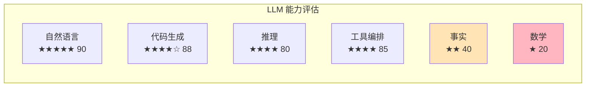
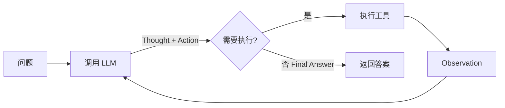
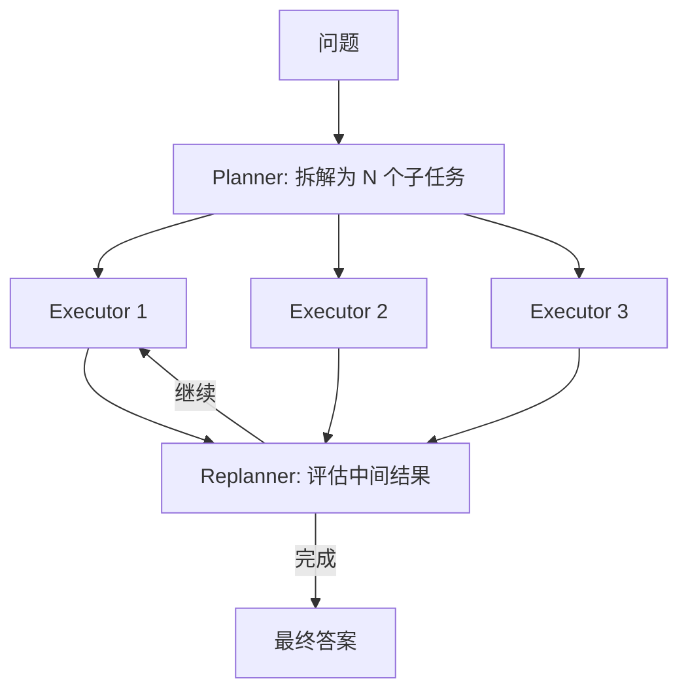
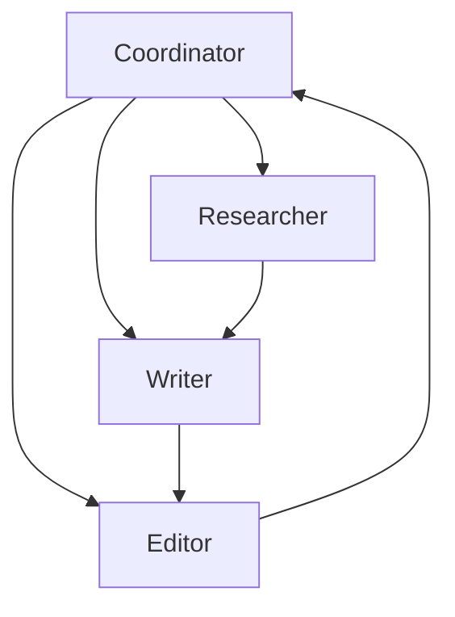
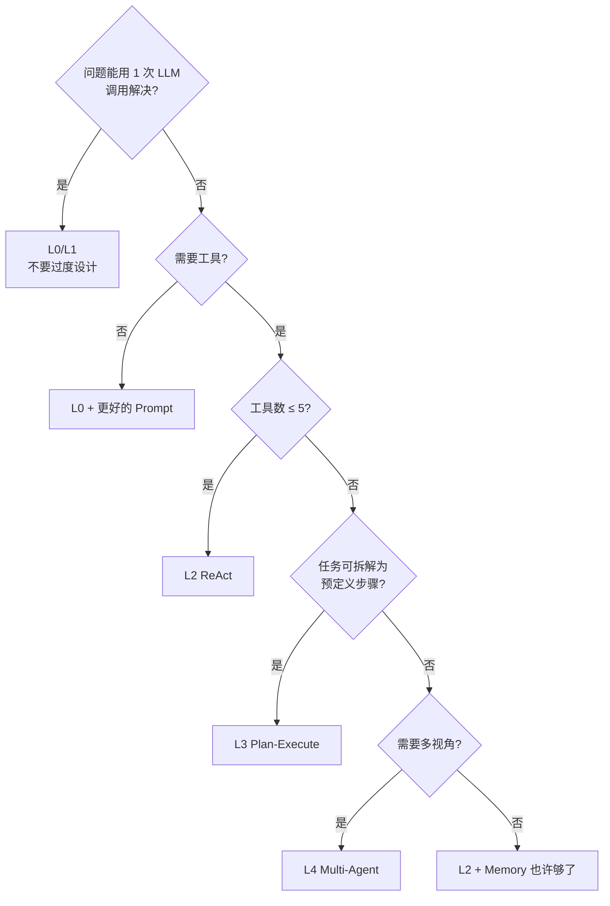
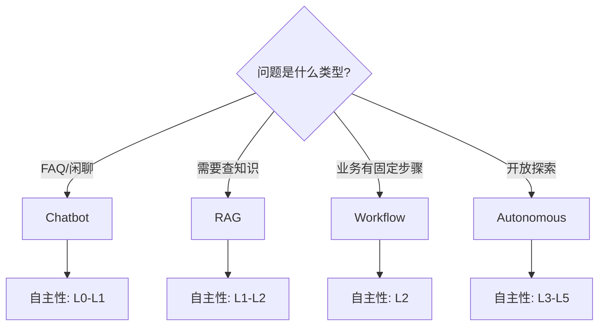
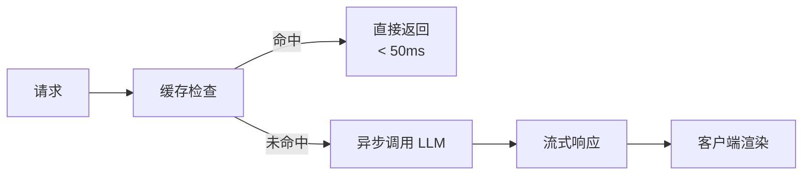
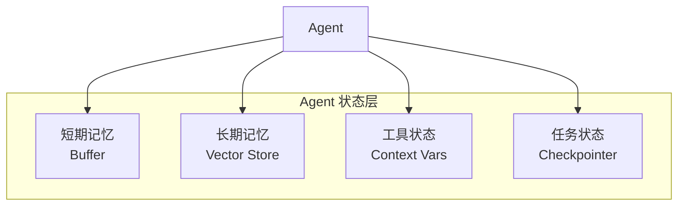
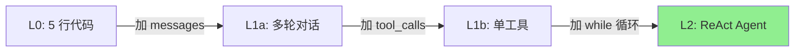

# Ch1｜大模型 Agent 时代的软件工程

> **本章目标**：建立 Agent 系统的"共同语言"——自主性等级、核心组件、典型形态。学完后，你能在团队里讲清楚"为什么需要 Agent、Agent 是什么、Agent 怎么分级"。

## 引入：9.11 和 9.9 哪个大？

2023 年初，GPT-4 上线时，OpenAI 演示了一个反直觉的现象：让 GPT-4 比较 9.11 和 9.9 的大小，它会回答"9.11 更大"——因为小数点在它的"认知"里像版本号分隔符，而不是数学符号。这个 bug 引发了一波讨论，也让从业者第一次真切地感受到：**大模型的"思考"和人类的"思考"是两种东西**。

两年过去了，主流大模型在这个问题上已经基本翻车完毕。但类似的现象依然存在：让 GPT-4o 数 `strawberry` 这个单词里有几个 `r`，它常常数错；让它心算 12345 × 67890，它会给出错得离谱的答案。

**这就是本章要回答的第一个问题：大模型到底擅长什么、不擅长什么？**

继续追问：既然 LLM 不擅长精确计算、容易幻觉，为什么 ChatGPT 还能帮你写代码、做翻译、辅助决策？因为——**LLM 不是一个独立的产品，而是一个需要被"组装"进系统的核心组件**。它是大脑，不是整个人。

当我们说"Agent"时，说的就是**那个把 LLM 当大脑、给它接上手脚（工具）、让它在循环里自主决策的系统**。这就是本章要回答的第二个问题：**Agent 是什么？**

更进一步，Agent 系统有很多种形态，从最简单的"5 行代码调用 LLM"到复杂的"多 Agent 协作研究团队"，自主性天差地别。怎么给它们分级？什么场景该用哪种？这是本章要回答的第三个问题：**Agent 系统的分类与选型**。

读完本章，你将：

- 用一张表讲清楚 LLM 的能力边界
- 用一张图区分 6 个自主性等级
- 用 4 个真实案例识别不同 Agent 形态
- 解释为什么 Agent 系统需要新的工程架构

---

## 1.1 LLM 的能力边界：它不是数据库，是概率性 CPU

### 1.1.1 一个反直觉的类比

很多人把 LLM 理解成"更大的数据库"——给它输入，它"查找"出一个最像的答案。这是一种危险的误解。

更准确的类比是：**LLM 是一颗概率性 CPU**。

| 维度 | 传统 CPU | LLM |
|---|---|---|
| 计算方式 | 确定性（1+1 永远等于 2） | 概率性（同 prompt 可能不同输出） |
| 知识存储 | 不存储知识，靠访问内存 | 知识压缩在权重里，**易幻觉** |
| 输入输出 | 字节 / 整数 | Token 序列 |
| 错误模式 | 异常 / 崩溃 | 静默错误（给错答案但"看起来对"） |
| 时延 | 纳秒级 | 秒级 |

理解这个类比，是理解 Agent 设计哲学的起点：**不要让 LLM 做它不该做的事；让它做它擅长的事，把不擅长的交给工具**。

### 1.1.2 LLM 擅长的 5 件事

> 💡 **实战经验**：下面每一条都来自真实生产场景。

**1. 自然语言理解与生成**

这是 LLM 的"本职工作"。给定一段文字，让它总结、翻译、改写、分类、提取信息，准确率通常 90%+。

*案例*：某电商用 GPT-4o-mini 做客服工单的意图分类，10 万条样本上准确率 92%，比传统 BERT 模型（88%）还高，而且**不用标注数据**。

**2. 模式识别与代码生成**

LLM 在代码任务上表现惊人。HumanEval 基准上，GPT-4o 的 Pass@1 超过 90%。

*案例*：某团队用 LLM 做 Code Review，能找出 70% 的常见 bug（包括空指针、资源未关闭、SQL 注入），但仍有 30% 漏报——**所以人类 Review 依然必要**。

**3. 多步推理（配合 CoT）**

直接让 LLM 算"鸡兔同笼"可能算错，但加上"让我们一步步思考"（Chain-of-Thought），准确率能从 40% 提升到 80%。Ch3 会详细讲 CoT。

**4. 工具编排（Function Calling）**

2023 年起，主流 LLM 都支持 Function Calling——让模型在合适的时候"决定"调哪个工具、传什么参数。这让 LLM 有了"动手"的能力。Ch4 会详细讲。

**5. 模糊匹配与生成**

"写一首关于秋天的诗"、"给我 3 个产品命名建议"——这种开放式生成任务，LLM 远超传统算法。

### 1.1.3 LLM 不擅长的 5 件事

> ⚠️ **避坑**：把这些任务交给 LLM 是常见的新手错误。

**1. 精确数学计算**

- 9.11 vs 9.9、小数比较、大数乘法、心算——统统不可靠
- 正确做法：让 LLM 调计算器 / Python 解释器

**2. 长尾事实与最新信息**

- LLM 训练数据有截止日期，之后的事件完全不知道
- 正确做法：搭配搜索工具 / RAG

**3. 严格逻辑推理（带复杂约束）**

- 多重否定、复杂命题、约束满足问题——容易"看似合理但实际错误"
- 正确做法：用符号推理工具，或拆解为多步

**4. 多源信息精确整合**

- 让 LLM 阅读 3 篇文档然后写综述，常出现"张冠李戴"
- 正确做法：让 LLM 写大纲 + 逐篇引用，避免整体总结

**5. 持续学习**

- LLM 不会"记住"对话之外的内容（除非用 Memory 机制）
- 正确做法：每次都把必要信息塞进 Context

### 1.1.4 真实生产案例：3 个故事

**故事 1：客服意图分类（成功）**

某 SaaS 公司用 LLM 替代传统的 FastText 分类器，处理客服工单。3 个月后，分类准确率 92%（vs 旧的 88%），标注成本从每月 10000 元降到 0。这是一个 LLM 擅长的场景。

**故事 2：财务比率计算（失败）**

某券商尝试让 LLM 直接根据财报计算"流动比率 = 流动资产 / 流动负债"。上线 1 周后被客户发现：在 1000 次调用中，**有 100+ 次结果偏离正确值超过 5%**。原因是 LLM 经常把"亿元"和"万元"搞混。

**故事 3：工具增强的金融分析（成功）**

同一个团队改进后，让 LLM 提取财报中的数字，**再用 Python 解释器做计算**。准确率提升到 99.5%，成本反而下降（因为 LLM 输出更短，Token 消耗更少）。

> 🎯 **关键洞见**：故事 1 和故事 3 都是 LLM 成功案例，但故事 3 的成功来自**让 LLM 做它擅长的事（提取数字），把不擅长的（计算）交给工具**。这就是 Agent 的核心思想。

### 1.1.5 能力雷达图



> 📌 **重点**：让 LLM 在擅长的维度做主控，在不擅长的维度调用工具补充。雷达图上黄色、红色区域就是必须接工具的地方。

### 1.1.6 小结

LLM 是"概率性 CPU"，不是"更大的数据库"。它的能力边界非常清晰：语言、模式、推理是强项；精确计算、长尾事实、严格逻辑是弱项。**任何把 LLM 当作万能工具的尝试都会失败**。正确做法是把它当作大脑——**做它擅长的事，把不擅长的事交给工具**。

接下来一节，我们用这个思路构建第一个"完整的 Agent"——一个能自主决定调什么工具的 ReAct 循环。

---

## 1.2 自主性等级：从 L0 到 L5

### 1.2.1 为什么要分级

接触 Agent 的人常常困惑：网上有人说"用 ReAct 就行"，有人说"必须上 Multi-Agent"，有人说"Autonomous Agent 才是未来"。但**没有分级，就没有共同语言**。

参考 OpenAI 2025 年发布的 Agent 实践指南并结合一线经验，我提出一个 6 级框架：

| 等级 | 名称 | 决策者 | 工具数 | 可预测性 | 典型场景 |
|---|---|---|---|---|---|
| L0 | 纯 LLM | 人 | 0 | 100% | 单轮问答 |
| L1 | 单工具 | 人 | 1 | 高 | 翻译 + 搜索 |
| L2 | ReAct 循环 | LLM | 2–5 | 中 | 工具增强问答 |
| L3 | 规划+执行 | LLM | 5–10 | 中 | 多步研究 |
| L4 | 多 Agent | LLM+协调 | 5+ | 低 | 复杂协作 |
| L5 | 自主学习 | LLM | 不限 | 极低 | 研究实验 |

### 1.2.2 L0：纯 LLM

最简单的形态——5 行代码，没有记忆，没有工具。

```python
from openai import OpenAI
client = OpenAI()
resp = client.chat.completions.create(
    model="gpt-4o-mini",
    messages=[{"role": "user", "content": "用一句话解释 Agent"}],
)
print(resp.choices[0].message.content)
```

这就是 L0。ChatGPT 最初的形态。**80% 的"AI 产品 Demo"其实就是 L0**。

**L0 的局限**：没有记忆（每次对话都从零开始）、没有工具（不能上网、不能算数学）、没有自主性（人问一句答一句）。

### 1.2.3 L1：单工具调用

加 1 个工具，比如搜索。**但调用时机由人决定**。

```python
def translate_with_search(text: str) -> str:
    if "最新" in text or "今天" in text:
        info = web_search(text)
        return llm(f"翻译：{text}\n参考信息：{info}")
    return llm(f"翻译：{text}")
```

L1 常见于企业内部工具——人写好 if-else，LLM 只负责"语言层"的工作。

**L1 的局限**：硬编码 if-else 无法扩展。如果有 10 个工具，逻辑会爆炸。**本质问题：决策权在程序员手上**。

### 1.2.4 L2：ReAct 循环（重点）

**质变点**：LLM 自主决定调什么工具、调几次。

ReAct（Reason + Act）的核心循环：



代码见 `agent-book-code/ch01/02_levels.py` 的 `level2_react()` 函数。核心 50 行：

```python
def level2_react(question, max_steps=5):
    history = REACT_PROMPT.format(question=question)
    for step in range(max_steps):
        resp = call_llm(history)
        history += resp
        if "Final Answer:" in resp:
            return resp.split("Final Answer:")[-1].strip()
        if "Action:" in resp:
            action = parse_action(resp)
            observation = execute_action(action)
            history += f"\nObservation: {observation}\n"
```

**从 L1 到 L2 的跨越，本质是：把决策权从程序员手上交到 LLM 手上**。

这是**80% 生产 Agent 的形态**。L2 在 Ch14 会详细讲。

### 1.2.5 L3：Plan-and-Execute

L2 的痛点：LLM 在循环中容易"走神"——长链路任务后期会忘记目标。

L3 的解法：**先规划，再执行**。



L3 适合**多步研究**类任务。Ch15 详细讲。

### 1.2.6 L4：多 Agent 协作

L3 的瓶颈：单个 LLM 上下文有限、视角单一。

L4 引入"角色分工"——多个 Agent 各自负责一部分：

- **Researcher**：搜资料
- **Writer**：写文章
- **Editor**：审核
- **Coordinator**：协调三者



L4 适合**复杂协作**类任务。Ch16 详细讲。

### 1.2.7 L5：自主学习

L4 的局限：Agent 不会从错误中学习，每次重置都从零开始。

L5 引入**长期记忆 + 自我反思**——Agent 在执行中学习。但目前还在研究阶段，生产环境慎用。

### 1.2.8 选型决策树



> 🎯 **实战建议**：**80% 的生产场景用 L2 即可**。盲目追求 L4/L5 只会带来调试噩梦。

---

## 1.3 Agent 系统的 4 种典型形态

L0–L5 是按"自主性"分级。本节按"形态"分类——同样的 L2，在不同场景下形态完全不同。

### 1.3.1 4 种形态速览

**形态 1：Chatbot（聊天机器人）**
- 核心：多轮对话
- 自主性：L0–L1
- 工具：0–1
- 例子：客服 FAQ、个人助手

**形态 2：RAG（检索增强生成）**
- 核心：知识库 + LLM
- 自主性：L1–L2
- 工具：1–3（检索、重排）
- 例子：企业知识库、法律咨询

**形态 3：Workflow（工作流）**
- 核心：预定义步骤的 Agent
- 自主性：L2
- 工具：3–10
- 例子：退款流程、报告生成

**形态 4：Autonomous（自主 Agent）**
- 核心：自主决策
- 自主性：L3–L5
- 工具：5+
- 例子：研究助手、代码 Agent

### 1.3.2 对比维度

| 维度 | Chatbot | RAG | Workflow | Autonomous |
|---|---|---|---|---|
| 决策方 | 人 | 系统 | 系统 | LLM |
| 工具数 | 0–1 | 1–3 | 3–10 | 5+ |
| 可预测性 | 极高 | 高 | 高 | 低 |
| 开发成本 | 低 | 中 | 中 | 高 |
| 调试难度 | 低 | 中 | 中 | 极高 |
| 适用场景 | FAQ | 知识查询 | 业务流程 | 研究、创作 |

### 1.3.3 真实案例

**Chatbot 案例：电商客服 FAQ**

某电商用 LLM + 知识库做售前咨询。80% 的问题 LLM 直接答，20% 转人工。日均处理 5 万次对话，人工成本下降 60%。

**RAG 案例：法律咨询系统**

某律所用 RAG 系统让律师快速查法条 + 判例。检索准确率 87%（vs 关键词搜索 65%），律师效率提升 3 倍。

**Workflow 案例：退款流程 Agent**

某 SaaS 公司把退款流程做成 Workflow：① 查订单 → ② 查退款政策 → ③ 计算可退金额 → ④ 走审批（人）→ ⑤ 执行退款。每步是 LLM + 工具的组合，但流程是确定的。

**Autonomous 案例：研究助手**

某投资机构用 Multi-Agent 做行业研究：Researcher 找资料、Analyst 分析数据、Writer 写报告、Editor 审核。一个完整的"研究员"工作流。

### 1.3.4 选型决策

> 🎯 **关键洞见**：**80% 的生产场景其实用 Workflow 就能解决**。盲目追求 Autonomous 会带来 3 个问题：
> 1. **不可预测**：LLM 决定调什么工具、怎么调，QA 难以覆盖
> 2. **难以调试**：失败时不知道是哪一步出错
> 3. **成本失控**：Autonomous Agent 可能"绕路"消耗大量 Token

什么时候该上 Autonomous？

- **任务有多种合理路径**（如开放式研究）
- **环境高度动态**（如实时数据监控）
- **容错率高**（失败不致命）

否则，**先用 Workflow**。

### 1.3.5 形态选择流程图



---

## 1.4 为什么 Agent 系统需要新架构

传统的 Web 后端架构长这样：

```
Client → Nginx → API Gateway → Service A/B/C → DB → Response
                  ↑ 同步、确定性
```

这套架构在 Agent 场景下**全面失灵**。原因有 4 个。

### 1.4.1 挑战 1：非确定性

传统 API 同样的输入永远返回同样的输出。Agent 系统**可能不同**。

举个例子：让 Agent 算"上海今天适合户外运动吗"——它可能查天气、可能查空气质量、可能直接基于温度答，路径不固定。

**架构影响**：

- 不能用"返回值断言"做单元测试
- 需要回归测试 + 行为快照
- 错误处理不能用 try-catch 一刀切

> ⚠️ **避坑**：Agent 系统的"行为快照"测试用**输出相似度**（如 BLEU、BERTScore）而非"精确匹配"。

### 1.4.2 挑战 2：长尾延迟

传统 API 延迟通常 < 100ms。LLM 调用延迟是 1–30 秒，**且分布不均**：

- 简单 prompt：500ms
- 复杂 prompt：3s
- 多步 Agent：10s+
- LLM 限流重试：30s+

P99 延迟可能是 P50 的 20 倍。

**架构影响**：

- 必须异步化
- 必须流式输出
- 需要超时降级



### 1.4.3 挑战 3：成本不可预测

传统 API 按"调用次数"计费，可预测。LLM 按"Token"计费，且**一次请求可能差 100 倍**：

- 简单问答：200 Token → $0.001
- 长文档 RAG：50k Token → $0.5
- 多步 Agent：500k Token → $5

**架构影响**：

- 必须限制最大 Token
- 需要成本监控 + 告警
- 高频请求要加缓存

> 📌 **数据**：某电商把 Agent 接入生产后，单次请求成本从 $0.01 飙到 $0.5。原因是**没有限制 Tool 循环次数**，Agent "绕路"调了 10 次搜索。

### 1.4.4 挑战 4：状态管理复杂

传统 API 无状态，所有上下文从请求中带。Agent 系统有**多层状态**：

- 短期记忆（当前对话）
- 长期记忆（用户偏好）
- 工具状态（中间结果）
- 任务状态（多步执行进度）

**架构影响**：

- 需要 Checkpointer（LangGraph 提供的核心能力）
- 任务可中断、可恢复
- 需要分布式状态存储（Redis / Postgres）



### 1.4.5 架构演进对比

```
传统架构                    Agent 架构
─────────                   ─────────
同步                       异步 + 流式
无状态                     有状态 + Checkpointer
单次调用                   循环 + 重试 + 降级
日志                       全链路 Tracing
```

后续章节（Part 5）会详细讲这些架构模式。本章只需要记住：**Agent 系统的工程复杂度 = LLM 的不确定性 + 工具的复杂度 + 状态管理的复杂度**。

### 1.4.6 一个生产事故案例

某金融科技公司把"AI 客服 Agent"接入了客服系统。第一个月：

- 每天 10000+ 通话
- 平均每次调用 5 步循环
- 每月 Token 成本 50 万美元

事后复盘发现 3 个架构问题：
1. **没有 max_steps 限制**：3% 的调用进入死循环，单次消耗 5 万 Token
2. **没有缓存**：30% 的重复问题被重新调用
3. **没有超时降级**：LLM 限流时整个系统挂掉

修复后成本降到 8 万美元/月，**降幅 84%**。

> 🎯 **关键洞见**：Agent 系统的"事故"通常不是"AI 答错了"，而是**架构没考虑 LLM 的特殊性**。Part 5 会系统讲这些架构模式。

---

## 1.5 5 行代码实现第一个 Agent

理论讲完了，来动手。第一个 Agent 只需要 5 行代码。

### 1.5.1 最简代码

完整代码见 `agent-book-code/ch01/01_basic.py`：

```python
from openai import OpenAI
client = OpenAI()
resp = client.chat.completions.create(
    model="gpt-4o-mini",
    messages=[{"role": "user", "content": "用一句话解释 Agent"}],
)
print(resp.choices[0].message.content)
```

### 1.5.2 逐行解读

| 行 | 代码 | 作用 |
|---|---|---|
| 1 | `from openai import OpenAI` | 导入 OpenAI 客户端 |
| 2 | `client = OpenAI()` | 初始化客户端（自动从环境变量读 API Key） |
| 3-5 | `chat.completions.create(...)` | 发送请求 |
| 6 | `print(...)` | 打印结果 |

就这么简单。运行它：

```bash
export OPENAI_API_KEY=sk-...
uv run python agent-book-code/ch01/01_basic.py
```

输出可能类似：

> Agent 是一个能感知环境、自主决策并执行动作以完成目标的智能系统。

### 1.5.3 这只是 L0

注意：这**不是**一个 Agent。L0 只是"LLM 调用器"，没有循环、没有工具。

把它升级为 L2 的 3 步：

1. **加 messages 历史**（多轮对话）
2. **加 tool_calls**（工具调用）
3. **加 while 循环**（自主决策）

具体代码见下一节。

> 💡 **动手建议**：先跑通 L0，感受"调 LLM 是怎么回事"。然后再升级，不要一上来就上 ReAct。

### 1.5.4 第一次跑的常见问题

**Q：报错 `openai.AuthenticationError`**
A：环境变量没设。运行 `export OPENAI_API_KEY=sk-...`（或写入 `.env` 文件）

**Q：报错 `ModuleNotFoundError: No module named 'openai'`**
A：依赖没装。运行 `uv sync` 或 `pip install openai`

**Q：响应很慢**
A：OpenAI 在国内连接慢。可用 `OPENAI_BASE_URL=https://api.openai-proxy.com/v1` 走代理

**Q：返回内容不是我想要的**
A：换 prompt 试试。本章 1.2 节会讲 ReAct 怎么改善这个问题

---

## 1.6 进阶：从 L0 到 L2

### 1.6.1 演进路径



### 1.6.2 L0 → L1a：加记忆

L0 没有记忆。L1a 加 messages 列表：

```python
messages = []
while True:
    user_input = input("你：")
    if user_input == "quit":
        break
    messages.append({"role": "user", "content": user_input})
    resp = client.chat.completions.create(
        model="gpt-4o-mini",
        messages=messages,
    )
    assistant = resp.choices[0].message.content
    print(f"AI: {assistant}")
    messages.append({"role": "assistant", "content": assistant})
```

这就有了"多轮对话"能力。

### 1.6.3 L1a → L2：加工具和循环

L2 的关键是**让 LLM 自己决定调什么工具**。完整代码见 `agent-book-code/ch01/03_capstone.py`，核心是 `run_agent()` 函数。

让我把这 80 行拆成 4 段讲解。

**段 1：工具定义**

```python
def web_search(query: str) -> str:
    """搜索互联网获取最新信息"""
    # TODO: 接入 Tavily
    return f"[模拟搜索] 关于 '{query}' 的 3 条结果"

def calculator(expression: str) -> str:
    """计算数学表达式"""
    try:
        return str(eval(expression, {"__builtins__": {}}, {}))
    except Exception as e:
        return f"计算错误: {e}"
```

每个工具是一个普通 Python 函数，加 docstring 描述它的功能（**LLM 靠这个 docstring 决定何时调它**）。

> 📌 **重点**：docstring 不是给程序员看的，是**给 LLM 看的**。每个 docstring 要写清楚"什么时候该调我"。

**段 2：System Prompt**

```python
SYSTEM_PROMPT = """你是一个研究助手 Agent。
可用工具：
- web_search(query): 搜索互联网
- calculator(expression): 计算数学表达式
- read_file(path): 读取本地文件

工作流程：
1. 仔细分析用户问题
2. 必要时调用工具
3. 综合信息给出答案

每步输出格式：
Thought: <你的思考>
Action: <工具名(参数)> 或 None
"""
```

**段 3：循环主体**

```python
def run_agent(question, max_steps=8):
    messages = [
        {"role": "system", "content": SYSTEM_PROMPT},
        {"role": "user", "content": question},
    ]
    for step in range(max_steps):
        resp = client.chat.completions.create(
            model="gpt-4o-mini",
            messages=messages,
        ).choices[0].message.content

        # 解析 Action
        if "Action: None" in resp or "Action:" not in resp:
            return resp
        action_line = [l for l in resp.split("\n") if l.strip().startswith("Action:")][0]
        action = action_line.split("Action:")[1].strip()

        # 执行工具
        tool_name, arg = action.split("(", 1)
        arg = arg.rstrip(")").strip().strip('"')
        observation = TOOLS[tool_name](arg)

        # 喂回 LLM
        messages.append({"role": "user", "content": f"Observation: {observation}"})

    return "[达到最大步数]"
```

**段 4：运行**

```python
print(run_agent("上海今天适合户外运动吗？需要先查天气再判断。"))
```

输出会类似：

```
Thought: 用户想了解上海天气并判断是否适合户外运动。
Action: web_search(上海今天天气)

Observation: [模拟搜索] 关于 '上海今天天气' 的 3 条结果

Thought: 现在我有了天气信息。
Action: None
上海今天晴，25°C，湿度 45%，适合户外运动...
```

### 1.6.4 这段代码的 3 个关键

**关键 1：Prompt Engineering 是核心**

LLM 能不能正确选择工具，**70% 取决于 System Prompt 写得好不好**。Ch3 会专门讲 Prompt。

**关键 2：循环必须有 max_steps**

不设上限的循环可能永远停不下来。生产环境通常设 5–10 步。

**关键 3：Action 解析很脆弱**

直接 split "Action:" 在生产中不够稳健。生产代码要用 OutputParser（Pydantic 解析）。Ch3 讲。

> ⚠️ **避坑**：上面代码的 `eval()` 是**危险操作**，生产环境必须用 `numexpr` 或单独沙箱执行。

### 1.6.5 真实运行示例

让我们跑 2 个真实例子看效果。

**示例 1：纯计算**

```
问题：请计算 23 * 47 + 156 的结果
Thought: 需要调用 calculator。
Action: calculator(23 * 47 + 156)
Observation: 1237
Thought: 计算结果是 1237。
Action: None
答案是 1237。
```

**示例 2：多步推理**

```
问题：上海今天适合户外运动吗？需要先查天气再判断。
Thought: 先查天气。
Action: web_search(上海今天天气)
Observation: 上海今日晴，25°C
Thought: 有天气信息了，可以判断。
Action: None
上海今天天气晴朗，气温 25°C，湿度适中，适合户外运动...
```

> 🎯 **实战心得**：示例 1 是 LLM 擅长的（直接调工具）；示例 2 是典型的 L2 场景（工具+推理）。**生产中 80% 的 Agent 任务长这样**。

### 1.6.6 L2 的局限

跑过上面的例子，你会发现 L2 有 3 个问题：

1. **工具选择错误**：偶尔会调错工具（如该调搜索却调了计算器）
2. **循环"走神"**：超过 3 步后，LLM 容易忘记最初目标
3. **解析脆弱**：Action 解析失败率高

这些问题在 L3 / L4 会得到改善。但 L2 **已经能解决 80% 的实际生产场景**。先把 L2 写稳，再考虑升级。

---

## 1.7 小结与思考

### 3 个核心 takeaway

1. **LLM 是概率性 CPU，不是数据库**。让它做擅长的（语言、模式、推理），不擅长的（计算、事实）交给工具。
2. **Agent = LLM + 循环 + 工具**。从 L0 到 L5 的 6 个等级帮你选型，**80% 场景用 L2**。
3. **Agent 系统的工程挑战 = 不确定性 + 长尾延迟 + 不可预测成本 + 复杂状态**。这决定了它需要全新的架构方法。

### 一句话总结

> **Agent 系统的设计哲学：让 LLM 做擅长的事，把不擅长的事交给工具，把决策放在合适的自主性等级上。**

### 思考题

- ★ **基础**：用 `agent-book-code/ch01/01_basic.py` 跑通你的第一个 LLM 调用。修改 prompt，让它扮演一个"翻译助手"。
- ★★ **进阶**：`02_levels.py` 中 L2 的 `level2_react()` 用了文本格式的 ReAct。改成 Function Calling（OpenAI Tool Use）的版本，对比两者的代码量和稳定性。
- ★★★ **挑战**：阅读 [OpenAI A Practical Guide to Building Agents](https://cdn.openai.com/business-guides-and-tools/a-practical-guide-to-building-agents.pdf)（2025），对比本书的 L0–L5 分级是否一致。写一篇 500 字的对比分析。

### 动手题

完成以下任一任务，提交 PR 到 `agent-book-code`：

1. **真实业务版 L2**：用 `03_capstone.py` 的模板写一个**你自己工作场景**的 Agent（如 GitHub Issue 分类、SQL 生成、周报生成）
2. **L1 vs L2 对比实验**：选 10 个测试问题，对比 L1（人工决定调工具）和 L2（LLM 自主）的准确率、成本、延迟
3. **多 LLM 对比**：把 `gpt-4o-mini` 替换为 `claude-3.5-haiku`、`qwen-turbo`，对比 ReAct 效果

### 推荐阅读

- 📄 **论文**：Yao et al., *ReAct: Synergizing Reasoning and Acting in Language Models*, 2022
- 📘 **指南**：OpenAI, *A Practical Guide to Building Agents*, 2025
- 📖 **博客**：Simon Willison, [How I Use AI](https://til.simonwillison.net/)
- 💻 **代码**：`agent-book-code/ch01/` 全部 4 个文件

---

## Ch1 速查表

| 概念 | 速记 |
|---|---|
| LLM 擅长 | 语言、模式、推理、代码 |
| LLM 不擅长 | 计算、事实、严格逻辑 |
| Agent 公式 | LLM + 循环 + 工具 |
| L0 | 纯 LLM，5 行代码 |
| L2 | ReAct 循环（80% 场景用这个） |
| 4 形态 | Chatbot / RAG / Workflow / Autonomous |
| 4 大挑战 | 不确定性、延迟、成本、状态 |

下一章（Ch2）我们深入 LLM 的"度量单位"——Token、Context、Embedding。
