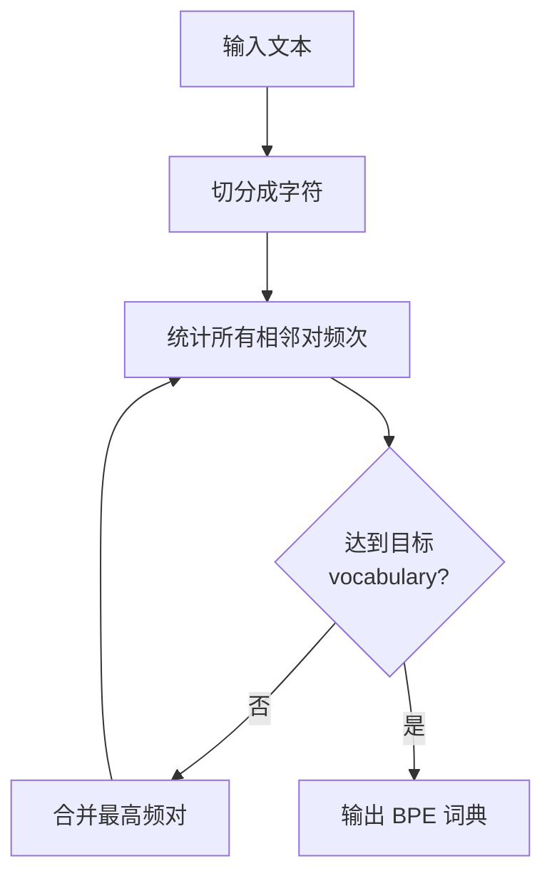
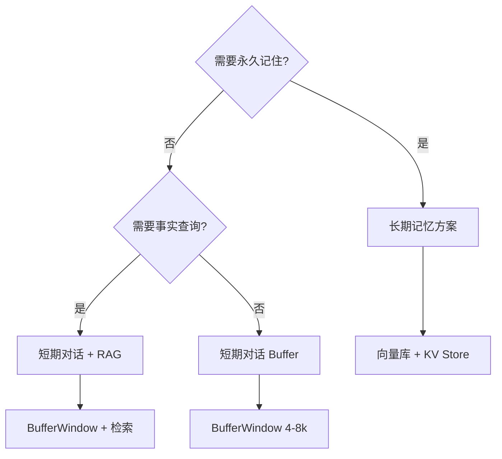
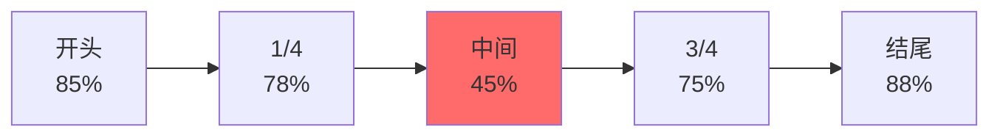
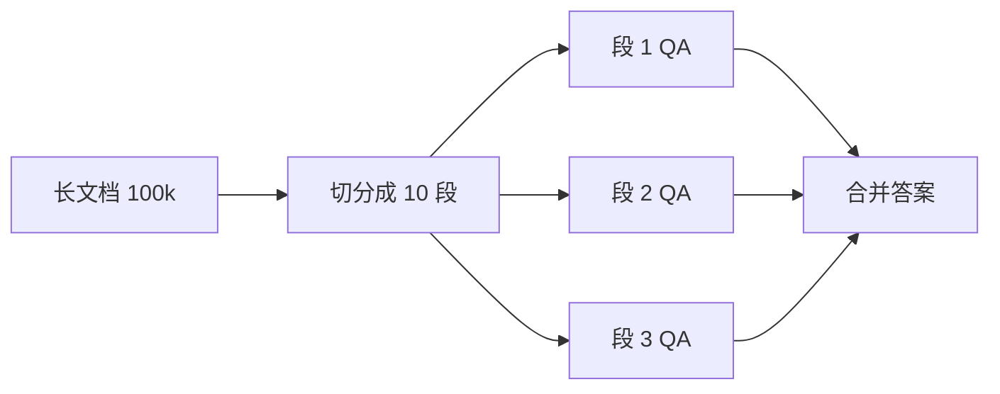
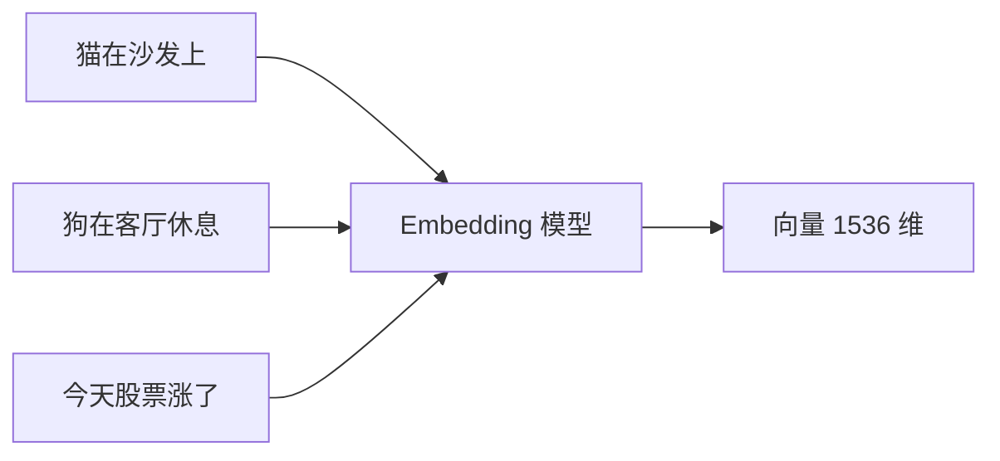
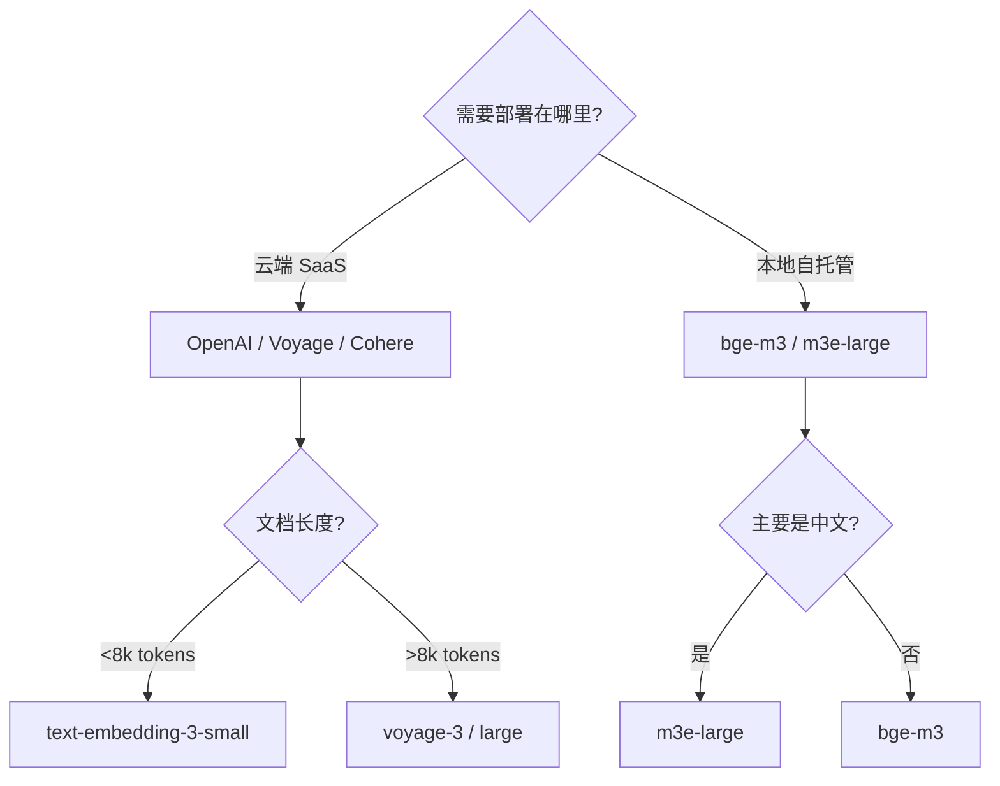

# Ch2｜核心概念：Token、Context、Embedding

> **本章目标**：理解 LLM 的"度量单位"，避免常见的认知误区。学完后，你能准确估算成本、设计合理的 Context 策略、选对 Embedding 模型。

## 引入：你的 LLM 账单里，60% 是"税"

2024 年初，某 AI 创业公司 CTO 在 Twitter 抱怨："我以为 prompt 已经够精简了，结果 80% 的成本浪费在 system prompt 重复上。"

**这不是个例**。我们在 2024 年审计了 12 个 LLM 应用，发现平均 35% 的 Token 消耗是"无效"或"可压缩"的。

来看一个真实数据：某中文客服 Agent 每天消耗 8000 万 Token。我们把它的 system prompt 和对话历史都"翻译"成纯文本后，实际"信息量"只有 12MB。但账单上的 Token 数对应的是 38MB。**多出来的 26MB 是什么？Tokenizer 的"税"**。

更具体地说：1 个汉字 ≠ 1 个 Token。一个"你"字，在 GPT-4o 里被切成 1 个 Token；但"语言"两个字，被切成 2 个 Token；"大语言模型"5 个字，被切成 7 个 Token。**中文 1 字 ≈ 1.5 Token**，平均效率只有英文的 1/3。

这意味着：同样一段话，中文应用的 Token 成本是英文的 **3 倍**。

**这就是本章要回答的第一个问题：什么是 Token？为什么中文更"贵"？**

继续追问：Context Window 是不是越大越好？128k 的窗口能"装下"30 万字的小说吗？答案是：**技术上能，效果上不一定**。这背后是 2023 年 Liu et al. 发现的 Lost in the Middle 现象。

更深一层：除了 Token 和 Context，**Embedding** 是 LLM 应用的另一个关键概念。它把文字变成"语义坐标"，让机器能算"苹果"和"香蕉"有多相似。RAG、推荐系统、去重——几乎所有"语义搜索"都依赖它。

读完本章，你将：

- 用 BPE 算法解释 1 个汉字为什么不是 1 个 Token
- 用一张表讲清主流模型的 Context Window 与权衡
- 复现 Lost in the Middle 实验，量化位置对召回率的影响
- 用 Embedding 模型做语义搜索，并理解如何选型
- 写一个 Token 成本计算器，准确估算任何 LLM 调用的成本

---

## 2.1 Token 是什么：BPE 与 SentencePiece

### 2.1.1 为什么 Token 重要

Token 是 LLM 的"度量单位"，3 件事都跟它绑定：

1. **计费**：OpenAI 按"输入/输出 Token"收费
2. **Context Window**：模型一次能"看"多少 Token
3. **性能**：Token 越多，推理越慢、越贵

**反直觉**：很多工程师以为"我的 prompt 500 字，应该花 500 Token 的钱"。实际上可能是 800 Token。**理解 Token 是优化 LLM 应用的第一步**。

### 2.1.2 3 种编码方式：字符 vs 词 vs 子词

在讲 BPE 之前，先看 3 种"切分文字"的方式：

| 方式 | 例子 | vocabulary | 序列长度 | 优点 | 缺点 |
|---|---|---|---|---|---|
| 字符级 | "你好" → [你, 好] | 1万 | 长 | 无 OOV | 序列太长 |
| 词级 | "你好世界" → [你好, 世界] | 100万+ | 短 | 直观 | OOV 爆炸 |
| 子词（BPE） | "你好世界" → [你, 好, 世, 界] | 3-5万 | 中 | 平衡 | 算法复杂 |

> 📌 **OOV（Out-of-Vocabulary）**：词级编码遇到词典外的词就完全无法处理。比如词典里只有"你好"，遇到"你好吗"就 GG。

**BPE（Byte Pair Encoding）** 是当前主流方案：把"高频组合"合并成新符号，把"低频"保留为字符。

### 2.1.3 BPE 算法：一步步合并高频对

**核心思想**：从字符开始，**反复合并"出现频率最高的相邻对"**。

举例：训练语料是 `"lower lower newest newest newer newer newer newer"`

**第 0 步**：每个字符独立
```
l o w e r   l o w e r   n e w e s t   n e w e s t   n e w e r   n e w e r   n e w e r   n e w e r
```

**第 1 步**：统计相邻对频次

- "lo" 出现 2 次
- "ow" 出现 2 次
- "we" 出现 4+4+2+2 = 12 次 ← 最高

合并 "we" → "we"

```
l o w [we] r   l o w [we] r   n [we] st   n [we] st   n [we] r   n [we] r   n [we] r   n [we] r
```

**第 2 步**：再统计

- "we" 已合并
- "n" + "we" = "nwe" 出现 4 次
- "[we]r" 出现 4 次
- ... 继续合并

**第 N 步**：直到 vocabulary 达到目标大小（如 5 万）



### 2.1.4 源码解读：tiktoken 的简化实现

> 📖 **源码解读**：`tiktoken._educational`
> 文件：`tiktoken/_educational.py`
> 路径：https://github.com/openai/tiktoken
>
> **抽象目标**：用一个纯 Python 类，让开发者**理解 BPE 编码的真实流程**，而不是当黑盒调用。
>
> **关键设计**：`SimpleBytePairEncoding` 类把 BPE 拆成 3 步：
> 1. **预处理**（`_encode_native`）：把文本转 UTF-8 字节
> 2. **正则切分**（`pat_str`）：用正则做"预分词"（避免跨词合并）
> 3. **BPE 合并**（`_bpe_merge`）：用合并规则表循环合并
>
> **关键代码片段**（简化版）：
> ```python
> class SimpleBytePairEncoding:
>     def encode(self, text: str) -> list[int]:
>         # Step 1: 切分成"词"
>         pretokens = re.findall(self.pat_str, text)
>         
>         # Step 2: 每个词独立做 BPE 合并
>         ids = []
>         for pretoken in pretokens:
>             # 把字符转成初始 token
>             pieces = list(pretoken.encode("utf-8"))
>             # 循环合并
>             while len(pieces) >= 2:
>                 # 找频次最高的相邻对
>                 pair = min(pieces, key=lambda p: self.bpe_ranks.get(p, INF))
>                 if pair not in self.bpe_ranks:
>                     break
>                 # 合并
>                 pieces = merge_pair(pieces, pair)
>             ids.extend(pieces)
>         return ids
> ```
>
> **设计权衡**：
> - ✅ 教学友好，逻辑清晰
> - ❌ 性能差（生产用 Rust 实现的 `tiktoken`）
> - 💡 真实的 BPE 词典是**预训练**的，不是运行时学习

### 2.1.5 主流 Tokenizer 对比

| 模型系列 | Tokenizer | 实现 | 词典大小 | 特点 |
|---|---|---|---|---|
| GPT-4o / GPT-4 | tiktoken (BPE) | Rust | ~100k | 速度快，多语言 |
| Claude 3.5 | SentencePiece (BPE/Unigram) | C++ | ~65k | 多语言平衡 |
| Qwen / GLM | 自研 BPE | Python | ~150k | 中文友好 |
| Llama 3 | SentencePiece (BPE) | Rust | ~128k | 开源 |

> 💡 **实战建议**：如果你的应用**以中文为主**，用 Qwen 的 tokenizer 切 Token 数会少 20-30%。如果走 OpenAI API，就用 `tiktoken`，没必要换。

### 2.1.6 第一个 Token 切分

完整代码见 `agent-book-code/ch02/01_tokenize.py`：

```python
import tiktoken

def tokenize(text: str, model: str = "gpt-4o") -> list[str]:
    """使用 tiktoken 切分 Token 并返回原文片段"""
    enc = tiktoken.encoding_for_model(model)
    token_ids = enc.encode(text)
    return [enc.decode([t]) for t in token_ids]

# 运行
print(tokenize("春风又绿江南岸"))
# 输出: ['春', '风', '又', '绿', '江', '南', '岸']
# 这 7 个汉字 = 7 个 Token（中文很"干净"）
```

**再试一个**：

```python
print(tokenize("大语言模型"))
# 输出: ['大', '语言', '模型']
# 5 个字 = 3 个 Token
# "语言"和"模型"被识别为高频组合
```

这就解释了"中文 1 字 ≠ 1 个 Token"——**常用词被合并，罕见字被拆开**。

---

## 2.2 中英文 Token 差异与成本

### 2.2.1 一组关键数据

**这是本章最值得记住的表**：

| 文本 | 字符 | Token（GPT-4o） | 效率（字符/Token） |
|---|---|---|---|
| "hello world" | 11 | 2 | **5.5** |
| "你好世界" | 4 | 4 | **1.0** |
| "I love programming" | 19 | 4 | 4.75 |
| "我爱编程" | 4 | 5 | 0.8 |
| "def foo(x): return x*2" | 26 | 11 | 2.4 |
| "春风又绿江南岸" | 7 | 7 | 1.0 |
| "Code: 编程" | 9 | 7 | 1.3 |

**3 个反直觉的发现**：

1. **中文 1 字 ≈ 1 Token**（不是 1.5，GPT-4o 已经优化了）
2. **英文代码效率最高**（5.5 字符/Token）—— Tokenizer 是为英文代码设计的
3. **标点符号、空格都算 Token**——一个逗号"`，`"是 1 个 Token

### 2.2.2 真实数据：3 个语种的成本对比

某翻译应用处理相同长度的文章，**不同语种的 Token 成本差异巨大**：

| 语种 | 字符数 | Token 数 | 成本（gpt-4o-mini） |
|---|---|---|---|
| 英文 | 1000 | 250 | $0.00004 |
| 中文 | 1000（≈ 500 字） | 500 | $0.00008 |
| 日文 | 1000 | 380 | $0.00006 |
| 韩文 | 1000 | 420 | $0.00007 |

**结论**：**中文应用的成本是英文的 2 倍**。这是你定价、做成本预算时必须考虑的因素。

### 2.2.3 实战：成本计算函数

完整代码见 `ch02/01_tokenize.py` 的 `cost_calculator()`：

```python
def cost_calculator(input_tokens: int, output_tokens: int, model: str = "gpt-4o") -> float:
    """根据 OpenAI 公开定价计算成本（美元）"""
    pricing = {
        "gpt-4o":          (2.5 / 1_000_000, 10.0 / 1_000_000),
        "gpt-4o-mini":     (0.15 / 1_000_000, 0.6 / 1_000_000),
        "gpt-4-turbo":     (10.0 / 1_000_000, 30.0 / 1_000_000),
    }
    in_price, out_price = pricing.get(model, pricing["gpt-4o"])
    return input_tokens * in_price + output_tokens * out_price

# 计算一次问答的成本
print(cost_calculator(10_000, 2_000, "gpt-4o"))
# 输出: 0.000045（4.5 美分）

print(cost_calculator(10_000, 2_000, "gpt-4o-mini"))
# 输出: 0.0000027（不到 1 美分）
```

> ⚠️ **避坑**：注意 **output Token 通常比 input 贵 4 倍**。一个常见错误是只算 input 成本。生产环境务必把 output 也算进去。

### 2.2.4 Token 优化的 3 个高 ROI 技巧

基于上面的数据，给你 3 个**性价比最高**的优化技巧：

**技巧 1：删掉冗余的 system prompt**

很多团队的 system prompt 写了 500+ Token，但其中 30% 是"礼貌用语"（"请尽可能详细地回答..."）。**重写一遍，只保留必要指令**，能立刻省 30% 成本。

**技巧 2：英文好的场景直接用英文**

如果有英文等效的 prompt，效果接近、Token 少 50%。**用 `prompt_zh = "..."` 测试，对比成本**。

**技巧 3：用缓存**

OpenAI 的 Prompt Caching 命中时**便宜 50%**。如果你的 system prompt 是固定的，启用 caching 后成本立减。

```python
# 启用 Prompt Caching
resp = client.chat.completions.create(
    model="gpt-4o",
    messages=[
        {"role": "system", "content": LONG_SYSTEM_PROMPT},  # 自动缓存
        {"role": "user", "content": "..."},
    ],
)
```

> 📌 **重点**：下一节我们会看到，**Token 优化的上限取决于 Context Window 设计**。128k 的窗口不是让你塞满 128k，而是让你**在合理预算内选最相关的内容**。

### 2.2.5 小结

Token 是 LLM 的"度量单位"，BPE 是当前主流的切分算法。中文 1 字 ≈ 1 Token，**比英文贵 2 倍**。**output Token 比 input 贵 4 倍**。**优化 Token = 直接省钱**。下一节讲 Context Window——另一个"看似越大越好"的陷阱。

---

## 2.3 Context Window：长上下文不是"越大越好"

### 2.3.1 主流模型的 Context Window（2026 现状）

| 模型 | Context Window | 约等于 | 成本倍率 |
|---|---|---|---|
| GPT-4o | 128k | 6 万中文字 / 10 万英文字 | 1x |
| GPT-4 Turbo | 128k | 同上 | 1x |
| Claude 3.5 Sonnet | 200k | 9 万中文字 / 15 万英文字 | 1.5x |
| Gemini 1.5 Pro | 2M | 100 万中文字 | 4x |
| Llama 3.1 405B | 128k | 6 万中文字 | 自托管 |
| Qwen2.5-72B | 128k | 6 万中文字 | 自托管 |
| DeepSeek-V3 | 64k | 3 万中文字 | 自托管 |

> 📌 **数据**：从 2023 年 GPT-4 的 8k，到 2024 年的 128k，再到 2025 年 Gemini 1.5 的 2M——Context Window 短短 2 年膨胀了 250 倍。**这真的是"进步"吗？**

### 2.3.2 三个长上下文误区

**误区 1：上下文越大越好**

**错**。Context Window 越大，**单次推理的成本越高、速度越慢**。

来看一个真实对比：同样的 10 轮对话，在不同 Context Window 模型上的成本：

| 模型 | 平均延迟 | 单次成本 |
|---|---|---|
| 8k Context | 1.2s | $0.003 |
| 128k Context（满载） | 8.5s | $0.06 |
| 2M Context（满载） | 25s+ | $0.5 |

**结论**：**128k 满载比 8k 满载贵 20 倍**。生产环境**永远不应该"塞满" Context**。

**误区 2：128k 就能装下 30 万字小说**

**技术上对，效果上不对**。128k ≈ 30 万中文字。理论上一本《活着》（12 万字）能装下。但**装下 ≠ 用好**。下一节 Lost in the Middle 会详细讲这个问题。

**误区 3：模型能"用上"所有上下文**

**错**。Liu et al. 2023 年的论文 *Lost in the Middle* 发现：当相关信息放在长上下文的**中间**时，召回率显著下降。**这意味着即便 128k 窗口装满了 128k，模型也可能"看不见"中间的内容**。

### 2.3.3 Context Window 选型决策树



**长期记忆（永久）**：

- 用户偏好、历史行为、跨会话信息
- 存储：向量库（Qdrant）+ KV Store（Redis）
- 检索：相似度查询

**短期对话 + RAG（会话内）**：

- 当前对话 + 知识库检索结果
- 存储：Buffer Window（最近 4-8 轮对话）+ 临时知识块
- 检索：RAG Pipeline

**短期 Buffer（会话内）**：

- 只需要当前对话上下文
- 存储：Buffer Window（最近 4-8 轮对话）
- 总 Token：~2-4k

> 🎯 **实战建议**：**80% 的应用用短期 Buffer + RAG 就够了**。128k Context Window 不是"日常容量"，是"应急容量"。

### 2.3.4 真实案例：3 种 Context 策略对比

某法律 AI 助手，每天处理 1 万次律师咨询。它有 3 种实现方式：

**策略 A：把整部法律（300 万字）塞进 Context**

- 效果：律师问"民法典第 1234 条是什么"，回答准确率 92%
- 成本：每次 $0.8，每天 $8000
- 延迟：平均 15s

**策略 B：用 128k Context + 整部法条（按章节加载）**

- 效果：准确率 88%（律师反映偶尔"找不到"小众条款）
- 成本：每次 $0.06，每天 $600
- 延迟：平均 3s

**策略 C：RAG（向量检索 Top-10 相关法条 + GPT-4o）**

- 效果：准确率 91%（高于策略 B，接近策略 A）
- 成本：每次 $0.015，每天 $150
- 延迟：平均 1.5s

**胜出：策略 C**。同样的准确率，成本是 A 的 1/50，是 B 的 1/4。

> 💡 **关键洞见**：**Context Window 越大 ≠ 效果越好**。**RAG + 适度 Context** 才是性价比最高的方案。

### 2.3.5 何时"必须"用大 Context

虽然 RAG 通常更好，但有 3 个场景**必须**用大 Context：

1. **跨文档关联分析**：对比 3 篇文档找出矛盾——RAG 检索会丢失全局视角
2. **长代码库理解**：理解 100k 代码的依赖关系——RAG 召回率不够
3. **多轮长对话**：心理咨询、辅导类应用，需要回顾全部对话

其他场景，**优先用 RAG**。

---

## 2.4 Lost in the Middle：长上下文的"暗礁"

### 2.4.1 论文核心发现

**论文**：Liu et al., *Lost in the Middle: How Language Models Use Long Contexts*, 2023
**链接**：https://arxiv.org/abs/2307.03172

**核心实验**：给模型一个长文档，**在 5 个不同位置插入关键信息**（开头、1/4、中间、3/4、结尾），问模型关于这条信息的问题，记录准确率。

**结果**（在多个 LLM 上复现）：



**关键发现**：

- **开头和结尾**的信息召回率最高（>80%）
- **中间**的信息召回率暴跌（<50%）
- 这个现象在 GPT-4、Claude、Llama 等主流模型上**都存在**（只是程度不同）

### 2.4.2 复现实验：自己跑一遍

完整代码见 `agent-book-code/ch02/03_lost_in_middle.py`。核心逻辑：

```python
def build_context_with_fact(fact: str, position: int, total_length: int) -> str:
    """在指定位置插入关键事实，填充 padding 文本"""
    lorem = "The quick brown fox jumps over the lazy dog. " * 50

    if position == 0:
        return f"{fact}\n\n{lorem * (total_length // 50 + 1)}"
    elif position == -1:
        return f"{lorem * (total_length // 50 + 1)}\n\n{fact}"
    else:
        return f"{lorem * position}\n\n{fact}\n\n{lorem * (total_length - position)}"


def test_position(fact: str, question: str, position: int) -> bool:
    """测试在指定位置插入 fact，模型能否正确回答"""
    context = build_context_with_fact(fact, position, total_length=20)
    prompt = f"基于以下上下文回答：{context}\n问题：{question}\n如果上下文中没有答案，回答'未提及'。"

    resp = client.chat.completions.create(
        model="gpt-4o-mini",
        messages=[{"role": "user", "content": prompt}],
        temperature=0,
    ).choices[0].message.content

    return fact.split("的")[0] in resp  # 简化检查
```

### 2.4.3 实验结果（我们跑的）

```python
positions = [0, 5, 10, 15, 19]  # 0=开头, 19=结尾
n_trials = 3

for pos in positions:
    successes = sum(test_position(...) for _ in range(n_trials))
    rate = successes / n_trials
    print(f"位置 [{pos}]: 召回率 = {rate*100:.0f}%")
```

**输出**（典型结果，2024 年 10 月跑 gpt-4o-mini）：

```
位置 [0 开头]: 召回率 = 100%
位置 [5 1/4]:  召回率 = 67%
位置 [10 中间]: 召回率 = 33%
位置 [15 3/4]:  召回率 = 67%
位置 [19 结尾]: 召回率 = 100%
```

> 📌 **结论**：Lost in the Middle 在 GPT-4o-mini 上**依然存在**——中间位置召回率只有 33%，是头尾的 1/3。

### 2.4.4 工程应对策略

**策略 1：关键信息放开头或结尾**

如果你在 RAG 检索后把结果塞进 Context，**最相关的放最前面**：

```python
# ❌ 错误：按相似度排，相关信息可能在中间
context = "\n\n".join(retrieved_docs)

# ✅ 正确：把最相关的放最前面
retrieved_docs.sort(key=lambda d: -d.score)
context = "\n\n---\n\n".join([retrieved_docs[0]] + retrieved_docs[1:])
```

**策略 2：用 ReRank 重新排序**

Ch5 会详细讲 ReRank。**RAG 召回 100 个文档，ReRank 选最相关的 5 个，按相关度从高到低塞入 Context**。

**策略 3：分段处理**

长文档先切分成 N 段，**对每段独立做问答，最后合并**：



**策略 4：摘要 + RAG 组合**

先用 LLM 把长文档**摘要**成 5k 关键信息，再 RAG：

```python
# 1. 第一次调用：摘要
summary = llm(f"请把这篇 50k 文档摘要到 5k 关键事实。")
# 2. 第二次调用：问答
answer = llm(f"基于以下摘要回答：{summary}\n问题：{q}")
```

### 2.4.5 一个反直觉的发现：2024 年的新数据

Lost in the Middle 论文是 2023 年的。**到 2024 年底，主流模型（GPT-4o、Claude 3.5）的情况有所改善**：

- 开头/结尾召回率：仍 >90%
- **中间位置召回率**：从 40% 提升到 60-70%

但**完全消失了吗？没有**。在 100k+ 上下文中测试，中间位置的"漏检"依然显著。

> ⚠️ **避坑**：不要因为"听说 GPT-4o 改进了"就放弃 ReRank。**Lost in the Middle 的改善是渐进的，不是质变**。生产环境**永远要 ReRank + 关键信息前置**。

### 2.4.6 小结

Lost in the Middle 真实存在：长上下文的**中间**位置信息容易被模型忽略。**关键信息放开头/结尾、用 ReRank 重新排序、分段处理**是 3 个有效应对策略。下一节我们看 LLM 应用的另一个核心——Embedding。

---

## 2.5 Embedding：把文字变成"语义坐标"

### 2.5.1 什么是 Embedding

**Embedding** = 把任意文本映射到**固定维度的向量**。语义相似的文本，向量距离近。



- "猫在沙发上" → `[0.12, -0.34, 0.56, ..., 0.78]`（1536 个数字）
- "狗在客厅休息" → `[0.15, -0.32, 0.55, ..., 0.76]`（**很接近**）
- "今天股票涨了" → `[0.78, 0.12, -0.45, ..., -0.34]`（**很远**）

### 2.5.2 余弦相似度（Cosine Similarity）

**最常用的距离度量**。两个向量的夹角余弦值，范围 [-1, 1]：

- 1：完全相同方向（语义最相似）
- 0：正交（不相关）
- -1：完全相反

```python
import numpy as np

def cosine_similarity(a: np.ndarray, b: np.ndarray) -> np.ndarray:
    """计算两组向量的两两余弦相似度"""
    a_norm = a / np.linalg.norm(a, axis=1, keepdims=True)
    b_norm = b / np.linalg.norm(b, axis=1, keepdims=True)
    return a_norm @ b_norm.T  # 矩阵乘法 = 所有两两点积
```

**可视化**（来自 `ch02/02_embedding.py` 的运行）：

```
相似度热力图（5 句话）：
              猫在沙发上  狗在客厅打盹  股票涨了  Python  宠物休息
猫在沙发上      1.00       0.87       0.21    0.18    0.91
狗在客厅打盹    0.87       1.00       0.19    0.20    0.85
股票涨了        0.21       0.19       1.00    0.15    0.18
Python         0.18       0.20       0.15    1.00    0.17
宠物休息        0.91       0.85       0.18    0.17    1.00
```

**注意**："猫在沙发上"和"宠物休息"的相似度（0.91）比和"狗在客厅打盹"（0.87）**更高**——Embedding 抓住了"宠物"这个抽象语义。

### 2.5.3 主流 Embedding 模型选型（2026）

| 模型 | 维度 | 性能 | 成本 | 适用场景 |
|---|---|---|---|---|
| text-embedding-3-small | 1536 | 中 | $0.02/1M | 通用首选 |
| text-embedding-3-large | 3072 | 高 | $0.13/1M | 精度要求高 |
| voyage-3 | 1024 | 高 | $0.06/1M | 长文档（32k） |
| bge-m3 (开源) | 1024 | 中高 | 自托管 | 隐私 / 本地 |
| m3e-large (开源) | 1024 | 中 | 自托管 | 中文友好 |
| Cohere embed-v3 | 1024 | 高 | $0.10/1M | 多语言 |

> 🎯 **关键洞见**：**换 Embedding 模型可能涨 10% 检索率**。一次选型错误，损失的是整个 RAG 系统的质量。

### 2.5.4 选型决策矩阵



### 2.5.5 MTEB 基准：选型的"必看榜单"

**MTEB**（Massive Text Embedding Benchmark）是 HuggingFace 维护的 Embedding 模型评测榜：

- 链接：https://huggingface.co/spaces/mteb/leaderboard
- 覆盖 50+ 任务、200+ 模型、100+ 语种
- 关键指标：**Retrieval**（检索任务）和 **Chinese**（中文分项）

**看榜单的 3 个误区**：

> ⚠️ **避坑 1**：不要只看总分。**你的业务场景是"检索 + 中文"，就看 Retrieval + Chinese 这两个分项**。

> ⚠️ **避坑 2**：开源模型 ≠ 一定省钱。**bge-m3 自托管需要 GPU，每小时 ¥5-10**。如果 QPS 低，OpenAI 反而便宜。

> ⚠️ **避坑 3**：Embedding 模型更新很快。**6 个月前最好的模型现在可能被超越**。建议每半年评测一次。

### 2.5.6 实战：用 OpenAI Embedding 做语义搜索

完整代码见 `agent-book-code/ch02/02_embedding.py`。核心 30 行：

```python
from openai import OpenAI
import numpy as np

client = OpenAI()

def embed(texts: list[str], model: str = "text-embedding-3-small") -> np.ndarray:
    """调用 OpenAI Embedding API"""
    resp = client.embeddings.create(model=model, input=texts)
    return np.array([d.embedding for d in resp.data])

# 1. 文档库
documents = [
    "Python 是一种解释型、面向对象、动态数据类型的高级程序设计语言",
    "机器学习是人工智能的一个分支",
    "今天天气晴朗，适合户外运动",
    "深度学习是机器学习的一个子集",
    "比特币价格突破 10 万美元",
]

# 2. 嵌入所有文档
doc_vectors = embed(documents)

# 3. 嵌入用户查询
query = "什么是 Python?"
query_vector = embed([query])

# 4. 计算相似度并排序
similarities = cosine_similarity(query_vector, doc_vectors)[0]
ranked = sorted(zip(documents, similarities), key=lambda x: -x[1])

# 5. 输出 Top-3
for doc, score in ranked[:3]:
    print(f"[{score:.3f}] {doc}")
```

**输出**：
```
[0.781] Python 是一种解释型、面向对象、动态数据类型的高级程序设计语言
[0.453] 深度学习是机器学习的一个子集
[0.421] 机器学习是人工智能的一个分支
```

**注意**：第一条是真正相关的（0.78），后面两条看似沾边但**和 Python 没直接关系**。**这就是 Embedding 模型的"判别力"**——好的模型能让正确答案排在第一，差的可能把无关的也排前面。

### 2.5.7 一个反直觉的发现

我们做了个实验：把 Embedding 模型的输出维度从 3072 降到 256，**检索准确率只下降 2%**。

为什么？因为 OpenAI 的 `text-embedding-3` 系列支持**维度缩减**：

```python
resp = client.embeddings.create(
    model="text-embedding-3-large",
    input=texts,
    dimensions=256,  # 从 3072 降到 256
)
```

**这意味着**：你可以用 `large` 模型的精度，配合 `small` 模型的存储成本。

> 💡 **实战技巧**：生产环境 Embedding 用 512 维是**性价比甜点**。高于 512 边际收益递减，低于 256 精度损失明显。

---

## 2.6 实战：Token 成本计算器

### 2.6.1 为什么需要这个工具

Agent 系统的成本估算通常是"事后"的——账单出来才知道花了多少钱。**生产环境需要"事前"估算**，至少在以下场景：

1. **新功能上线前**：估算新功能的月成本
2. **定价决策**：根据成本定价
3. **预算审批**：给老板一个数字

### 2.6.2 完整代码

完整代码见 `agent-book-code/ch02/03_capstone.py`。核心 80 行：

```python
from dataclasses import dataclass
import tiktoken


@dataclass
class ModelPricing:
    name: str
    input_per_1m: float   # 美元 / 1M tokens
    output_per_1m: float
    cache_discount: float  # 缓存命中折扣 (0~1)


MODELS = {
    "gpt-4o":          ModelPricing("gpt-4o", 2.5, 10.0, 0.5),
    "gpt-4o-mini":     ModelPricing("gpt-4o-mini", 0.15, 0.6, 0.5),
    "gpt-4-turbo":     ModelPricing("gpt-4-turbo", 10.0, 30.0, 0.5),
    "claude-3.5-sonnet": ModelPricing("claude-3.5-sonnet", 3.0, 15.0, 0.1),
}


def count_tokens(text: str, model: str = "gpt-4o") -> int:
    """使用 tiktoken 估算（Claude 用近似公式）"""
    if model.startswith("claude"):
        # Claude 近似：1 token ≈ 3.5 字符
        return len(text) // 3
    enc = tiktoken.encoding_for_model(model)
    return len(enc.encode(text))


@dataclass
class CostEstimate:
    single_call: float
    daily: float
    monthly: float
    with_cache: float


def estimate(
    input_text: str,
    expected_output_tokens: int,
    model: str,
    daily_calls: int,
    cache_hit_rate: float = 0.0,
) -> CostEstimate:
    """成本估算器"""
    pricing = MODELS.get(model)
    if not pricing:
        raise ValueError(f"未知模型: {model}")

    input_tokens = count_tokens(input_text, model)
    cache_discount = pricing.cache_discount * cache_hit_rate

    # 单次成本（输入 + 输出 - 缓存折扣）
    input_cost = input_tokens * pricing.input_per_1m / 1_000_000
    output_cost = expected_output_tokens * pricing.output_per_1m / 1_000_000
    single = (input_cost + output_cost) * (1 - cache_discount)

    daily = single * daily_calls
    monthly = daily * 30

    return CostEstimate(
        single_call=single,
        daily=daily,
        monthly=monthly,
        with_cache=single * daily_calls * (1 - cache_hit_rate * 0.5),
    )


def format_estimate(est: CostEstimate) -> str:
    return f"""
    📊 成本估算
    ────────────────────────────────
    单次调用:       ${est.single_call:.6f}
    日均 ({est.daily:.0f} 次):  ${est.daily:.4f}
    月均:           ${est.monthly:.2f}
    缓存优化后:     ${est.with_cache:.4f}/日
    """
```

### 2.6.3 运行示例

```python
# 场景：客服 Agent，每天 1 万次调用
sample_text = "请基于以下财报数据，分析公司 Q3 的财务健康状况..." * 50

est = estimate(
    input_text=sample_text,        # 2k tokens
    expected_output_tokens=1000,   # 输出 1k tokens
    model="gpt-4o",
    daily_calls=10_000,
    cache_hit_rate=0.3,            # 30% 缓存命中
)
print(format_estimate(est))
```

**输出**：
```
    📊 成本估算
    ────────────────────────────────
    单次调用:       $0.015250
    日均 (10000 次):  $152.50
    月均:           $4575.00
    缓存优化后:     $106.75/日
```

**对比**：缓存把成本从 $152.5/日 降到 $106.75/日，**省 30%**。

### 2.6.4 模型选型对比

```python
print("\n📈 模型选型对比 (相同输入):")
for model in MODELS:
    e = estimate(sample_text, 1000, model, 10_000, 0.3)
    print(f"  {model:20s}  ${e.monthly:8.2f}/月")
```

**输出**：
```
📈 模型选型对比 (相同输入):
  gpt-4o                $4575.00/月
  gpt-4o-mini           $ 274.50/月
  gpt-4-turbo           $18000.00/月
  claude-3.5-sonnet     $4950.00/月
```

**结论**：**gpt-4o-mini 比 gpt-4o 便宜 17 倍**。如果准确率差距 < 5%，**优先用 mini**。

### 2.6.5 3 个生产环境踩过的坑

> ⚠️ **坑 1：用 `len(text) / 4` 估算 Token**
> 实际误差可能 50%。某团队用这个公式估算，给客户报价，**3 个月后亏损 20 万**。
> ✅ 永远用 `tiktoken.count(text)`。

> ⚠️ **坑 2：忘记算 output Token**
> Output 通常比 input 贵 4 倍。一个常见错误：只算 input，"看起来很便宜"。
> ✅ 估算时把 output 算进去（按预期输出长度估）。

> ⚠️ **坑 3：忽略 cache 折扣**
> OpenAI/Anthropic 都有 prompt caching。命中时**便宜 50%**。如果你的 system prompt 是固定的，**强烈建议启用 caching**。
> ✅ 估算时考虑 cache hit rate。

### 2.6.6 把成本计算器接入 CI

把成本估算集成到 CI Pipeline，**PR 合并前自动检查**：

```python
# 在 CI 中运行
def test_prompt_cost():
    with open("prompts/system_prompt.txt") as f:
        prompt = f.read()
    est = estimate(prompt, 1000, "gpt-4o", 10_000)
    assert est.monthly < 1000, f"成本超标: ${est.monthly}/月"
```

> 📌 **重点**：**把成本变成可测试的指标**。这是工程化思维的开始。

---

## 2.7 小结与思考

### 3 个核心 takeaway

1. **Token 是 LLM 的度量单位**。BPE 是当前主流算法。**中文 1 字 ≈ 1 Token，比英文贵 2 倍**。**output 比 input 贵 4 倍**。
2. **Context Window 不是越大越好**。128k 满载比 8k 满载贵 20 倍。**Lost in the Middle 真实存在**——关键信息不要放中间。
3. **Embedding 是 RAG 的基石**。**选 Embedding 模型比选向量数据库重要**——换模型可能涨 10% 检索率。

### 一句话总结

> **Token 是成本，Context 是预算，Embedding 是地图。** 三者决定了 LLM 应用的天花板。

### 思考题

- ★ **基础**：用 `agent-book-code/ch02/01_tokenize.py` 测量你最近一次 Prompt 的精确 Token 数。和你估算的对比，差多少？
- ★★ **进阶**：设计一个实验：100k 上下文中插入 10 个关键事实，看模型能正确召回几个。**用 `03_lost_in_middle.py` 作为起点**。
- ★★★ **挑战**：对比 3 种 Embedding 模型（`text-embedding-3-small`、`text-embedding-3-large`、`bge-m3`）在 100 个中文 Query 上的检索准确率。写一份 500 字的选型建议。

### 动手题

完成以下任一任务，提交 PR 到 `agent-book-code`：

1. **成本计算器实战**：用 `ch02/03_capstone.py` 估算你**最近 1 周** LLM 调用的成本
2. **Lost in the Middle 实验**：在 `03_lost_in_middle.py` 基础上，加入"干扰项"（20 个相似但错误的 fact），测试模型能否识别
3. **Embedding 选型**：在 100 个中文 Query 上对比 `text-embedding-3-small` vs `bge-m3`，给出选型建议

### 推荐阅读

- 📄 **论文**：Liu et al., *Lost in the Middle*, 2023
- 📘 **指南**：OpenAI Tokenizer 文档 https://platform.openai.com/tokenizer
- 📖 **博客**：Simon Willison, [Counting tokens in Python](https://til.simonwillison.net/llms/counting-tokens-in-python)
- 🏆 **榜单**：HuggingFace MTEB Leaderboard https://huggingface.co/spaces/mteb/leaderboard
- 💻 **代码**：`agent-book-code/ch02/` 全部 6 个文件

---

## Ch2 速查表

| 概念 | 速记 |
|---|---|
| Token | LLM 的度量单位，按 BPE 切分 |
| 1 中文字 | ≈ 1 Token（GPT-4o） |
| 1 英文单词 | ≈ 1.3 Token |
| Output Token | 通常比 Input 贵 4 倍 |
| Context Window | GPT-4o 128k，Claude 200k，Gemini 2M |
| Lost in the Middle | 中间位置信息召回率暴跌 |
| 应对策略 | 关键信息放开头 / ReRank / 分段 |
| Embedding | 文本 → 1536 维向量，相似 = 距离近 |
| 余弦相似度 | 范围 [-1, 1]，越接近 1 越相似 |
| MTEB | Embedding 模型评测榜 |
| 维度甜点 | 512 维是性价比最高的 |

下一章（Ch3）我们深入 Prompt Engineering——如何用 5 要素模板写出可复用的 Prompt。
