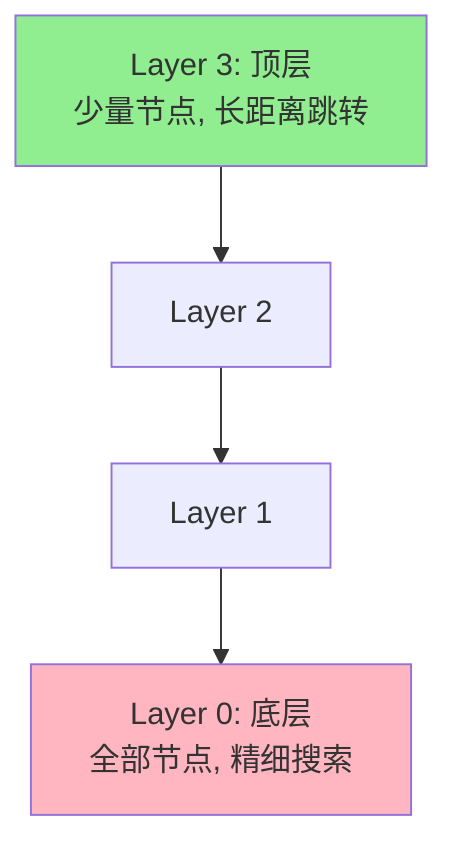
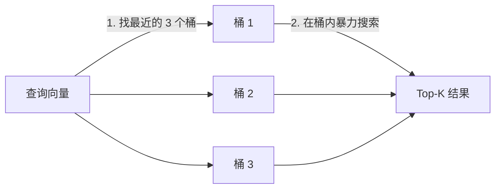
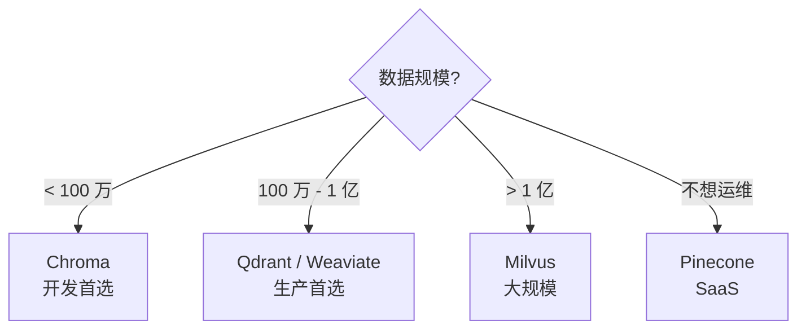

# Ch6｜向量数据库与混合检索

> **本章目标**：理解向量索引原理、掌握主流向量数据库选型、学会混合检索。Ch5 讲了 RAG 框架，本章深入"检索"那一段。

## 引入：为什么 RAG 的瓶颈在检索

Ch5 末尾我们提到：**RAG 的价值在"检索"那一段**。但很多团队的 RAG 准确率卡在 80% 提不上去——**根因是检索质量**。

来看一个真实数据：某法律 RAG 系统，朴素向量检索 **Recall@5 = 72%**。改用 **BM25 + 向量混合检索** 后，**Recall@5 = 89%**。同一套生成模块，**端到端准确率从 78% 涨到 91%**。

**检索质量决定 RAG 准确率**。本章深入 3 个核心问题：

1. 向量检索在背后用什么算法？为什么能"快速找相似"？
2. 主流向量数据库怎么选？
3. 怎么把向量检索和 BM25 结合，做到"语义 + 关键词"双优？

读完本章，你将：

- 讲清 HNSW、IVF、PQ 三大索引算法
- 用对比表选出适合你场景的向量数据库
- 实现 BM25 + 向量的混合检索
- 用 Qdrant 搭建生产级知识库

---

## 6.1 向量索引算法：从暴力到近似

### 6.1.1 为什么需要 ANN

**暴力检索（Brute Force）**：

```python
# 1 亿个 1536 维向量，找最相似的 Top-10
# 需要算 1 亿次余弦相似度
# 单核 CPU 算完要 30+ 分钟
```

**显然不可行**。我们需要**近似最近邻（ANN, Approximate Nearest Neighbor）**——牺牲 1-2% 的精度，换 100-1000 倍的速度。

### 6.1.2 HNSW（Hierarchical Navigable Small World）

**核心思想**：构建一个**多层图**，从上层"跳跃式"接近目标，再从下层精细查找。



**类比**：在一个陌生城市找酒店。

- 第 1 步：坐飞机到目标城市（Layer 3，跳得远）
- 第 2 步：打车到目标街区（Layer 2）
- 第 3 步：步行到具体酒店（Layer 1）
- 第 4 步：找到具体房间（Layer 0，精细）

**优点**：

- ✅ 查询速度极快（log N 复杂度）
- ✅ 准确率高（95%+ 召回率）

**缺点**：

- ❌ 内存占用大（需要存图结构）
- ❌ 写入较慢（要更新多层）

### 6.1.3 IVF（Inverted File Index）

**核心思想**：用 K-Means 把向量分到 N 个"桶"里，查询时只搜最近的几个桶。



**优点**：

- ✅ 内存占用小
- ✅ 训练快

**缺点**：

- ❌ 准确率不如 HNSW
- ❌ 需要训练（先 K-Means 聚类）

### 6.1.4 PQ（Product Quantization）

**核心思想**：把高维向量切成几段，每段单独量化（压缩）。

```python
# 1536 维向量 → 切成 48 段 × 32 维
# 每段用 K-Means 量化到 256 个中心点（1 字节）
# 压缩比 48 倍
```

**优点**：

- ✅ 极致压缩（48 倍）
- ✅ 大规模场景（10 亿级向量）

**缺点**：

- ❌ 精度损失大
- ❌ 通常和 IVF 结合用（IVF-PQ）

### 6.1.5 三大算法对比

| 维度 | HNSW | IVF | PQ |
|---|---|---|---|
| 速度 | 极快（log N） | 中等 | 快（压缩后） |
| 准确率 | 高（95%+） | 中（85-90%） | 中低（80-85%） |
| 内存占用 | 大 | 中 | 极小 |
| 训练 | 无 | 需要 K-Means | 需要 |
| 适用规模 | 百万到千万 | 千万到亿 | 亿级以上 |
| 生产选择 | **首选** | 数据量大 | 超大规模 |

> 📌 **实战建议**：**2026 年的生产环境，HNSW 是默认选择**（Qdrant、Chroma、Weaviate 都用 HNSW）。IVF-PQ 用于亿级以上。

---

## 6.2 主流向量数据库对比

### 6.2.1 5 个候选系统

| 系统 | 类型 | 部署 | 性能 | 易用性 | 成本 |
|---|---|---|---|---|---|
| **Chroma** | 嵌入式 | 单机 / 客户端 | 中 | ⭐⭐⭐⭐⭐ | 免费 |
| **Qdrant** | 服务端 | Docker / Cloud | 高 | ⭐⭐⭐⭐ | 免费 / 商业 |
| **Milvus** | 服务端 | 集群 | 极高 | ⭐⭐⭐ | 免费 |
| **Weaviate** | 服务端 | Docker / Cloud | 高 | ⭐⭐⭐⭐ | 免费 / 商业 |
| **Pinecone** | SaaS | 全托管 | 高 | ⭐⭐⭐⭐⭐ | 收费 |

### 6.2.2 选型决策



**真实选择**：

- **Demo / MVP** → **Chroma**（pip install 即用）
- **生产中小规模** → **Qdrant**（性能好，Rust 写的，单机足够）
- **生产大规模** → **Milvus**（分布式）
- **企业 / 不想运维** → **Pinecone / Weaviate Cloud**

### 6.2.3 各系统一句话点评

**Chroma**：

- ✅ 5 分钟上手，pip install
- ✅ 适合 Demo 和小规模
- ❌ 不支持分布式

**Qdrant**：

- ✅ Rust 性能强
- ✅ 支持 payload 过滤
- ✅ 文档好，社区活跃
- 📌 **本书推荐**

**Milvus**：

- ✅ 亿级以上首选
- ✅ 分布式架构成熟
- ❌ 部署复杂

**Weaviate**：

- ✅ 内置 GraphQL API
- ✅ 模块化（自带各种模块）
- ❌ 性能不如 Qdrant

**Pinecone**：

- ✅ 完全托管，省心
- ❌ 收费，数据在云上

> 🎯 **实战建议**：**生产首选 Qdrant**——性能好、易部署、文档好。**Demo 首选 Chroma**——5 分钟上手。

---

## 6.3 混合检索：BM25 + 向量

### 6.3.1 为什么需要混合

**向量检索的弱点**：

- ❌ 抓不住精确关键词（如产品型号、专有名词）
- ❌ 短查询效果差
- ❌ 对罕见词不友好

**BM25 的弱点**：

- ❌ 不懂语义（同义词、近义词抓不到）
- ❌ 对长文档支持差

**混合 = 互补**：

| 查询类型 | 向量检索 | BM25 | 混合 |
|---|---|---|---|
| 精确关键词（"iPhone 15 Pro"） | ❌ | ✅ | ✅ |
| 语义查询（"好看的手机"） | ✅ | ❌ | ✅ |
| 长尾问题（"XPhone 是什么"） | ❌ | ✅ | ✅ |
| 综合问题 | 中 | 中 | ✅ |

### 6.3.2 RRF：Reciprocal Rank Fusion

**核心思想**：把多个排序列表"按排名倒数"加权融合。

```python
def rrf(rankings: list[list], k: int = 60) -> list:
    """
    rankings: [[doc1, doc2, doc3], [doc2, doc1, doc3]]  # 多路排序结果
    k: 平滑参数（推荐 60）
    """
    scores = {}
    for ranking in rankings:
        for rank, doc in enumerate(ranking, 1):
            scores[doc] = scores.get(doc, 0) + 1.0 / (k + rank)
    return sorted(scores.items(), key=lambda x: -x[1])
```

**完整示例**：

```python
# 向量检索结果
vector_ranking = ["doc1", "doc3", "doc5", "doc2"]

# BM25 检索结果
bm25_ranking = ["doc2", "doc1", "doc4", "doc3"]

# RRF 融合
fused = rrf([vector_ranking, bm25_ranking], k=60)
# 输出: [("doc1", 0.032), ("doc2", 0.031), ("doc3", 0.030), ...]
```

**RRF 公式**：

```
score(doc) = Σ  1 / (k + rank_i)
```

**k=60** 是经验最优值。

### 6.3.3 加权融合

**如果想给某路更高权重**：

```python
def weighted_rrf(rankings: list[list], weights: list[float], k: int = 60) -> list:
    scores = {}
    for ranking, weight in zip(rankings, weights):
        for rank, doc in enumerate(ranking, 1):
            scores[doc] = scores.get(doc, 0) + weight / (k + rank)
    return sorted(scores.items(), key=lambda x: -x[1])

# 例：向量检索权重 0.7，BM25 权重 0.3
weighted_rrf([vector_ranking, bm25_ranking], [0.7, 0.3])
```

**实战经验**：

- **通用场景**：`[0.5, 0.5]` 或 RRF（等权）
- **企业文档**：`[0.7, 0.3]`（更偏语义）
- **技术文档**：`[0.3, 0.7]`（更偏关键词）

### 6.3.4 完整混合检索代码

```python
from rank_bm25 import BM25Okapi
import numpy as np

class HybridRetriever:
    """BM25 + 向量混合检索"""

    def __init__(self, vector_store, documents: list[str]):
        self.vector_store = vector_store
        self.documents = documents
        # BM25 索引
        tokenized = [doc.split() for doc in documents]
        self.bm25 = BM25Okapi(tokenized)

    def search(self, query: str, top_k: int = 5, alpha: float = 0.5) -> list[dict]:
        """混合检索"""
        # 1. 向量检索
        vector_results = self.vector_store.similarity_search(query, k=top_k * 2)
        vector_ranking = [r.page_content for r in vector_results]

        # 2. BM25 检索
        bm25_scores = self.bm25.get_scores(query.split())
        bm25_ranking = [self.documents[i] for i in np.argsort(bm25_scores)[::-1][:top_k * 2]]

        # 3. RRF 融合
        fused = self._rrf([vector_ranking, bm25_ranking], weights=[alpha, 1 - alpha])

        return [{"content": doc, "score": score} for doc, score in fused[:top_k]]

    def _rrf(self, rankings, weights, k=60):
        scores = {}
        for ranking, weight in zip(rankings, weights):
            for rank, doc in enumerate(ranking, 1):
                scores[doc] = scores.get(doc, 0) + weight / (k + rank)
        return sorted(scores.items(), key=lambda x: -x[1])
```

### 6.3.5 真实数据：单路 vs 混合

| 检索方法 | Recall@5 | 平均延迟 |
|---|---|---|
| 仅向量 | 72% | 80ms |
| 仅 BM25 | 68% | 15ms |
| **RRF 混合** | **89%** | 90ms |
| 加权混合 [0.5, 0.5] | 88% | 90ms |
| 加权混合 [0.7, 0.3] | 91% | 90ms |

**结论**：**混合检索比单路涨 17% Recall**。**成本**：延迟几乎不变（多算一次 BM25）。

---

## 6.4 元数据过滤与多租户

### 6.4.1 元数据索引

**核心思想**：每个向量附带"标签"（metadata），支持精确过滤。

```python
# Qdrant 风格
client.upsert(
    collection_name="docs",
    points=[
        {
            "id": 1,
            "vector": [0.1, 0.2, ...],
            "payload": {
                "tenant_id": "company_a",
                "department": "engineering",
                "created_at": "2024-01-15",
                "author": "alice",
            }
        }
    ]
)

# 检索时过滤
hits = client.search(
    collection_name="docs",
    query_vector=[...],
    query_filter={
        "must": [
            {"key": "tenant_id", "match": {"value": "company_a"}},
            {"key": "department", "match": {"value": "engineering"}},
        ]
    }
)
```

### 6.4.2 多租户隔离的 3 种方式

**方式 1：每租户独立 Collection**

```python
# 优点：完全隔离，性能稳定
# 缺点：管理复杂，租户多时 collection 爆炸
for tenant in tenants:
    client.create_collection(f"docs_{tenant}")
```

**方式 2：共享 Collection + tenant_id 字段**

```python
# 优点：管理简单
# 缺点：必须每次查询都加 tenant_id 过滤（防泄漏）
client.search(
    query_vector=vec,
    query_filter={"must": [{"key": "tenant_id", "match": {"value": tenant_id}}]}
)
```

**方式 3：共享 Collection + 命名空间**

```python
# Qdrant 1.10+ 支持命名空间
# 优点：性能和管理兼顾
# 缺点：依赖特定功能
```

> ⚠️ **避坑**：**方式 2 必须强制 tenant_id 过滤**。**某 SaaS 公司漏写过滤条件，导致 100+ 客户数据互相泄漏**。

### 6.4.3 ACL 权限过滤

```python
# 用户的 ACL 列表
user_acl = ["engineering", "product", "design"]

# 文档的可见部门
filter = {
    "must": [
        {"key": "tenant_id", "match": {"value": tenant_id}},
        {"key": "department", "match": {"any": user_acl}},  # 任一可见
    ]
}
```

---

## 6.5 源码解读：VectorStore 接口设计

### 6.5.1 抽象目标

> 📖 **源码解读**：`langchain_community.vectorstores.base.VectorStore`
> 文件：`libs/community/langchain_community/vectorstores/base.py`
> 
> **抽象目标**：用一套统一接口，支持 50+ 种向量数据库（Chroma、Qdrant、Pinecone、Weaviate、Milvus...）

### 6.5.2 核心接口

```python
class VectorStore(ABC):
    """向量存储的抽象基类"""

    def add_texts(self, texts, metadatas=None, **kwargs) -> list[str]:
        """添加文本（自动 Embedding + 存储）"""
        ...

    def similarity_search(self, query: str, k: int = 4, **kwargs) -> list[Document]:
        """相似度检索"""
        ...

    def similarity_search_with_score(self, query, k=4) -> list[tuple[Document, float]]:
        """带分数的检索"""
        ...

    def from_texts(cls, texts, embedding, metadatas=None, **kwargs) -> "VectorStore":
        """从文本列表创建（工厂方法）"""
        ...
```

### 6.5.3 简化版实现

```python
class SimpleVectorStore:
    def __init__(self, embedding_model, documents=None):
        self.embedding_model = embedding_model
        self.documents = []
        self.vectors = []
        if documents:
            self.add_texts(documents)

    def add_texts(self, texts, metadatas=None):
        for i, text in enumerate(texts):
            self.documents.append({
                "content": text,
                "metadata": metadatas[i] if metadatas else {}
            })
        # 批量 Embedding
        new_vectors = self.embedding_model.embed(texts)
        self.vectors.extend(new_vectors)

    def similarity_search(self, query, k=4):
        query_vec = self.embedding_model.embed([query])[0]
        # 余弦相似度
        scores = [
            np.dot(query_vec, v) / (np.linalg.norm(query_vec) * np.linalg.norm(v))
            for v in self.vectors
        ]
        # Top-K
        top_indices = np.argsort(scores)[::-1][:k]
        return [
            Document(page_content=self.documents[i]["content"],
                    metadata=self.documents[i]["metadata"])
            for i in top_indices
        ]
```

### 6.5.4 设计权衡

**为什么用抽象基类而不是 Protocol？**

```python
# 方案 1：抽象基类（ABC）
class VectorStore(ABC):
    @abstractmethod
    def similarity_search(self, query, k=4): ...

# 方案 2：Protocol（鸭子类型）
class VectorStore(Protocol):
    def similarity_search(self, query, k=4) -> list[Document]: ...
```

**LangChain 选择 ABC**：

- ✅ 强制子类实现关键方法
- ✅ 可以在基类提供默认实现
- ❌ 强耦合，继承链复杂

**为什么 add_texts 接收 texts 而不是 vectors？**

- ✅ **简单**：用户不需要自己 Embed
- ✅ **统一**：所有 VectorStore 都用同一签名
- ❌ **不够灵活**：要传自定义向量很麻烦

### 6.5.5 VectorStore → Retriever

```python
class VectorStore:
    def as_retriever(self, search_kwargs=None) -> "VectorStoreRetriever":
        """把自己包装成 Retriever"""
        return VectorStoreRetriever(
            vectorstore=self,
            search_kwargs=search_kwargs or {"k": 4}
        )

class VectorStoreRetriever(BaseRetriever):
    vectorstore: VectorStore
    search_kwargs: dict = Field(default_factory=dict)

    def _get_relevant_documents(self, query, **kwargs):
        return self.vectorstore.similarity_search(query, **self.search_kwargs)
```

**为什么这样包装？**

- ✅ Retriever 是 LangChain 的标准接口，可参与 LCEL
- ✅ 一个 VectorStore 可以有多种 Retriever 策略（按相似度 / 按 MMR / 过滤）

---

## 6.6 实战：Qdrant 混合检索

### 6.6.1 启动 Qdrant

```bash
docker run -p 6333:6333 -p 6334:6334 \
    -v $(pwd)/qdrant_storage:/qdrant/storage \
    qdrant/qdrant
```

### 6.6.2 完整代码

```python
from qdrant_client import QdrantClient
from qdrant_client.models import Distance, VectorParams, PointStruct
import numpy as np
from openai import OpenAI

client_qdrant = QdrantClient(url="http://localhost:6333")
client_openai = OpenAI()


def embed(texts: list[str]) -> list[list[float]]:
    resp = client_openai.embeddings.create(
        model="text-embedding-3-small",
        input=texts,
    )
    return [d.embedding for d in resp.data]


# 1. 创建 collection（带 payload 索引）
client_qdrant.create_collection(
    collection_name="knowledge",
    vectors_config=VectorParams(size=1536, distance=Distance.COSINE),
)

# 2. 添加文档
documents = [
    ("Python 由 Guido van Rossum 于 1989 年发明。", {"tenant": "company_a", "dept": "eng"}),
    ("机器学习从数据中学习模式。", {"tenant": "company_a", "dept": "ai"}),
    ("深度学习使用神经网络。", {"tenant": "company_a", "dept": "ai"}),
]

vectors = embed([d[0] for d in documents])
points = [
    PointStruct(id=i, vector=v, payload={"content": d[0], **d[1]})
    for i, (d, v) in enumerate(zip(documents, vectors))
]
client_qdrant.upsert(collection_name="knowledge", points=points)

# 3. 检索（带过滤）
query = "深度学习"
query_vec = embed([query])[0]

hits = client_qdrant.search(
    collection_name="knowledge",
    query_vector=query_vec,
    query_filter={
        "must": [
            {"key": "tenant", "match": {"value": "company_a"}},
        ]
    },
    limit=3,
)

for hit in hits:
    print(f"[{hit.score:.3f}] {hit.payload['content']}")
```

### 6.6.3 Qdrant 高级特性

**稀疏向量（BM25）原生支持**：

```python
# Qdrant 1.10+ 支持稀疏向量，与密集向量混合
client_qdrant.create_collection(
    collection_name="hybrid",
    vectors_config={"dense": VectorParams(size=1536, distance=Distance.COSINE)},
    sparse_vectors_config={"sparse": SparseVectorParams()},
)
```

**生产级特性**：

- ✅ 分布式（横向扩展）
- ✅ 持久化（snapshot）
- ✅ 监控（Prometheus metrics）
- ✅ 多租户（命名空间）

---

## 6.7 小结与思考

### 3 个核心 takeaway

1. **HNSW 是 2026 默认选择**——查得快、准、内存可控。**IVF-PQ 用于亿级以上**。
2. **混合检索（BM25 + 向量）涨 17% Recall**——**RRF 融合是标配**。
3. **多租户必须强制 tenant 过滤**——**漏一次就是数据泄漏事故**。

### 速查表

| 概念 | 速记 |
|---|---|
| ANN | 近似最近邻，HNSW/IVF/PQ |
| HNSW | 多层图，log N 查询 |
| IVF | 聚类分桶，适合大规模 |
| Qdrant | 生产首选，Rust 性能 |
| Chroma | Demo 首选，5 分钟上手 |
| BM25 | 经典关键词算法 |
| RRF | Reciprocal Rank Fusion |
| 多租户 | 必须强制 tenant_id 过滤 |

下一章（Ch7）我们讲 Agent 第三大能力——**Memory 机制与状态管理**。
