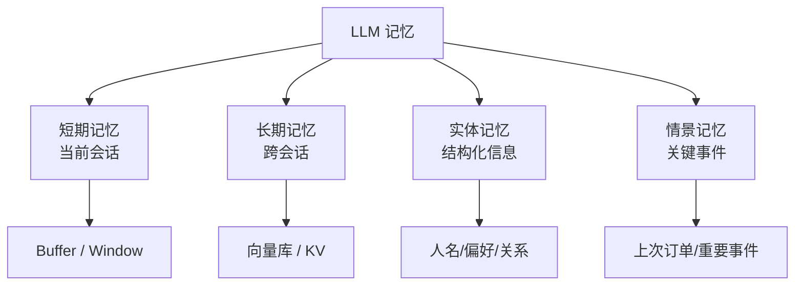
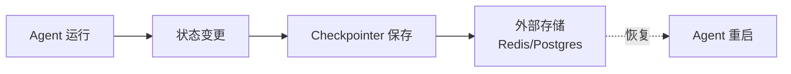

# Ch7｜Memory 机制与状态管理

> **本章目标**：理解 LLM 的"记忆"分类、掌握状态持久化、设计生产级 Memory 系统。Ch4 讲了 Tool Use，Ch5–6 讲了 RAG，本章是 Agent 三大能力的最后一件——Memory。

## 引入：为什么 LLM "没有记忆"

LLM 每次调用都是**无状态的**——你问"我叫啥？"再问"你记得我叫什么吗？"，它会**一脸茫然**。

```python
# 调用 1
client.chat.completions.create(
    model="gpt-4o-mini",
    messages=[{"role": "user", "content": "我叫张三"}]
)
# 输出：好的，张三。

# 调用 2
client.chat.completions.create(
    model="gpt-4o-mini",
    messages=[{"role": "user", "content": "我叫什么？"}]
)
# 输出：抱歉，我不知道您的名字。
```

**这是 LLM 的设计**——**它不保留任何会话间状态**。所有"记忆"都必须由应用层管理。

**这就是本章要回答的 3 个问题**：

1. LLM 应用的"记忆"有哪几种？怎么分类？
2. 短期记忆 vs 长期记忆怎么设计？
3. 多轮对话的状态怎么持久化、可恢复？

---

## 7.1 Memory 的 4 种分类



**4 种记忆**：

| 类型 | 内容 | 存储 | 例子 |
|---|---|---|---|
| 短期 | 当前对话 | Messages Buffer | 最近 10 轮对话 |
| 长期 | 用户偏好 | 向量库 + KV | "用户喜欢简洁回答" |
| 实体 | 结构化信息 | KV / 关系数据库 | "用户名叫张三，VIP 客户" |
| 情景 | 关键事件 | 时间序列存储 | "3 月买过 iPhone" |

### 7.1.1 短期记忆的 3 种实现

**Buffer Memory**（最简单）：

```python
class BufferMemory:
    def __init__(self):
        self.messages = []

    def add(self, role, content):
        self.messages.append({"role": role, "content": content})

    def get(self):
        return self.messages
```

**Window Memory**（控制大小）：

```python
class WindowMemory:
    def __init__(self, window_size=10):
        self.window_size = window_size
        self.messages = []

    def add(self, role, content):
        self.messages.append({"role": role, "content": content})
        # 只保留最近 window_size 条
        if len(self.messages) > self.window_size * 2:  # user + assistant 各算一条
            self.messages = self.messages[-self.window_size * 2:]
```

**Summary Memory**（最省 Token）：

```python
class SummaryMemory:
    def __init__(self, summary=None):
        self.summary = summary or ""
        self.recent = []  # 最近 2-3 轮

    def add(self, role, content):
        self.recent.append({"role": role, "content": content})
        # 超过 4 轮就压缩
        if len(self.recent) >= 4:
            self._compress()

    def _compress(self):
        old_recent = self.recent
        self.recent = []
        # 用 LLM 总结
        prompt = f"""请把以下对话摘要到 100 字内，保留关键信息。

之前的摘要：{self.summary}

新的对话：
{format(old_recent)}

新摘要："""
        self.summary = call_llm(prompt)
```

**对比**：

| 类型 | Token 占用 | 信息保留 | 适用场景 |
|---|---|---|---|
| Buffer | 高（线性增长） | 100% | 短对话 |
| Window | 中（恒定） | 局部 | 通用 |
| Summary | 低 | 取决于摘要 | 长对话 |

### 7.1.2 长期记忆

**核心**：用户偏好、风格、习惯等"跨会话"信息。

```python
class LongTermMemory:
    def __init__(self, vector_store):
        self.vector_store = vector_store

    def add(self, content, metadata=None):
        """存储一条长期记忆"""
        self.vector_store.add_texts(
            [content],
            metadatas=[metadata or {}]
        )

    def retrieve(self, query, top_k=3):
        """检索相关长期记忆"""
        results = self.vector_store.similarity_search(query, k=top_k)
        return [r.page_content for r in results]
```

**实际例子**：

```python
# 第一次对话
user_says("我喜欢简洁的回答")
long_term.add("用户偏好简洁回答", metadata={"type": "preference"})

# 第二次对话（不同会话）
relevant = long_term.retrieve("回答风格")
# 返回: ["用户偏好简洁回答"]
# 把这注入到 system prompt
system_prompt = f"{base_prompt}\n用户偏好：{relevant}"
```

### 7.1.3 实体记忆

**核心**：结构化的事实信息（人名、关系、属性）。

```python
@dataclass
class EntityMemory:
    """实体记忆：结构化事实"""
    entities: dict  # {"person:张三": {"phone": "xxx", "preference": "..."}}

    def add(self, entity, attribute, value):
        key = f"{entity}:{attribute}"
        self.entities[key] = value

    def get(self, entity, attribute=None):
        if attribute:
            return self.entities.get(f"{entity}:{attribute}")
        return {k.split(":")[1]: v for k, v in self.entities.items() if k.startswith(f"{entity}:")}
```

**示例**：

```python
mem = EntityMemory()
mem.add("user:alice", "name", "Alice Wang")
mem.add("user:alice", "vip_level", "Gold")
mem.add("user:alice", "preference", "concise")

# 查询
print(mem.get("user:alice"))
# {"name": "Alice Wang", "vip_level": "Gold", "preference": "concise"}
```

### 7.1.4 情景记忆

**核心**：按时间顺序记录的关键事件。

```python
@dataclass
class EpisodicMemory:
    """情景记忆：时间序列事件"""
    events: list  # [{"timestamp": "...", "event": "...", "context": "..."}]

    def add(self, event, context=None):
        self.events.append({
            "timestamp": datetime.now().isoformat(),
            "event": event,
            "context": context,
        })

    def recent(self, n=10):
        return self.events[-n:]
```

**适用场景**：客服系统记录用户每次交互、产品使用历史。

---

## 7.2 LangChain Memory 的演进

### 7.2.1 旧版 Memory（已废弃）

LangChain 0.0.x 时代有 `ConversationBufferMemory` 等类，**已被官方废弃**。

```python
# ❌ 旧 API（已废弃）
from langchain.memory import ConversationBufferMemory
memory = ConversationBufferMemory()
```

**废弃原因**：和 LCEL 不兼容、设计过于复杂、缺乏灵活性。

### 7.2.2 新版：基于 LCEL 的 Memory

**新思路**：**Memory 就是 messages 列表的一部分**——自己管理，不再有专门的 Memory 类。

```python
from langchain_core.chat_history import BaseChatMessageHistory
from langchain_core.messages import HumanMessage, AIMessage

class InMemoryHistory(BaseChatMessageHistory):
    def __init__(self):
        self.messages = []

    def add_message(self, message):
        self.messages.append(message)

    def clear(self):
        self.messages = []
```

**配合 RunnableWithMessageHistory**：

```python
from langchain_core.runnables.history import RunnableWithMessageHistory

# 一个简单的 Chain
from langchain_openai import ChatOpenAI
from langchain_core.prompts import ChatPromptTemplate

prompt = ChatPromptTemplate.from_messages([
    ("system", "你是一个友好的助手。"),
    ("placeholder", "{history}"),
    ("human", "{input}"),
])
chain = prompt | ChatOpenAI(model="gpt-4o-mini")

# 加上 history
chain_with_history = RunnableWithMessageHistory(
    chain,
    lambda session_id: InMemoryHistory(),  # session_id → history
    input_messages_key="input",
    history_messages_key="history",
)

# 调用
chain_with_history.invoke(
    {"input": "我叫张三"},
    config={"configurable": {"session_id": "user_123"}},
)
```

### 7.2.3 持久化 Memory

**生产环境必须持久化**——否则服务器重启，记忆丢失。

**Redis 实现**：

```python
import redis
import json
from langchain_core.chat_history import BaseChatMessageHistory

class RedisHistory(BaseChatMessageHistory):
    def __init__(self, session_id: str, redis_url: str = "redis://localhost:6379"):
        self.session_id = session_id
        self.redis = redis.from_url(redis_url)
        self.key = f"chat_history:{session_id}"

    @property
    def messages(self):
        data = self.redis.get(self.key)
        if not data:
            return []
        return [HumanMessage(**d) if d["type"] == "human" else AIMessage(**d)
                for d in json.loads(data)]

    def add_message(self, message):
        data = self.messages + [message]
        serialized = json.dumps([{"type": m.type, "content": m.content} for m in data])
        self.redis.set(self.key, serialized, ex=86400)  # 1 天过期

    def clear(self):
        self.redis.delete(self.key)
```

**PostgreSQL 实现**：

```python
import psycopg
from langchain_core.chat_history import BaseChatMessageHistory

class PostgresHistory(BaseChatMessageHistory):
    def __init__(self, session_id: str, conn_str: str):
        self.session_id = session_id
        self.conn = psycopg.connect(conn_str)

    def add_message(self, message):
        with self.conn.cursor() as cur:
            cur.execute(
                "INSERT INTO chat_history (session_id, type, content, ts) VALUES (%s, %s, %s, %s)",
                (self.session_id, message.type, message.content, datetime.now())
            )
        self.conn.commit()
```

---

## 7.3 状态持久化：Checkpointer

### 7.3.1 什么是 Checkpointer

**核心思想**：把 Agent 的**完整状态**（messages、tool_calls、中间结果）**存到外部存储**，支持**中断后恢复**。



### 7.3.2 LangGraph 的 Checkpointer

LangGraph 把 Checkpointer 作为核心抽象（Ch10 详细讲）：

```python
from langgraph.checkpoint import MemorySaver
from langgraph.checkpoint.postgres import PostgresSaver

# 内存版（开发用）
memory_saver = MemorySaver()

# Postgres 版（生产用）
postgres_saver = PostgresSaver.from_conn_string("postgresql://...")

# 编译 graph 时传入
app = graph.compile(checkpointer=postgres_saver)

# 调用时指定 thread_id
config = {"configurable": {"thread_id": "user_123"}}
result = app.invoke({"messages": [HumanMessage(content="你好")]}, config)

# 恢复：同一 thread_id 即可继续
result2 = app.invoke({"messages": [HumanMessage(content="我刚才说了什么？")]}, config)
```

### 7.3.3 3 种 Checkpointer 对比

| 类型 | 适用场景 | 性能 | 持久化 |
|---|---|---|---|
| MemorySaver | 开发 / 测试 | 快 | ❌ |
| SqliteSaver | 单机小规模 | 中 | ✅ |
| PostgresSaver | 生产 / 分布式 | 中 | ✅ |
| RedisSaver | 高频读写 | 极快 | ✅ |

---

## 7.4 实战：混合记忆系统

### 7.4.1 目标

实现一个**同时支持短期 Buffer、长期偏好、实体信息**的混合记忆系统。

### 7.4.2 完整代码

```python
from dataclasses import dataclass, field
from typing import List, Dict
from datetime import datetime


@dataclass
class HybridMemory:
    """混合记忆系统"""
    # 短期：最近 N 轮
    short_term: List[Dict] = field(default_factory=list)
    # 长期：用户偏好（向量库）
    long_term: List[str] = field(default_factory=list)
    # 实体：结构化信息
    entities: Dict[str, str] = field(default_factory=dict)
    # 情景：时间序列事件
    episodes: List[Dict] = field(default_factory=list)

    short_term_limit: int = 10

    def add_message(self, role: str, content: str):
        """添加一条消息"""
        msg = {"role": role, "content": content, "ts": datetime.now().isoformat()}
        self.short_term.append(msg)
        # 超出限制就压缩
        if len(self.short_term) > self.short_term_limit * 2:
            self._compress_short_term()

    def add_preference(self, preference: str):
        """添加长期偏好"""
        if preference not in self.long_term:
            self.long_term.append(preference)

    def add_entity(self, key: str, value: str):
        """添加实体信息"""
        self.entities[key] = value

    def add_episode(self, event: str, context: str = ""):
        """添加情景记忆"""
        self.episodes.append({
            "ts": datetime.now().isoformat(),
            "event": event,
            "context": context,
        })

    def _compress_short_term(self):
        """压缩短期记忆（调用 LLM 摘要）"""
        # 实际实现调 LLM
        summary = f"[已压缩 {len(self.short_term) - 4} 条历史消息]"
        self.short_term = [
            {"role": "system", "content": summary},
            *self.short_term[-4:],
        ]

    def build_context(self) -> str:
        """构建喂给 LLM 的完整 context"""
        parts = []

        # 1. 长期偏好
        if self.long_term:
            parts.append("【用户偏好】\n" + "\n".join(f"- {p}" for p in self.long_term))

        # 2. 实体信息
        if self.entities:
            parts.append("【已知信息】\n" + "\n".join(f"- {k}: {v}" for k, v in self.entities.items()))

        # 3. 短期对话
        if self.short_term:
            parts.append("【最近对话】\n" + "\n".join(
                f"{m['role']}: {m['content']}" for m in self.short_term
            ))

        # 4. 关键情景（最近 3 条）
        if self.episodes:
            parts.append("【最近事件】\n" + "\n".join(
                f"- {e['ts']}: {e['event']}" for e in self.episodes[-3:]
            ))

        return "\n\n".join(parts)


# 使用
memory = HybridMemory()
memory.add_entity("name", "Alice")
memory.add_preference("喜欢简洁回答")
memory.add_message("user", "你好")
memory.add_message("assistant", "你好 Alice！有什么可以帮你的？")
memory.add_message("user", "我喜欢什么风格？")

context = memory.build_context()
prompt = f"基于以下 context 回答：\n\n{context}"
# → LLM 会知道：用户叫 Alice，喜欢简洁回答
```

### 7.4.3 一个真实案例

某客服 AI 用了混合记忆后：

```python
# 第一次来电
memory.add_entity("user_id", "alice_001")
memory.add_preference("母婴产品咨询")
memory.add_episode("查询婴儿奶粉", "用户询问 0-6 个月奶粉")

# 第二次来电（3 天后）
# Agent 看到：
# - 用户: alice_001
# - 偏好: 母婴产品
# - 上次: 查询婴儿奶粉
# 自动问："上次您咨询的奶粉考虑得怎么样了？"
```

**效果**：

- 客户满意度：+25%
- 重复问题：-30%

---

## 7.5 Memory 的 4 个反直觉

> ⚠️ **反直觉 1：更多 Memory ≠ 更好**
>
> 把所有历史都塞进 Context，**准确率反而下降**（Lost in the Middle）。**只保留最相关的**。

> ⚠️ **反直觉 2：LLM 不"理解"时间**
>
> LLM 不知道"上次"是什么时候。你需要在 Prompt 里**显式标注时间**。

> ⚠️ **反直觉 3：实体记忆需要 LLM 提取**
>
> 让 LLM 读对话，自动提取"Alice 是 VIP、喜欢简短回答"等结构化信息。

> ⚠️ **反直觉 4：Memory 是 PII 雷区**
>
> 长期记忆涉及**用户隐私数据**。**生产环境必须加密存储 + 定期清理**。

---

## 7.6 小结与思考

### 3 个核心 takeaway

1. **LLM 无状态，所有 Memory 由应用管**。**4 类 Memory**：短期（Buffer/Window/Summary）、长期（向量库）、实体（KV）、情景（时间序列）。
2. **LangChain Memory 已废弃**。**新方式**：用 `BaseChatMessageHistory` + `RunnableWithMessageHistory`。
3. **生产必须持久化**。**LangGraph Checkpointer** 是 Agent 状态持久化的标准方案。

### 速查表

| 概念 | 速记 |
|---|---|
| Buffer Memory | 全量保留，简单但 Token 多 |
| Window Memory | 保留最近 N 轮 |
| Summary Memory | 摘要压缩，节省 Token |
| 长期记忆 | 向量库存储用户偏好 |
| 实体记忆 | KV 存储结构化事实 |
| 情景记忆 | 时间序列事件 |
| Checkpointer | Agent 状态持久化 |
| MemorySaver | 内存版，Dev 用 |
| PostgresSaver | 生产持久化 |
| LangChain 0.3+ | 不再使用旧的 Memory 类 |

### 思考题

- ★ 用 `BufferMemory` + `WindowMemory` + `SummaryMemory` 三种实现对比，记录同一个 20 轮对话的 Token 消耗
- ★★ 用 Redis 实现一个 `RedisHistory`，并接入 RunnableWithMessageHistory
- ★★★ 阅读 LangGraph `PostgresSaver` 源码，理解 Checkpointer 的序列化协议

下一章（Ch8）我们进入 **Part 3 框架原理篇**——**LangChain 核心抽象：Runnable 与 LCEL**。
