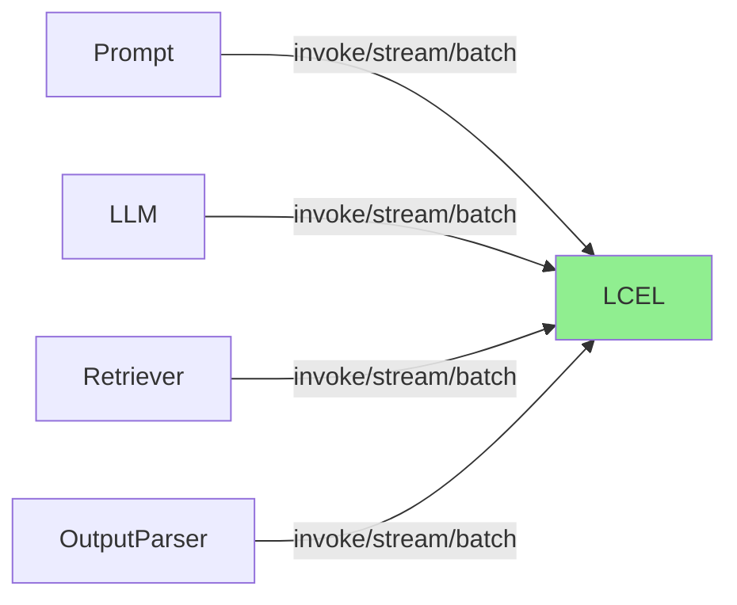

# Ch8｜LangChain 核心抽象：Runnable 与 LCEL

> **本章目标**：深入 LangChain 的核心抽象——`Runnable` 接口和 LCEL 表达式。读完后，你能用 5 行代码组合任意 LLM Pipeline，并理解它背后的源码设计。

## 引入：为什么 LangChain 重写了 70% 代码

2023 年 10 月，LangChain 发布了 **LCEL（LangChain Expression Language）**——**重写了 70% 的核心代码**。这次重写让 LangChain 从"一堆零散的工具"变成"一个可组合的框架"。

**LCEL 之前**：

```python
# 调用 LLM 写一段 Chain
from langchain.chains import LLMChain
from langchain.prompts import PromptTemplate
from langchain.llms import OpenAI

prompt = PromptTemplate.from_template("翻译 {text} 到 {language}")
chain = LLMChain(llm=OpenAI(), prompt=prompt)
result = chain.run(text="Hello", language="中文")
# 限制：不能流式、不能批量、不能异步
```

**LCEL 之后**：

```python
from langchain_openai import ChatOpenAI
from langchain_core.prompts import ChatPromptTemplate

prompt = ChatPromptTemplate.from_template("翻译 {text} 到 {language}")
chain = prompt | ChatOpenAI() | StrOutputParser()
result = chain.invoke({"text": "Hello", "language": "中文"})
# 特性：invoke / stream / batch / ainvoke / astream 全部支持
```

**一行 `|`** 替代了 70 行配置代码。**这就是 LCEL 的价值**——让 Chain 像 Unix 管道一样可组合。

读完本章，你将：

- 理解 `Runnable` 接口的 4 个核心方法
- 讲清 LCEL 的源码实现（`RunnableSequence`）
- 组合 10+ 个常用组件
- 自定义一个 `Runnable`

---

## 8.1 Runnable：LangChain 的"统一接口"

### 8.1.1 4 个核心方法

```python
class Runnable(ABC):
    """所有 LangChain 组件的基类"""

    def invoke(self, input, config=None, **kwargs) -> Any:
        """同步调用"""

    async def ainvoke(self, input, config=None, **kwargs) -> Any:
        """异步调用"""

    def stream(self, input, config=None, **kwargs) -> Iterator[Any]:
        """流式输出"""

    async def astream(self, input, config=None, **kwargs) -> AsyncIterator[Any]:
        """异步流式"""

    def batch(self, inputs, config=None, **kwargs) -> list[Any]:
        """批量调用（默认并发）"""
```

**关键点**：**所有 LangChain 组件都实现这 4 个方法**——Prompt、LLM、Retriever、OutputParser、Tool 全部一致。

### 8.1.2 Runnable 的好处



**好处 1：组合性**

任意 Runnable 可以用 `|` 组合。

**好处 2：可观测**

所有 Runnable 都支持 Callback（on_start / on_end / on_error）。

**好处 3：可配置**

所有 Runnable 都支持 `configurable_fields`（运行时改参数）。

**好处 4：可异步**

所有 Runnable 都支持异步——不需要单独写 async 链。

### 8.1.3 5 个常用 Runnable

| 类 | 作用 | 例子 |
|---|---|---|
| `ChatPromptTemplate` | 格式化 Prompt | `prompt.format_messages(text="hi")` |
| `ChatOpenAI` | LLM 调用 | `model.invoke(messages)` |
| `StrOutputParser` | 解析输出 | `parser.invoke(ai_message)` |
| `RunnableLambda` | 包装普通函数 | `lambda x: x.upper()` |
| `RunnablePassthrough` | 直接透传 | 不变 |

---

## 8.2 LCEL 表达式：`|` 运算符

### 8.2.1 基础用法

```python
from langchain_openai import ChatOpenAI
from langchain_core.prompts import ChatPromptTemplate
from langchain_core.output_parsers import StrOutputParser

# 定义 3 个 Runnable
prompt = ChatPromptTemplate.from_template("讲一个关于 {topic} 的笑话")
model = ChatOpenAI(model="gpt-4o-mini")
parser = StrOutputParser()

# 用 | 组合
chain = prompt | model | parser

# 调用
result = chain.invoke({"topic": "程序员"})
print(result)
# 输出：为什么程序员总是穿黑衣？因为他们想和 Bug 融为一体。
```

**`|` 运算符做了什么？**

```python
# 实际上等价于：
chain = RunnableSequence(steps=[prompt, model, parser])

# 内部存储步骤列表，依次调用
def invoke(self, input, **kwargs):
    for step in self.steps:
        input = step.invoke(input, **kwargs)
    return input
```

### 8.2.2 4 个调用方式

```python
# 1. invoke：单次同步
result = chain.invoke({"topic": "猫"})

# 2. ainvoke：单次异步
import asyncio
result = asyncio.run(chain.ainvoke({"topic": "猫"}))

# 3. stream：流式
for chunk in chain.stream({"topic": "猫"}):
    print(chunk, end="", flush=True)

# 4. batch：批量（默认并发）
results = chain.batch([
    {"topic": "猫"},
    {"topic": "狗"},
    {"topic": "鱼"},
])
```

### 8.2.3 RunnableParallel：并行

```python
from langchain_core.runnables import RunnableParallel

# 同时跑 3 个独立的 chain
parallel_chain = RunnableParallel(
    joke=ChatPromptTemplate.from_template("讲笑话") | model | parser,
    poem=ChatPromptTemplate.from_template("写诗") | model | parser,
    fact=ChatPromptTemplate.from_template("给个事实") | model | parser,
)

# 一次调用，3 个结果
result = parallel_chain.invoke({"topic": "月亮"})
# {"joke": "...", "poem": "...", "fact": "..."}
```

**3 个 LLM 调用并发执行**——延迟从 3x 降到 1x。

### 8.2.4 RunnablePassthrough：透传

```python
from langchain_core.runnables import RunnablePassthrough

# 把输入原样传递
chain = (
    {"context": retriever, "question": RunnablePassthrough()}
    | prompt
    | model
    | parser
)
# 输入 {"question": "..."} → 输出 "context": [docs], "question": "..."
```

### 8.2.5 RunnableLambda：包装函数

```python
from langchain_core.runnables import RunnableLambda

# 任何函数变成 Runnable
def upper(text: str) -> str:
    return text.upper()

chain = prompt | model | parser | RunnableLambda(upper)
# 输出会被转大写
```

### 8.2.6 RunnableAssign：赋值

```python
from langchain_core.runnables import RunnableAssign

# 给输入字典加一个 key
chain = RunnableAssign(
    {"summary": summary_chain}
) | final_chain
# 输入 {"text": "..."} → 中间 {"text": "...", "summary": "..."} → 最终
```

---

## 8.3 复杂链的 4 个模式

### 8.3.1 模式 1：RAG Chain

```python
from langchain_community.vectorstores import Chroma
from langchain_openai import OpenAIEmbeddings, ChatOpenAI
from langchain_core.prompts import ChatPromptTemplate
from langchain_core.runnables import RunnablePassthrough

# 1. 向量库
vectorstore = Chroma.from_texts(documents, OpenAIEmbeddings())
retriever = vectorstore.as_retriever(search_kwargs={"k": 3})

# 2. Prompt
prompt = ChatPromptTemplate.from_template("""
基于以下 context 回答问题：
{context}

问题：{question}
""")

# 3. 组装
chain = (
    {"context": retriever, "question": RunnablePassthrough()}
    | prompt
    | ChatOpenAI(model="gpt-4o-mini")
    | StrOutputParser()
)

# 4. 调用
print(chain.invoke("什么是 Python？"))
```

### 8.3.2 模式 2：Agent Chain

```python
from langchain_core.tools import tool
from langgraph.prebuilt import create_react_agent

@tool
def get_weather(city: str) -> str:
    """查询天气"""
    return f"{city} 25°C"

tools = [get_weather]

# LangGraph 的 create_react_agent 内部就是 Runnable
agent = create_react_agent(ChatOpenAI(model="gpt-4o-mini"), tools)

# 调用（自动流式 / 异步 / 批量都支持）
result = agent.invoke({"messages": [("human", "上海天气")]})
```

### 8.3.3 模式 3：分支路由

```python
from langchain_core.runnables import RunnableBranch

# 根据输入选不同分支
branch = RunnableBranch(
    (lambda x: "天气" in x["question"], weather_chain),
    (lambda x: "翻译" in x["question"], translate_chain),
    default_chain,  # 默认
)

result = branch.invoke({"question": "上海天气"})
```

### 8.3.4 模式 4：Fallback

```python
# 主链失败时跑 fallback
chain = primary_chain.with_fallbacks([fallback_chain])
# 主 LLM 限流 → 自动用 fallback
```

---

## 8.4 源码解读：`RunnableSequence`

### 8.4.1 抽象目标

> 📖 **源码解读**：`langchain_core.runnables.base.RunnableSequence`
> 文件：`libs/core/langchain_core/runnables/base.py`
> 
> **抽象目标**：把多个 `Runnable` 串成 pipeline，保持 invoke/stream/batch 全接口一致。

### 8.4.2 核心代码

```python
class RunnableSequence(Runnable):
    steps: list[Runnable]

    def invoke(self, input, config=None, **kwargs):
        # 依次调用每个 step
        for step in self.steps:
            input = step.invoke(input, config, **kwargs)
        return input

    async def ainvoke(self, input, config=None, **kwargs):
        for step in self.steps:
            input = await step.ainvoke(input, config, **kwargs)
        return input

    def stream(self, input, config=None, **kwargs):
        # 流式：只对最后一个 step 流式
        *steps, last = self.steps
        for step in steps:
            input = step.invoke(input, config, **kwargs)
        # 最后一个 step 用 stream
        for chunk in last.stream(input, config, **kwargs):
            yield chunk
```

### 8.4.3 关键设计

**设计 1：`__or__` 方法让 `|` 工作**

```python
def __or__(self, other):
    """让 a | b 等价于 RunnableSequence([a, b])"""
    return RunnableSequence(steps=[self, other])
```

**所以** `prompt | model | parser` **就是** `RunnableSequence([prompt, model, parser])`。

**设计 2：流式只在最后一步**

```python
# 流的语义：边生成边输出
# 但中间的 step 必须有完整输入
# 所以前 N-1 步用 invoke，最后一步用 stream
```

**设计 3：统一的 config 传递**

```python
# config 用于传递 callback、metadata、tags、run_name
# 任何 Runnable 的 invoke 都接受 config
# 这样可以在 chain 任意位置埋点
```

### 8.4.4 简化版实现

```python
from typing import Iterator

class SimpleRunnable:
    def __init__(self, func):
        self.func = func

    def invoke(self, input):
        return self.func(input)

    def __or__(self, other):
        return RunnableSequence([self, other])


class RunnableSequence(SimpleRunnable):
    def __init__(self, steps):
        self.steps = steps

    def invoke(self, input):
        for step in self.steps:
            input = step.invoke(input)
        return input

    def stream(self, input):
        *steps, last = self.steps
        for step in steps:
            input = step.invoke(input)
        for chunk in last.stream(input):
            yield chunk
```

### 8.4.5 设计权衡

> ⚠️ **权衡 1：流式只在最后一步**
>
> **优点**：实现简单，行为可预期
> **缺点**：中间 step 的"流式"被丢了
> **解决**：用 `RunnableParallel` 让中间 step 也能流

> ⚠️ **权衡 2：同步/异步双实现**
>
> **优点**：灵活，IO 密集场景能用 async
> **缺点**：每加一个 step 都要写两套（invoke/ainvoke）

---

## 8.5 自定义 Runnable

### 8.5.1 3 种方式

**方式 1：RunnableLambda（最简单）**

```python
from langchain_core.runnables import RunnableLambda

upper = RunnableLambda(lambda x: x.upper())
result = upper.invoke("hello")
print(result)  # "HELLO"
```

**方式 2：继承 Runnable**

```python
from langchain_core.runnables import Runnable

class MyRunnable(Runnable):
    def invoke(self, input, config=None, **kwargs):
        return f"Processed: {input}"

    async def ainvoke(self, input, config=None, **kwargs):
        return f"Async processed: {input}"
```

**方式 3：用 `@chain` 装饰器**

```python
from langchain_core.runnables import chain

@chain
def my_chain(input: dict) -> str:
    """自动变成 Runnable"""
    prompt_value = prompt.format(**input)
    response = model.invoke(prompt_value)
    return response.content
```

### 8.5.2 实战：自定义 RAG Chain

```python
@chain
def custom_rag(question: str) -> str:
    """自定义 RAG"""
    # 1. 检索
    docs = retriever.invoke(question)
    # 2. 拼 prompt
    context = "\n".join(d.page_content for d in docs)
    prompt_value = prompt.format(context=context, question=question)
    # 3. 调 LLM
    response = model.invoke(prompt_value)
    return response.content
```

---

## 8.6 Callback 系统：可观测性的基础

### 8.6.1 4 个核心事件

```python
from langchain_core.callbacks import BaseCallbackHandler

class MyCallback(BaseCallbackHandler):
    def on_chain_start(self, serialized, inputs, **kwargs):
        print(f"Chain 开始: {serialized.get('name')}")

    def on_chain_end(self, outputs, **kwargs):
        print(f"Chain 结束: {outputs}")

    def on_llm_start(self, serialized, prompts, **kwargs):
        print(f"LLM 开始: {len(prompts)} 个 prompt")

    def on_llm_end(self, response, **kwargs):
        print(f"LLM 结束: {response.llm_output.get('token_usage')}")
```

### 8.6.2 使用 Callback

```python
# 在 invoke 时传入
chain.invoke({"topic": "猫"}, config={"callbacks": [MyCallback()]})
```

### 8.6.3 LangSmith 集成

```bash
export LANGCHAIN_TRACING_V2=true
export LANGCHAIN_API_KEY=...
```

**开启后**，所有 Runnable 调用自动追踪，访问 https://smith.langchain.com 查看。

---

## 8.7 小结与思考

### 3 个核心 takeaway

1. **Runnable 是 LangChain 的"统一接口"**——4 个方法（invoke/ainvoke/stream/astream）+ batch。**所有组件都实现这 4 个方法**。
2. **LCEL = `|` 运算符 + RunnableSequence**——**一行代码组合任意 Pipeline**。流式、异步、批量、配置全免费。
3. **源码设计哲学**：`__or__` 让 `|` 工作；流式只在最后一步；config 统一传递。

### 速查表

| 概念 | 速记 |
|---|---|
| Runnable | 4 方法：invoke/ainvoke/stream/astream |
| LCEL | `prompt | model | parser` |
| RunnableSequence | 内部存储 steps 列表 |
| RunnableParallel | 并行执行多个分支 |
| RunnableLambda | 包装普通函数 |
| RunnablePassthrough | 透传输入 |
| RunnableBranch | 条件分支 |
| with_fallbacks | fallback 链 |
| @chain | 装饰器自定义 Runnable |
| Callback | on_chain_start/end, on_llm_start/end |

### 思考题

- ★ 用 RunnableLambda 写一个 `text_clean` Runnable（去除首尾空格 + 转小写）
- ★★ 写一个 3 路并行的 Chain：同时生成"摘要 / 关键词 / 翻译"
- ★★★ 阅读 `RunnableSequence.stream` 源码，理解它如何在"流式"和"中间步非流式"之间平衡

下一章（Ch9）我们读 `BaseChatModel`、`BaseRetriever`、`OutputParser` 三个核心模块的源码。
