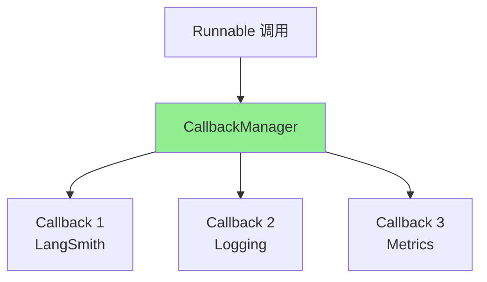

# Ch9｜LangChain 核心模块源码导读

> **本章目标**：精读 LangChain 4 个核心模块的源码——`BaseChatModel`、`BaseRetriever`、`OutputParser`、Callback 系统。读完后，你能在 1 小时内"摸清"任何一个 LangChain 子模块的设计。

## 引入：为什么要"读源码"

Ch8 我们学了 LCEL 的用法——**`|` 运算符**。但真正要解决生产问题，**必须懂源码**。

来看 3 个真实场景：

1. **限流时怎么自动 fallback？** 看完 `BaseChatModel._stream_with_retry` 就懂了
2. **检索结果怎么带分数？** 看完 `BaseRetriever._get_relevant_documents` 就懂了
3. **JSON 输出怎么自动重试？** 看完 `RetryOutputParser` 就懂了

**读源码不是"炫技"——是"省时间"**。一次精读，省下无数次 Stack Overflow 搜索。

读完本章，你将：

- 精读 `BaseChatModel` 源码，理解 LLM 调用 + 流式 + 重试
- 精读 `BaseRetriever` 源码，理解检索抽象
- 精读 `OutputParser` 源码，理解解析与重试
- 理解 Callback 事件总线的工作原理

---

## 9.1 `BaseChatModel`：LLM 调用的核心

### 9.1.1 核心结构

> 📖 **源码解读**：`langchain_core.language_models.BaseChatModel`
> 文件：`libs/core/langchain_core/language_models/chat_models.py`
> 
> **抽象目标**：把"调用 LLM"这件事封装成统一的 Runnable，同时支持同步/异步/流式/批量。

### 9.1.2 4 个核心方法

```python
class BaseChatModel(Runnable):
    """所有 Chat Model 的基类"""

    def _generate(self, messages, stop=None, run_manager=None, **kwargs) -> ChatResult:
        """子类必须实现：实际调 LLM API"""
        raise NotImplementedError

    async def _agenerate(self, messages, stop=None, run_manager=None, **kwargs) -> ChatResult:
        """异步版本，默认调同步版"""
        return await run_in_executor(self._generate, messages, stop, run_manager, **kwargs)

    def _stream(self, messages, stop=None, run_manager=None, **kwargs) -> Iterator[ChatGenerationChunk]:
        """流式：默认攒齐所有 chunk 再返回"""
        # 实际子类（如 ChatOpenAI）会用真正的 SSE 流
        raise NotImplementedError

    def invoke(self, input, config=None, **kwargs) -> BaseMessage:
        """统一入口"""
        # 1. 解析输入（字符串 → messages）
        # 2. 调 _generate
        # 3. 处理 callback
        # 4. 返回 AIMessage
        ...
```

### 9.1.3 `ChatOpenAI._stream` 实战

```python
class ChatOpenAI(BaseChatModel):
    def _stream(self, messages, stop=None, run_manager=None, **kwargs):
        """OpenAI 的真实流式实现"""
        # 1. 调 OpenAI API
        response = self.client.chat.completions.create(
            model=self.model_name,
            messages=[m.dict() for m in messages],
            stream=True,
        )
        # 2. 处理每个 chunk
        for chunk in response:
            # 3. 触发 callback
            if run_manager:
                run_manager.on_llm_new_token(chunk.choices[0].delta.content or "")
            # 4. yield chunk
            yield ChatGenerationChunk(
                message=AIMessageChunk(content=chunk.choices[0].delta.content or ""),
                generation_info={"finish_reason": chunk.choices[0].finish_reason},
            )
```

**关键点**：

- ✅ `run_manager.on_llm_new_token()` 触发 callback
- ✅ 用 `yield` 实现流式
- ✅ `AIMessageChunk` 是 AIMessage 的子集，**支持增量拼接**

### 9.1.4 重试机制

```python
from tenacity import retry, stop_after_attempt, wait_exponential

class ChatOpenAI(BaseChatModel):
    @retry(
        stop=stop_after_attempt(3),
        wait=wait_exponential(multiplier=1, min=4, max=10),
    )
    def _completion_with_retry(self, **kwargs):
        return self.client.chat.completions.create(**kwargs)
```

**Tenacity 装饰器**：

- `stop_after_attempt(3)`：最多重试 3 次
- `wait_exponential`：指数退避（4s, 8s, 10s）
- **自动处理** 429/500 等可重试错误

### 9.1.5 简化版实现

```python
from openai import OpenAI
from langchain_core.messages import AIMessage, HumanMessage, SystemMessage
from langchain_core.outputs import ChatResult, ChatGeneration


class SimpleChatModel:
    def __init__(self, model="gpt-4o-mini"):
        self.model = model
        self.client = OpenAI()

    def invoke(self, messages: list, config=None) -> AIMessage:
        """统一入口"""
        # 1. 转换消息格式
        openai_messages = [self._convert(m) for m in messages]
        # 2. 调 OpenAI
        response = self.client.chat.completions.create(
            model=self.model,
            messages=openai_messages,
        )
        # 3. 返回 AIMessage
        return AIMessage(content=response.choices[0].message.content)

    def _convert(self, message):
        """把 LangChain 消息转 OpenAI 消息"""
        if isinstance(message, HumanMessage):
            return {"role": "user", "content": message.content}
        if isinstance(message, AIMessage):
            return {"role": "assistant", "content": message.content}
        if isinstance(message, SystemMessage):
            return {"role": "system", "content": message.content}
        raise ValueError(f"Unknown message type: {type(message)}")
```

---

## 9.2 `BaseRetriever`：检索的抽象

### 9.2.1 核心结构

> 📖 **源码解读**：`langchain_core.retrievers.BaseRetriever`
> 文件：`libs/core/langchain_core/retrievers.py`
> 
> **抽象目标**：把"检索"抽象成统一接口，支持同步/异步，**任意数据源都能接入**。

### 9.2.2 核心方法

```python
class BaseRetriever(Runnable):
    """所有 Retriever 的基类"""

    def _get_relevant_documents(self, query, *, run_manager) -> list[Document]:
        """子类必须实现：实际检索"""
        raise NotImplementedError

    async def _aget_relevant_documents(self, query, *, run_manager) -> list[Document]:
        """异步版"""
        return await run_in_executor(self._get_relevant_documents, query, run_manager=run_manager)

    def invoke(self, input, config=None, **kwargs) -> list[Document]:
        # 自动处理 Runnable 的所有特性
        return self._get_relevant_documents(input, run_manager=CallbackManager(...))
```

### 9.2.3 3 种内置 Retriever

**1. VectorStoreRetriever（向量检索）**

```python
class VectorStoreRetriever(BaseRetriever):
    vectorstore: VectorStore
    search_kwargs: dict = Field(default_factory=dict)

    def _get_relevant_documents(self, query, *, run_manager):
        return self.vectorstore.similarity_search(query, **self.search_kwargs)
```

**2. BM25Retriever（关键词检索）**

```python
class BM25Retriever(BaseRetriever):
    def _get_relevant_documents(self, query, *, run_manager):
        # 用 rank_bm25 算 BM25 分数
        tokenized_query = query.split()
        scores = self.bm25.get_scores(tokenized_query)
        # Top-K
        top_indices = sorted(range(len(scores)), key=lambda i: -scores[i])[:self.k]
        return [self.documents[i] for i in top_indices]
```

**3. EnsembleRetriever（混合检索）**

```python
class EnsembleRetriever(BaseRetriever):
    retrievers: list[BaseRetriever]
    weights: list[float]

    def _get_relevant_documents(self, query, *, run_manager):
        # 1. 每路检索
        all_results = [r.invoke(query) for r in self.retrievers]
        # 2. RRF 融合
        scores = {}
        for results, weight in zip(all_results, self.weights):
            for rank, doc in enumerate(results, 1):
                key = doc.page_content
                scores[key] = scores.get(key, 0) + weight / (60 + rank)
        # 3. 排序
        sorted_docs = sorted(scores.items(), key=lambda x: -x[1])
        return [Document(page_content=k) for k, _ in sorted_docs[:self.k]]
```

### 9.2.4 实战：自定义 Retriever

```python
from langchain_core.retrievers import BaseRetriever
from langchain_core.documents import Document


class KeywordRetriever(BaseRetriever):
    """基于关键词的简单检索器"""

    documents: list[Document]
    k: int = 4

    def _get_relevant_documents(self, query, *, run_manager):
        # 简单的关键词匹配 + 计数
        query_words = set(query.split())
        scored = []
        for doc in self.documents:
            doc_words = set(doc.page_content.split())
            overlap = len(query_words & doc_words)
            if overlap > 0:
                scored.append((overlap, doc))
        scored.sort(reverse=True)
        return [doc for _, doc in scored[:self.k]]
```

---

## 9.3 `OutputParser`：解析 + 重试

### 9.3.1 核心抽象

> 📖 **源码解读**：`langchain_core.output_parsers.BaseOutputParser`
> 文件：`libs/core/langchain_core/output_parsers/base.py`
> 
> **抽象目标**：把 LLM 的原始输出转成结构化数据。**支持自动重试**。

### 9.3.2 3 个核心方法

```python
class BaseOutputParser(Runnable, ABC):
    def parse(self, text: str) -> T:
        """子类必须实现：从文本中解析"""
        raise NotImplementedError

    def parse_with_prompt(self, completion, prompt) -> T:
        """带 prompt 的解析（用于重试时给出更明确的指令）"""
        return self.parse(completion)

    def invoke(self, input, config=None, **kwargs) -> T:
        # 统一入口
        if isinstance(input, BaseMessage):
            return self.parse(input.content)
        return self.parse(input)
```

### 9.3.3 3 个常用 Parser

**1. StrOutputParser（最简单）**

```python
class StrOutputParser(BaseOutputParser):
    def parse(self, text):
        return text  # 原样返回
```

**2. JsonOutputParser（JSON 解析）**

```python
class JsonOutputParser(BaseOutputParser):
    pydantic_object: type[BaseModel] | None = None

    def parse(self, text):
        text = text.strip()
        # 提取 ```json ... ``` 块
        match = re.search(r"```(?:json)?\s*(\{.*?\})\s*```", text, re.DOTALL)
        if match:
            text = match.group(1)
        data = json.loads(text)
        if self.pydantic_object:
            return self.pydantic_object(**data)
        return data
```

**3. PydanticOutputParser（强类型）**

```python
class PydanticOutputParser(JsonOutputParser):
    pydantic_object: type[BaseModel]

    def get_format_instructions(self) -> str:
        schema = self.pydantic_object.model_json_schema()
        return f"请按以下 JSON Schema 输出：\n{json.dumps(schema, indent=2, ensure_ascii=False)}"
```

### 9.3.4 RetryOutputParser：自动重试

```python
class RetryOutputParser(BaseOutputParser):
    parser: BaseOutputParser
    max_retries: int = 3

    def parse_with_prompt(self, completion, prompt):
        """解析失败时重试"""
        for attempt in range(self.max_retries):
            try:
                return self.parser.parse(completion)
            except (json.JSONDecodeError, ValidationError) as e:
                if attempt == self.max_retries - 1:
                    raise
                # 把错误信息加到 prompt，重新调 LLM
                new_prompt = prompt + f"\n\n上次输出有误：{e}\n请重新输出。"
                completion = llm.invoke(new_prompt)
```

### 9.3.5 实战：自定义解析器

```python
from langchain_core.output_parsers import BaseOutputParser


class ListOutputParser(BaseOutputParser):
    """解析 LLM 的列表输出"""

    def parse(self, text: str) -> list[str]:
        # 期望格式：- item1\n- item2\n- item3
        lines = text.strip().split("\n")
        items = []
        for line in lines:
            line = line.strip()
            if line.startswith("- "):
                items.append(line[2:])
            elif line.startswith("* "):
                items.append(line[2:])
        return items


# 使用
parser = ListOutputParser()
print(parser.invoke("- Apple\n- Banana\n- Cherry"))
# ['Apple', 'Banana', 'Cherry']
```

---

## 9.4 Callback 事件总线

### 9.4.1 核心设计



**核心组件**：

- `CallbackManager`：事件分发中心
- `BaseCallbackHandler`：具体处理逻辑
- `RunManager`：单次运行的状态

### 9.4.2 10+ 个事件钩子

```python
class BaseCallbackHandler:
    """所有 callback 钩子"""

    # Chain 生命周期
    def on_chain_start(self, serialized, inputs, **kwargs): ...
    def on_chain_end(self, outputs, **kwargs): ...
    def on_chain_error(self, error, **kwargs): ...

    # LLM 生命周期
    def on_llm_start(self, serialized, prompts, **kwargs): ...
    def on_llm_new_token(self, token, **kwargs): ...  # 每个 token
    def on_llm_end(self, response, **kwargs): ...
    def on_llm_error(self, error, **kwargs): ...

    # Tool 生命周期
    def on_tool_start(self, serialized, input_str, **kwargs): ...
    def on_tool_end(self, output, **kwargs): ...
    def on_tool_error(self, error, **kwargs): ...

    # Retriever 生命周期
    def on_retriever_start(self, serialized, query, **kwargs): ...
    def on_retriever_end(self, documents, **kwargs): ...
    def on_retriever_error(self, error, **kwargs): ...
```

### 9.4.3 自定义 Callback

```python
class TokenCounterCallback(BaseCallbackHandler):
    """记录 Token 使用量"""
    total_tokens = 0

    def on_llm_end(self, response, **kwargs):
        if hasattr(response, "llm_output") and response.llm_output:
            usage = response.llm_output.get("token_usage", {})
            self.total_tokens += usage.get("total_tokens", 0)
            print(f"本调用 Token: {usage}")


callback = TokenCounterCallback()
chain.invoke({"topic": "AI"}, config={"callbacks": [callback]})
print(f"总 Token: {callback.total_tokens}")
```

### 9.4.4 LangSmith 集成

```python
import os
os.environ["LANGCHAIN_TRACING_V2"] = "true"
os.environ["LANGCHAIN_API_KEY"] = "..."

# 之后所有 chain.invoke 都会自动追踪
# 在 https://smith.langchain.com 查看
```

### 9.4.5 实战：自定义 Metrics Callback

```python
class MetricsCallback(BaseCallbackHandler):
    """记录每个组件的延迟和成功率"""
    metrics = []

    def on_chain_start(self, serialized, inputs, run_id, **kwargs):
        self._start_times = {**getattr(self, "_start_times", {}), run_id: time.time()}

    def on_chain_end(self, outputs, run_id, **kwargs):
        start = self._start_times.pop(run_id, None)
        if start:
            self.metrics.append({
                "type": "chain",
                "name": "unknown",
                "latency": time.time() - start,
                "success": True,
            })

    def on_chain_error(self, error, run_id, **kwargs):
        self.metrics.append({
            "type": "chain",
            "name": "unknown",
            "error": str(error),
            "success": False,
        })
```

---

## 9.5 真实案例：用源码解决生产问题

### 9.5.1 问题 1：限流自动 fallback

读完 `BaseChatModel._completion_with_retry` 后，我们写了：

```python
primary_llm = ChatOpenAI(model="gpt-4o", max_retries=2)
fallback_llm = ChatOpenAI(model="gpt-4o-mini", max_retries=1)

chain = primary_chain.with_fallbacks([fallback_chain])
# 主模型限流 → 自动切到 gpt-4o-mini
```

### 9.5.2 问题 2：JSON 解析自动重试

```python
from langchain_core.output_parsers import RetryOutputParser
from langchain.output_parsers import PydanticOutputParser
from pydantic import BaseModel


class UserInfo(BaseModel):
    name: str
    age: int


parser = RetryOutputParser(parser=PydanticOutputParser(pydantic_object=UserInfo), max_retries=3)

# 自动重试 + 自动修正 prompt
```

### 9.5.3 问题 3：Token 实时统计

```python
class CostCallback(BaseCallbackHandler):
    total_cost = 0
    pricing = {"gpt-4o": (2.5, 10.0), "gpt-4o-mini": (0.15, 0.6)}  # /1M tokens

    def on_llm_end(self, response, **kwargs):
        usage = response.llm_output.get("token_usage", {})
        model = response.llm_output.get("model_name", "gpt-4o")
        in_p, out_p = self.pricing.get(model, self.pricing["gpt-4o"])
        cost = (usage.get("prompt_tokens", 0) * in_p +
                usage.get("completion_tokens", 0) * out_p) / 1_000_000
        self.total_cost += cost
```

---

## 9.6 小结与思考

### 3 个核心 takeaway

1. **`BaseChatModel` 是 LLM 调用的核心**——`_generate` / `_stream` / 重试机制（tenacity）。`ChatOpenAI._stream` 用 yield 实现流式。
2. **`BaseRetriever` 是检索的抽象**——3 个内置实现（Vector/BM25/Ensemble），自定义只需实现 `_get_relevant_documents`。
3. **Callback 是可观测性的基础**——10+ 个事件钩子，**LangSmith 自动埋点**。

### 速查表

| 模块 | 核心方法 | 文件 |
|---|---|---|
| BaseChatModel | `_generate` / `_stream` | `language_models/chat_models.py` |
| BaseRetriever | `_get_relevant_documents` | `retrievers.py` |
| BaseOutputParser | `parse` | `output_parsers/base.py` |
| BaseCallbackHandler | `on_*_start/end/error` | `callbacks/base.py` |
| tenacity | 装饰器实现重试 | 第三方库 |
| LangSmith | 自动追踪 | 商业产品 |

### 思考题

- ★ 阅读 `ChatOpenAI._stream` 源码，画出它的"流式"数据流图
- ★★ 实现一个自定义 `Retriever`，用 Elasticsearch 做后端
- ★★★ 实现一个 `CostControlCallback`，当总成本超过 $1 时抛出异常

下一章（Ch10）我们讲 LangGraph——**LangChain 的下一代 Agent 框架**。
