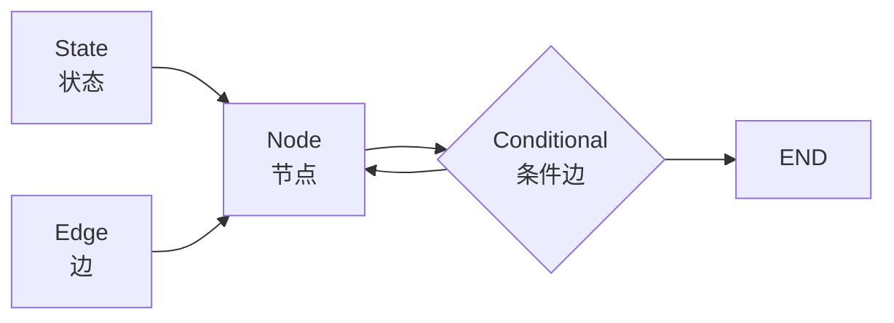
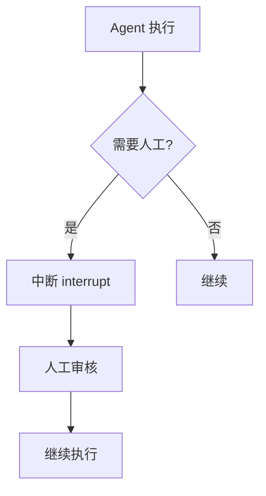
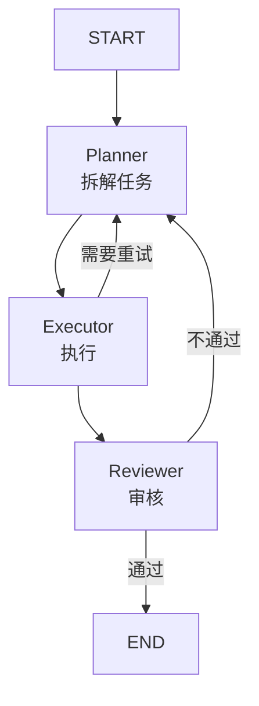

# Ch10｜LangGraph 状态图与有状态 Agent

> **本章目标**：深入 LangGraph——LangChain 团队推出的"下一代 Agent 框架"。读完后，你能用 StateGraph 构建支持循环、人机协作、持久化的生产级 Agent。

## 引入：为什么 LangChain 团队要"自创新框架"

2024 年 1 月，LangChain 团队发布 LangGraph 0.1——一个**专门为有状态 Agent 设计的框架**。它的诞生是因为 LangChain 的 Chain 抽象**有 3 个根本限制**：

1. **不能循环**——Chain 是 DAG（有向无环图），没法表达"循环执行直到完成"
2. **没有持久化**——Chain 状态不存盘，重启就丢
3. **难做人机协作**——"审核后再继续"这种模式很难实现

**LangGraph 的解法**：

- ✅ **真正的图**——支持环、条件分支、并行
- ✅ **Checkpointer**——状态可持久化、可恢复
- ✅ **Human-in-the-Loop**——内置 `interrupt()` API
- ✅ **Pregel 执行模型**——来自 Google 的图计算引擎

**LangGraph 在 2025 年成为 LangChain 官方推荐的 Agent 框架**。Ch1 的 L2（ReAct）实现就是 LangGraph 的 `create_react_agent`。

读完本章，你将：

- 理解 StateGraph 的 5 个核心概念
- 用 StateGraph 实现"计划 → 执行 → 审核 → 重试"
- 掌握 Checkpointer 和人机协作
- 读懂 Pregel 执行模型的源码

---

## 10.1 5 个核心概念



| 概念 | 作用 | 类比 |
|---|---|---|
| **State** | 整个图共享的状态（dict） | Redux store |
| **Node** | 接收 State，返回 State 更新 | Redux reducer |
| **Edge** | 节点之间的固定连接 | DAG 的有向边 |
| **Conditional Edge** | 运行时决定下一个节点 | if-else |
| **Checkpointer** | 状态持久化 | 数据库事务 |

### 10.1.1 State：图的"共享状态"

```python
from typing import TypedDict, Annotated
from langgraph.graph.message import add_messages


class AgentState(TypedDict):
    """Agent 的状态"""
    messages: Annotated[list, add_messages]  # 自动合并消息
    # 其他字段
    iterations: int
    final_answer: str | None
```

**关键**：`Annotated[list, add_messages]` 表示 messages 列表**用 `add_messages` 函数自动合并**（而不是覆盖）。

### 10.1.2 Node：状态变更函数

```python
def call_llm(state: AgentState) -> dict:
    """调 LLM"""
    response = model.invoke(state["messages"])
    return {"messages": [response]}  # 返回部分更新

def should_continue(state: AgentState) -> str:
    """决定下一步"""
    last = state["messages"][-1]
    if hasattr(last, "tool_calls") and last.tool_calls:
        return "tools"
    return END
```

**Node 函数的规则**：

- ✅ 接收完整 State
- ✅ 返回**部分更新**（只写改动的字段）
- ✅ 不修改原 State

### 10.1.3 Edge：节点之间的连接

```python
from langgraph.graph import StateGraph, START, END

graph = StateGraph(AgentState)

# 加节点
graph.add_node("agent", call_llm)
graph.add_node("tools", tool_node)

# 加边
graph.add_edge(START, "agent")  # 起点
graph.add_edge("tools", "agent")  # 工具 → 回 agent
graph.add_conditional_edges("agent", should_continue, {
    "tools": "tools",
    END: END,
})
```

### 10.1.4 Conditional Edge：条件路由

```python
def route(state: AgentState) -> str:
    """根据 state 决定下一步"""
    if state["iterations"] > 5:
        return "max_iter"
    if state["approved"]:
        return "execute"
    return "plan"

graph.add_conditional_edges("supervisor", route, {
    "plan": "planner",
    "execute": "executor",
    "max_iter": "max_iter_handler",
})
```

### 10.1.5 Checkpointer：状态持久化

```python
from langgraph.checkpoint import MemorySaver
from langgraph.checkpoint.postgres import PostgresSaver

# 内存版（开发）
memory = MemorySaver()

# Postgres 版（生产）
postgres = PostgresSaver.from_conn_string("postgresql://...")

# 编译时传入
app = graph.compile(checkpointer=postgres)

# 调用时指定 thread_id
config = {"configurable": {"thread_id": "user_123"}}
result = app.invoke({"messages": [...]}, config)

# 恢复：同一 thread_id
result2 = app.invoke({"messages": [...]}, config)
# 会接着上次的 state 继续
```

---

## 10.2 第一个 LangGraph

### 10.2.1 完整代码

```python
from typing import TypedDict, Annotated
from langgraph.graph import StateGraph, START, END
from langgraph.graph.message import add_messages
from langgraph.prebuilt import ToolNode
from langchain_openai import ChatOpenAI
from langchain_core.tools import tool


# 1. State
class State(TypedDict):
    messages: Annotated[list, add_messages]
    iterations: int


# 2. 工具
@tool
def get_weather(city: str) -> str:
    """查询天气"""
    return f"{city} 25°C"


@tool
def calculator(expression: str) -> str:
    """计算数学表达式"""
    return str(eval(expression, {"__builtins__": {}}, {}))


tools = [get_weather, calculator]


# 3. LLM
llm = ChatOpenAI(model="gpt-4o-mini").bind_tools(tools)


# 4. Node
def call_llm(state: State) -> dict:
    response = llm.invoke(state["messages"])
    return {
        "messages": [response],
        "iterations": state.get("iterations", 0) + 1,
    }


# 5. 路由
def should_continue(state: State) -> str:
    if state["iterations"] > 10:
        return END
    last = state["messages"][-1]
    if hasattr(last, "tool_calls") and last.tool_calls:
        return "tools"
    return END


# 6. 构图
graph = StateGraph(State)
graph.add_node("agent", call_llm)
graph.add_node("tools", ToolNode(tools))

graph.add_edge(START, "agent")
graph.add_conditional_edges("agent", should_continue, {
    "tools": "tools",
    END: END,
})
graph.add_edge("tools", "agent")

# 7. 编译
app = graph.compile()

# 8. 调用
result = app.invoke({"messages": [("human", "上海天气")], "iterations": 0})
print(result["messages"][-1].content)
```

### 10.2.2 图的可视化

```python
# 在 Jupyter 中可视化
from IPython.display import Image
Image(app.get_graph().draw_png())
```

---

## 10.3 Checkpointer 与状态恢复

### 10.3.1 3 种 Checkpointer

| 类型 | 持久化 | 性能 | 适用 |
|---|---|---|---|
| MemorySaver | ❌ | 极快 | 开发 |
| SqliteSaver | ✅ | 中 | 单机 |
| PostgresSaver | ✅ | 中 | 生产 |
| RedisSaver | ✅ | 极快 | 高频 |

### 10.3.2 实战：可恢复的 Agent

```python
from langgraph.checkpoint import MemorySaver

memory = MemorySaver()
app = graph.compile(checkpointer=memory)

# 第一次调用
config = {"configurable": {"thread_id": "user_001"}}
result1 = app.invoke(
    {"messages": [("human", "开始任务")]},
    config,
)
print(result1["messages"][-1].content)

# 模拟崩溃后恢复
# 用同一 thread_id 调用
result2 = app.invoke(
    {"messages": [("human", "继续任务")]},
    config,
)
# 会接着上次的状态
```

### 10.3.3 State 的 get_state 方法

```python
# 获取当前状态快照
state = app.get_state(config)
print(state.values)  # 完整 state
print(state.next)  # 下一步要执行的节点
print(state.config)  # 配置
```

### 10.3.4 时间旅行调试

```python
# 获取所有历史 checkpoint
for state in app.get_state_history(config):
    print(f"Step {state.config['configurable']['checkpoint_id']}: {state.values['messages'][-1].content}")
```

---

## 10.4 Human-in-the-Loop

### 10.4.1 3 种 HITL 模式



### 10.4.2 模式 1：审批（Approve/Reject）

```python
from langgraph.types import interrupt, Command
from langgraph.graph import StateGraph, START, END


def sensitive_tool_node(state: State) -> dict:
    """敏感操作前中断"""
    if not state.get("approved"):
        # 中断，等待人工
        decision = interrupt({
            "question": f"是否批准执行 {state['pending_action']}?",
            "options": ["approve", "reject"],
        })
        if decision == "approve":
            return {"approved": True}
        else:
            return {"messages": [AIMessage(content="用户拒绝")]}

    # 执行
    return {"messages": [...]}
```

### 10.4.3 模式 2：编辑（Edit）

```python
def edit_node(state: State) -> dict:
    """让人类编辑 LLM 输出"""
    edited = interrupt({
        "question": "请编辑 LLM 的输出：",
        "current_output": state["messages"][-1].content,
    })
    return {"messages": [AIMessage(content=edited)]}
```

### 10.4.4 模式 3：多轮对话

```python
def multi_turn_node(state: State) -> dict:
    """需要人类提供多轮输入"""
    while not state.get("complete"):
        user_input = interrupt("请提供更多信息：")
        # 处理 user_input
        ...
    return {"complete": True}
```

### 10.4.5 实战：审批流

```python
import uuid
from langgraph.checkpoint.memory import MemorySaver


def main():
    memory = MemorySaver()
    app = graph.compile(checkpointer=memory, interrupt_before=["tools"])

    config = {"configurable": {"thread_id": str(uuid.uuid4())}}

    # 第一次调用：到 tools 前中断
    result = app.invoke({"messages": [("human", "转账 1000 元")]}, config)

    # 人工审核
    print("Agent 准备执行：", result["messages"][-1])
    user_decision = input("批准? (y/n): ")

    if user_decision == "y":
        # 批准，继续执行
        result = app.invoke(None, config)
        print("完成:", result["messages"][-1])
    else:
        print("已取消")
```

---

## 10.5 源码解读：Pregel 执行模型

### 10.5.1 什么是 Pregel

**Pregel** 是 Google 的图计算引擎（用于 PageRank 等）。LangGraph 借鉴了它的设计：

- ✅ 每轮（"superstep"）并行执行所有激活的节点
- ✅ 节点之间通过消息传递
- ✅ 状态在每轮结束后统一更新

### 10.5.2 核心循环

```python
# LangGraph 的内部循环（简化版）
def run(self, input, config):
    state = input
    while True:
        # 1. 找出当前活跃的节点
        active_nodes = self.get_active_nodes(state)

        if not active_nodes:
            break  # 全部到 END

        # 2. 并行执行所有活跃节点
        updates = {}
        for node in active_nodes:
            updates[node] = self.nodes[node](state)

        # 3. 合并更新到 state
        state = self.apply_updates(state, updates)

        # 4. 保存 checkpoint
        self.checkpointer.save(state, config)

    return state
```

### 10.5.3 关键设计

**设计 1：节点并行执行**

```python
# 在一个 superstep 中，所有 active node 并行执行
# 这是为什么 LangGraph 支持 "Map-Reduce" 模式
```

**设计 2：状态原子更新**

```python
# 所有节点执行完才更新 state
# 避免 race condition
```

**设计 3：Checkpoint 在每步后**

```python
# 每步都保存 checkpoint
# 崩溃后可恢复
```

### 10.5.4 简化版 StateGraph

```python
class SimpleStateGraph:
    def __init__(self, state_type):
        self.nodes = {}
        self.edges = []
        self.conditional_edges = {}
        self.state_type = state_type

    def add_node(self, name, func):
        self.nodes[name] = func

    def add_edge(self, src, dst):
        self.edges.append((src, dst))

    def add_conditional_edges(self, src, condition, mapping):
        self.conditional_edges[src] = (condition, mapping)

    def compile(self):
        return CompiledGraph(self.nodes, self.edges, self.conditional_edges)


class CompiledGraph:
    def __init__(self, nodes, edges, conditional_edges):
        self.nodes = nodes
        self.edges = edges
        self.conditional_edges = conditional_edges

    def invoke(self, state):
        current = "START"
        while current != "END":
            # 执行节点
            if current != "START":
                update = self.nodes[current](state)
                state = {**state, **update}

            # 找下一步
            if current in self.conditional_edges:
                condition, mapping = self.conditional_edges[current]
                next_node = condition(state)
                current = mapping[next_node]
            else:
                # 固定边
                next_edge = next((d for s, d in self.edges if s == current), "END")
                current = next_edge

        return state
```

---

## 10.6 实战：完整的 LangGraph Agent

### 10.6.1 目标

构建一个**支持计划-执行-审核-重试**的 Agent。



### 10.6.2 完整代码

```python
from typing import TypedDict, Annotated
from langgraph.graph import StateGraph, START, END
from langgraph.graph.message import add_messages
from langgraph.checkpoint import MemorySaver


class PlanState(TypedDict):
    """完整的 plan-execute-review 状态"""
    goal: str
    plan: list[str]
    current_step: int
    results: list[str]
    approved: bool
    iterations: int
    final_answer: str | None


# 节点
def planner(state: PlanState) -> dict:
    """规划：把目标拆成步骤"""
    if not state.get("plan"):
        prompt = f"把目标 '{state['goal']}' 拆成 3-5 个步骤。只输出步骤列表，每行一个。"
        response = llm.invoke(prompt)
        plan = [line.strip() for line in response.content.split("\n") if line.strip()]
        return {"plan": plan, "current_step": 0, "iterations": 0}
    return {}


def executor(state: PlanState) -> dict:
    """执行：执行当前步骤"""
    step = state["plan"][state["current_step"]]
    # 调 LLM 执行这一步
    response = llm.invoke(f"执行这个任务：{step}\n基于之前的结果：{state['results']}")
    new_results = state["results"] + [response.content]
    return {
        "results": new_results,
        "current_step": state["current_step"] + 1,
    }


def reviewer(state: PlanState) -> dict:
    """审核：检查结果质量"""
    all_done = state["current_step"] >= len(state["plan"])
    if not all_done:
        return {}

    final_result = "\n".join(state["results"])
    prompt = f"""审核以下任务结果是否完成目标。

目标：{state['goal']}
结果：
{final_result}

回答 PASS 或 FAIL，并简要说明。"""
    response = llm.invoke(prompt)

    approved = "PASS" in response.content
    return {
        "approved": approved,
        "iterations": state.get("iterations", 0) + 1,
        "final_answer": final_result if approved else None,
    }


# 路由
def should_continue(state: PlanState) -> str:
    if state.get("final_answer"):
        return "end"
    if state.get("iterations", 0) > 3:
        return "max"
    return "replan"


# 构图
graph = StateGraph(PlanState)
graph.add_node("planner", planner)
graph.add_node("executor", executor)
graph.add_node("reviewer", reviewer)

graph.add_edge(START, "planner")
graph.add_edge("planner", "executor")
graph.add_edge("executor", "reviewer")
graph.add_conditional_edges("reviewer", should_continue, {
    "end": END,
    "replan": "planner",
    "max": END,
})

memory = MemorySaver()
app = graph.compile(checkpointer=memory)

# 调用
config = {"configurable": {"thread_id": "task_001"}}
result = app.invoke({"goal": "分析 Q3 财报", "plan": [], "current_step": 0, "results": []}, config)
print(result["final_answer"])
```

---

## 10.7 小结与思考

### 3 个核心 takeaway

1. **LangGraph 解决 LangChain 3 大限制**：循环、持久化、人机协作。**StateGraph + Node + Edge** 是核心抽象。
2. **Checkpointer 让 Agent 有"记忆"**——PostgresSaver 是生产标配。**同一 thread_id 即可恢复**。
3. **Pregel 执行模型**：每轮并行执行活跃节点，原子更新 state，**支持 time-travel 调试**。

### 速查表

| 概念 | 速记 |
|---|---|
| State | TypedDict + Annotated[list, add_messages] |
| Node | 接收 state，返回部分更新 |
| Edge | 固定连接 / 条件路由 |
| Conditional Edge | add_conditional_edges(name, condition, mapping) |
| Checkpointer | MemorySaver / PostgresSaver |
| thread_id | 同一 ID 即可恢复 |
| interrupt | Human-in-the-Loop |
| Command | interrupt 后传回决策 |
| Pregel | Google 图计算引擎，LangGraph 借鉴 |
| get_state | 获取当前状态 |
| get_state_history | 时间旅行调试 |

### 思考题

- ★ 用 LangGraph 重新实现 Ch4 的 5 工具 Agent
- ★★ 实现一个"先审批后执行"的转账 Agent（用 interrupt）
- ★★★ 阅读 LangGraph `PregelLoop` 源码，理解 superstep 的实现

下一章（Ch11）我们讲 LlamaIndex——**另一个主流 RAG 框架**。
