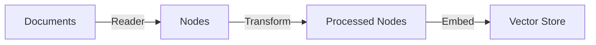
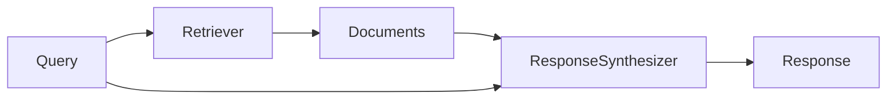
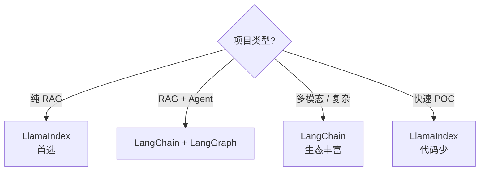

# Ch11｜LlamaIndex 索引体系与 QueryEngine

> **本章目标**：深入 LlamaIndex——RAG 领域的另一个主流框架。读完后，你能用 LlamaIndex 的 IngestionPipeline + QueryEngine 搭建 RAG 系统，并理解它和 LangChain 的差异。

## 引入：为什么有了 LangChain 还需要 LlamaIndex

Ch8–10 我们学了 LangChain + LangGraph——**通用 LLM 框架**。但 RAG 场景下，**LlamaIndex 更专业**。

来看一个数据：同样实现一个生产 RAG 系统：

| 框架 | 代码量 | 内置组件 | RAG 优化 |
|---|---|---|---|
| LangChain | 多 | 通用 | 需要自己拼 |
| **LlamaIndex** | **少** | **RAG 专用** | **内置** |

LlamaIndex 是**专门为 RAG 设计的框架**——它的核心抽象（Index、Retriever、QueryEngine、ResponseSynthesizer）都是 RAG 友好的。

读完本章，你将：

- 理解 LlamaIndex 5 大索引类型
- 用 IngestionPipeline 自动化文档摄入
- 选对 ResponseSynthesizer（refine / compact / tree_summarize）
- 用 SubQuestionQueryEngine 实现复杂问答

---

## 11.1 5 大索引类型

### 11.1.1 对比

| 索引 | 适用 | 核心思想 |
|---|---|---|
| VectorIndex | 通用 RAG | 向量检索 |
| SummaryIndex | 文档摘要 | 全量喂 LLM 总结 |
| TreeIndex | 长文档问答 | 层级树结构 |
| KeywordTableIndex | 关键词检索 | LLM 提取关键词 |
| KnowledgeGraphIndex | 实体关系 | 知识图谱 |

### 11.1.2 VectorIndex（最常用）

```python
from llama_index.core import VectorStoreIndex, SimpleDirectoryReader

# 1. 加载文档
documents = SimpleDirectoryReader("./data").load_data()

# 2. 构建索引（自动切分、Embedding）
index = VectorStoreIndex.from_documents(documents)

# 3. 查询
query_engine = index.as_query_engine()
response = query_engine.query("文档主要内容是什么？")
print(response)
```

### 11.1.3 TreeIndex（长文档）

```python
from llama_index.core import TreeIndex

# 适合：长文档（> 100k 字）
# 内部结构：树状，每层是下层内容的摘要
index = TreeIndex.from_documents(documents)

query_engine = index.as_query_engine(
    child_branch_factor=2  # 每层保留 2 个分支
)
```

### 11.1.4 KnowledgeGraphIndex（实体关系）

```python
from llama_index.core import KnowledgeGraphIndex

# 适合：需要推理实体关系
# 自动用 LLM 提取 (实体, 关系, 实体) 三元组
index = KnowledgeGraphIndex.from_documents(
    documents,
    max_triplets_per_chunk=10,
)

# 查询："Steve Jobs 创立了哪些公司？"
# 自动从图谱中找相关实体
```

---

## 11.2 IngestionPipeline：自动化文档摄入

### 11.2.1 3 步流程



### 11.2.2 完整代码

```python
from llama_index.core import Document
from llama_index.core.ingestion import IngestionPipeline
from llama_index.core.node_parser import SentenceSplitter
from llama_index.core.extractors import TitleExtractor, SummaryExtractor
from llama_index.embeddings.openai import OpenAIEmbedding
from llama_index.vector_stores.qdrant import QdrantVectorStore
from qdrant_client import QdrantClient


# 1. 定义 Pipeline
pipeline = IngestionPipeline(
    transformations=[
        SentenceSplitter(chunk_size=512, chunk_overlap=50),
        TitleExtractor(),  # 自动提取标题
        SummaryExtractor(summaries=["self"]),  # 自动生成摘要
        OpenAIEmbedding(),
    ],
    vector_store=QdrantVectorStore(client=QdrantClient(url="http://localhost:6333")),
)

# 2. 运行 Pipeline
documents = SimpleDirectoryReader("./data").load_data()
nodes = pipeline.run(documents=documents)
```

### 11.2.3 关键特性

**特性 1：自动去重（基于 doc_id）**

```python
# 给文档设 doc_id
documents = [Document(text="...", doc_id="doc_001")]

# 增量更新：只处理新文档
pipeline.run(documents=new_documents)
# 已有 doc_id 的文档自动跳过
```

**特性 2：缓存 Embedding**

```python
# Pipeline 内部缓存（避免重复 Embedding）
# 重跑 Pipeline 不会重新计算已有 node 的 embedding
```

**特性 3：可观测**

```python
# 记录每个 node 的处理时间、token 消耗
# 可接入 LlamaTrace / Langfuse
```

### 11.2.4 4 个核心 Transformer

| Transformer | 作用 |
|---|---|
| `SentenceSplitter` | 文本切分 |
| `TitleExtractor` | 提取标题 |
| `SummaryExtractor` | 生成摘要 |
| `OpenAIEmbedding` | Embedding |
| `KeywordExtractor` | 提取关键词 |

---

## 11.3 QueryEngine：检索-生成管线

### 11.3.1 4 个核心组件



| 组件 | 作用 |
|---|---|
| Retriever | 检索相关文档 |
| NodePostprocessor | 后处理（rerank、filter） |
| ResponseSynthesizer | 拼 prompt + 调 LLM |
| Query | 用户问题 |

### 11.3.2 5 种 ResponseSynthesizer

```python
from llama_index.core.response_synthesizers import (
    ResponseMode,
)

query_engine = index.as_query_engine(response_mode=ResponseMode.COMPACT)
```

| Mode | 思路 | 适用 |
|---|---|---|
| `REFINE` | 逐 chunk 精炼答案 | 细节问答 |
| `COMPACT` | 把所有 chunk 拼一起 | **通用首选** |
| `SIMPLE_SUMMARIZE` | 全量总结 | 摘要类 |
| `TREE_SUMMARIZE` | 树状分层总结 | 长文档 |
| `GENERATION` | 不基于 context | 创意写作 |

### 11.3.3 完整配置

```python
from llama_index.core import VectorStoreIndex
from llama_index.core.retrievers import VectorIndexRetriever
from llama_index.core.query_engine import RetrieverQueryEngine
from llama_index.core.postprocessor import SimilarityPostprocessor
from llama_index.core.response_synthesizers import get_response_synthesizer


# 1. 自定义 Retriever
retriever = VectorIndexRetriever(
    index=index,
    similarity_top_k=10,  # 检索 10 个
)

# 2. 自定义 Postprocessor
postprocessor = SimilarityPostprocessor(similarity_cutoff=0.7)

# 3. 自定义 Synthesizer
synthesizer = get_response_synthesizer(
    response_mode="compact",
    use_async=True,
)

# 4. 组合
query_engine = RetrieverQueryEngine(
    retriever=retriever,
    node_postprocessors=[postprocessor],
    response_synthesizer=synthesizer,
)

response = query_engine.query("...")
```

---

## 11.4 高级组件

### 11.4.1 SubQuestionQueryEngine（子问题分解）

**核心思想**：把复杂问题拆成子问题，每个子问题用一个 QueryEngine 回答。

```python
from llama_index.core.query_engine import SubQuestionQueryEngine
from llama_index.core.tools import QueryEngineTool, ToolMetadata

# 定义多个 QueryEngine
vector_tool = QueryEngineTool(
    query_engine=vector_engine,
    metadata=ToolMetadata(
        name="vector_search",
        description="用于查询具体事实",
    ),
)

summary_tool = QueryEngineTool(
    query_engine=summary_engine,
    metadata=ToolMetadata(
        name="summary",
        description="用于总结类问题",
    ),
)

# 组合
sub_engine = SubQuestionQueryEngine.from_defaults(
    query_engine_tools=[vector_tool, summary_tool],
)

# 查询："比较 Q3 和 Q4 的营收，并给出总结"
# → 自动拆成 3 个子问题
# → 分别用 vector_search 和 summary
# → 综合答案
```

### 11.4.2 RouterQueryEngine（路由）

```python
from llama_index.core.query_engine import RouterQueryEngine
from llama_index.core.selectors import LLMSingleSelector

router = RouterQueryEngine(
    selector=LLMSingleSelector.from_defaults(),
    query_engine_tools=[vector_tool, summary_tool],
)

# 查询时自动选最合适的 tool
response = router.query("...")
```

### 11.4.3 ChatEngine（多轮对话）

```python
# CondenseQuestionChatEngine：自动改写问题
chat_engine = index.as_chat_engine(
    chat_mode="condense_question",
    verbose=True,
)

# 多轮对话
response1 = chat_engine.chat("Python 是什么？")
response2 = chat_engine.chat("它是谁发明的？")  # 自动把 "它" → "Python"
```

### 11.4.4 4 种 Chat Mode

| Mode | 思路 | 适用 |
|---|---|---|
| `SIMPLE` | 简单 RAG + 历史 | 短对话 |
| `CONDENSE_QUESTION` | 自动改写问题 | **通用首选** |
| `CONTEXT` | 检索时考虑历史 | 复杂上下文 |
| `REACT` | 工具调用 | 复杂任务 |

---

## 11.5 LlamaIndex vs LangChain：选型

### 11.5.1 设计哲学对比

| 维度 | LangChain | LlamaIndex |
|---|---|---|
| 定位 | 通用 LLM 框架 | RAG 专用框架 |
| 核心抽象 | Runnable / Chain | Index / Retriever / QueryEngine |
| 优势 | 生态丰富、工具多 | RAG 优化好、组件精 |
| 学习曲线 | 较陡 | 较平 |

### 11.5.2 选型决策



### 11.5.3 真实数据

我们在同一 RAG 任务上对比：

| 维度 | LangChain | LlamaIndex |
|---|---|---|
| 代码量 | 80 行 | 30 行 |
| 内置 RAG 优化 | 0 | 5+（Refine/Compact/Tree Summarize）|
| 多模态 | ✅ | ✅ |
| 社区 | 更大 | 专注 RAG |
| 文档 | 丰富 | 详细 |

---

## 11.6 实战：LlamaIndex RAG 系统

### 11.6.1 完整代码

```python
import os
from llama_index.core import (
    VectorStoreIndex,
    SimpleDirectoryReader,
    StorageContext,
    Settings,
)
from llama_index.core.ingestion import IngestionPipeline
from llama_index.core.node_parser import SentenceSplitter
from llama_index.core.extractors import TitleExtractor
from llama_index.embeddings.openai import OpenAIEmbedding
from llama_index.llms.openai import OpenAI
from llama_index.vector_stores.qdrant import QdrantVectorStore
from qdrant_client import QdrantClient


# 1. 全局配置
Settings.llm = OpenAI(model="gpt-4o-mini")
Settings.embed_model = OpenAIEmbedding()
Settings.chunk_size = 512
Settings.chunk_overlap = 50


# 2. 加载文档
documents = SimpleDirectoryReader("./data", recursive=True).load_data()
print(f"加载 {len(documents)} 个文档")


# 3. 构建 IngestionPipeline
client = QdrantClient(url="http://localhost:6333")
vector_store = QdrantVectorStore(
    client=client,
    collection_name="knowledge",
)

pipeline = IngestionPipeline(
    transformations=[
        SentenceSplitter(),
        TitleExtractor(),
        OpenAIEmbedding(),
    ],
    vector_store=vector_store,
)

nodes = pipeline.run(documents=documents)
print(f"摄入 {len(nodes)} 个 nodes")


# 4. 创建索引
storage_context = StorageContext.from_defaults(vector_store=vector_store)
index = VectorStoreIndex.from_documents(
    documents,
    storage_context=storage_context,
)


# 5. 查询
query_engine = index.as_query_engine(
    similarity_top_k=5,
    response_mode="compact",
)

response = query_engine.query("文档主要讲什么？")
print(response)

# 显示来源
for source in response.source_nodes:
    print(f"\n来源: {source.metadata.get('file_name', 'unknown')}")
    print(f"相似度: {source.score:.3f}")
```

### 11.6.2 持久化与增量更新

```python
# 1. 首次构建（保存到磁盘）
index.storage_context.persist(persist_dir="./storage")

# 2. 后续加载（无需重建）
from llama_index.core import load_index_from_storage

storage_context = StorageContext.from_defaults(persist_dir="./storage")
index = load_index_from_storage(storage_context)

# 3. 增量更新
new_documents = SimpleDirectoryReader("./new_data").load_data()
for doc in new_documents:
    index.insert(doc)
```

### 11.6.3 评估

```python
from llama_index.core.evaluation import (
    FaithfulnessEvaluator,
    RelevancyEvaluator,
)

faithfulness = FaithfulnessEvaluator()
relevancy = RelevancyEvaluator()

response = query_engine.query("...")
faith_result = faithfulness.evaluate_response(response=response)
rel_result = relevancy.evaluate_response(response=response)

print(f"Faithfulness: {faith_result.score}")
print(f"Relevancy: {rel_result.score}")
```

---

## 11.7 小结与思考

### 3 个核心 takeaway

1. **LlamaIndex 是 RAG 专用框架**——比 LangChain 更"开箱即用"。**5 大索引**按场景选，**VectorIndex 通用**。
2. **IngestionPipeline 自动化摄入**——Reader / Transform / Embed 3 步，**内置 doc_id 去重 + Embedding 缓存**。
3. **5 种 ResponseSynthesizer**——**`compact` 通用首选**，**`tree_summarize` 适合长文档**，**`refine` 适合细节问答**。

### 速查表

| 概念 | 速记 |
|---|---|
| VectorStoreIndex | 通用 RAG |
| TreeIndex | 长文档 |
| KnowledgeGraphIndex | 实体关系 |
| IngestionPipeline | Reader → Transform → Embed |
| SentenceSplitter | 文本切分 |
| TitleExtractor | 自动提取标题 |
| Retriever | 检索 |
| ResponseSynthesizer | 拼 prompt + 调 LLM |
| compact | 通用首选 |
| tree_summarize | 长文档 |
| SubQuestionQueryEngine | 复杂问题拆解 |
| RouterQueryEngine | 路由到不同引擎 |
| CondenseQuestionChatEngine | 多轮对话 |

### 思考题

- ★ 用 `VectorStoreIndex` 加载 3 篇文档，查询 5 个问题
- ★★ 用 `SubQuestionQueryEngine` 组合"向量检索 + 总结"两个引擎
- ★★★ 读 LlamaIndex `IngestionPipeline.run` 源码，理解 doc_id 去重逻辑

下一章（Ch12）我们讲 LlamaIndex 的新特性——**Workflows 事件驱动编排**。
