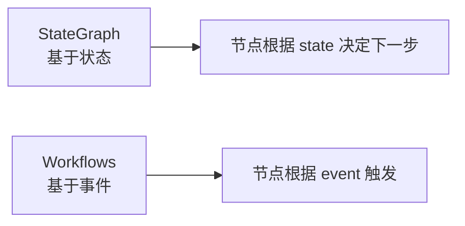
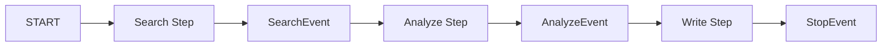

# Ch12｜LlamaIndex Workflows：事件驱动编排

> **本章目标**：掌握 LlamaIndex Workflows——一种**用事件驱动**写 Agent 的新范式。读完后，你能用 `@step` 装饰器写流式、可中断的复杂 Agent。

## 引入：为什么需要"事件驱动"

Ch10 讲了 LangGraph 的 StateGraph——**基于状态 + 节点**的图模型。LlamaIndex 2024 年推出的 **Workflows** 走了一条不同的路——**事件驱动**。



**核心差异**：

- **StateGraph**：写 `should_continue()` 函数决定下一步
- **Workflows**：写"我关心什么事件"，事件发生自动触发

事件驱动的优势：

- ✅ **更直观**：业务流程就是"事件流"
- ✅ **天然支持流式**：每步都可以 yield 给客户端
- ✅ **易测试**：每个 step 是独立函数

读完本章，你将：

- 理解 Workflow 的 3 个核心概念（Step、Event、Context）
- 写一个支持流式输出 + 中断恢复的 Workflow
- 和 LangGraph 横向对比，明白选哪个

---

## 12.1 3 个核心概念

### 12.1.1 Step

**Step 是 Workflow 的基本单元**——一个 Python 函数，用 `@step` 装饰。

```python
from llama_index.core.workflow import (
    StartEvent,
    StopEvent,
    Workflow,
    step,
)


class MyWorkflow(Workflow):
    @step
    async def my_step(self, ev: StartEvent) -> StopEvent:
        # 处理逻辑
        return StopEvent(result="done")
```

**规则**：

- ✅ 接收一个 Event，返回一个 Event
- ✅ async 函数
- ✅ 可以读/写 Context

### 12.1.2 Event

**Event 是 Step 之间传递的"消息"**。

```python
from llama_index.core.workflow import Event
from llama_index.core.workflow.events import StartEvent, StopEvent


# 自定义事件
class QueryEvent(Event):
    query: str
    user_id: str


class ResultEvent(Event):
    answer: str
    sources: list[str]
```

**事件链**：`StartEvent → Step1 → Event1 → Step2 → ... → StopEvent`

### 12.1.3 Context

**Context 用来在 Step 之间共享状态**。

```python
@step
async def step_one(self, ev: StartEvent, ctx: Context) -> None:
    # 写 context
    await ctx.set("key", "value")
    # 读 context
    val = await ctx.get("key")
```

**Context 比 StateGraph 的 State 更轻量**——只存"临时变量"，不强制 schema。

---

## 12.2 第一个 Workflow

### 12.2.1 完整代码

```python
from llama_index.core.workflow import (
    Context,
    Event,
    StartEvent,
    StopEvent,
    Workflow,
    step,
)
from openai import OpenAI
import os

client = OpenAI(api_key=os.getenv("OPENAI_API_KEY"))


# 自定义事件
class ResearchEvent(Event):
    topic: str
    findings: list[str] = []


class WritingEvent(Event):
    topic: str
    findings: list[str]


# Workflow
class ResearchWorkflow(Workflow):
    @step
    async def research(self, ctx: Context, ev: StartEvent) -> ResearchEvent:
        """研究阶段"""
        topic = ev.topic
        # 模拟研究
        findings = [f"关于 {topic} 的资料 1", f"关于 {topic} 的资料 2"]
        await ctx.set("findings", findings)
        return ResearchEvent(topic=topic, findings=findings)

    @step
    async def write(self, ctx: Context, ev: ResearchEvent) -> StopEvent:
        """写作阶段"""
        findings = ev.findings
        prompt = f"基于以下资料写一段关于 {ev.topic} 的文章：\n\n" + "\n".join(findings)
        response = client.chat.completions.create(
            model="gpt-4o-mini",
            messages=[{"role": "user", "content": prompt}],
        )
        return StopEvent(result=response.choices[0].message.content)


# 运行
wf = ResearchWorkflow()
result = await wf.run(topic="AI Agent")
print(result)
```

### 12.2.2 流式运行

```python
# 流式：边运行边返回事件
async for event in wf.run_stream(topic="AI Agent"):
    print(event)
    if isinstance(event, StopEvent):
        print("最终结果:", event.result)
```

**这是 Workflows 最大的优势**——**天然支持流式**。

---

## 12.3 复杂 Workflow：研究助手

### 12.3.1 多步流程



### 12.3.2 完整代码

```python
import asyncio
from llama_index.core.workflow import (
    Context,
    Event,
    StartEvent,
    StopEvent,
    Workflow,
    step,
)
from openai import OpenAI
import os

client = OpenAI(api_key=os.getenv("OPENAI_API_KEY"))


class ResearchEvent(Event):
    query: str
    search_results: list[str] = []


class AnalysisEvent(Event):
    query: str
    search_results: list[str]
    analysis: str = ""


class ResearchWorkflow(Workflow):
    @step
    async def search(self, ctx: Context, ev: StartEvent) -> ResearchEvent:
        """搜索阶段"""
        query = ev.query
        # 真实场景调搜索 API
        results = [
            f"搜索结果 1：关于 {query}",
            f"搜索结果 2：{query} 的最新进展",
        ]
        await ctx.set("search_results", results)
        return ResearchEvent(query=query, search_results=results)

    @step
    async def analyze(self, ctx: Context, ev: ResearchEvent) -> AnalysisEvent:
        """分析阶段"""
        prompt = f"分析以下资料的要点：\n\n" + "\n".join(ev.search_results)
        response = client.chat.completions.create(
            model="gpt-4o-mini",
            messages=[{"role": "user", "content": prompt}],
        )
        return AnalysisEvent(
            query=ev.query,
            search_results=ev.search_results,
            analysis=response.choices[0].message.content,
        )

    @step
    async def write_report(self, ctx: Context, ev: AnalysisEvent) -> StopEvent:
        """写报告阶段"""
        prompt = f"""基于以下分析写一份完整的研究报告：

主题：{ev.query}
资料：
{chr(10).join(ev.search_results)}
分析：
{ev.analysis}

要求：结构清晰、有数据、有结论。
"""
        response = client.chat.completions.create(
            model="gpt-4o-mini",
            messages=[{"role": "user", "content": prompt}],
        )
        return StopEvent(result=response.choices[0].message.content)


# 运行
async def main():
    wf = ResearchWorkflow(timeout=120)
    result = await wf.run(query="RAG 的最新进展")
    print(result)

asyncio.run(main())
```

### 12.3.3 流式 + 实时输出

```python
async def main_streaming():
    wf = ResearchWorkflow(timeout=120)
    async for event in wf.run_stream(query="RAG 的最新进展"):
        if isinstance(event, ResearchEvent):
            print(f"\n[搜索] 找到 {len(event.search_results)} 条资料")
        elif isinstance(event, AnalysisEvent):
            print(f"\n[分析] {event.analysis[:100]}...")
        elif isinstance(event, StopEvent):
            print(f"\n[报告] {event.result}")

asyncio.run(main_streaming())
```

**输出**：
```
[搜索] 找到 2 条资料

[分析] RAG 领域近期出现几个新趋势：Advanced RAG...

[报告] # RAG 最新进展报告...
```

---

## 12.4 高级特性

### 12.4.1 多步并行

```python
@step
async def parallel_search(self, ctx: Context, ev: StartEvent) -> ParallelEvent:
    """并行触发多个搜索"""
    queries = ["RAG 进展", "Agent 框架", "Embedding 模型"]
    # 用 asyncio.gather 并行
    tasks = [self.search_one(q) for q in queries]
    results = await asyncio.gather(*tasks)
    return ParallelEvent(results=results)
```

### 12.4.2 循环

```python
@step
async def iterative_refine(self, ctx: Context, ev: StartEvent) -> StopEvent | RefineEvent:
    """循环改进直到满意"""
    quality = await ctx.get("quality", 0)
    if quality > 0.9:
        return StopEvent(result=await ctx.get("output"))

    # 改进
    new_output = await self.refine(await ctx.get("output"))
    new_quality = await self.evaluate(new_output)
    await ctx.set("output", new_output)
    await ctx.set("quality", new_quality)
    return RefineEvent(...)  # 触发下一轮
```

### 12.4.3 Human-in-the-Loop

```python
@step
async def wait_for_approval(self, ctx: Context, ev: DraftEvent) -> StopEvent | RefineEvent:
    """等待人工审核"""
    draft = ev.draft
    # 在生产中，这里会中断并等待
    approval = input(f"\n[审核] 草稿：\n{draft}\n\n批准? (y/n): ")
    if approval == "y":
        return StopEvent(result=draft)
    else:
        feedback = input("修改意见: ")
        return RefineEvent(draft=draft, feedback=feedback)
```

### 12.4.4 Checkpointing

```python
from llama_index.core.workflow import Context


# Workflow 自带 checkpoint
wf = ResearchWorkflow()
ctx = Context(wf)

# 第一次运行
result = await wf.run(query="...", ctx=ctx)

# 恢复（手动管理 state）
# TODO: 待 LlamaIndex 完善
```

---

## 12.5 源码解读：@step 装饰器

### 12.5.1 抽象目标

> 📖 **源码解读**：`@step` 装饰器
> 文件：`llama_index/core/workflow/decorators.py`
> 
> **抽象目标**：把普通 async 函数变成 Workflow 的 Step

### 12.5.2 核心实现（简化版）

```python
def step(func):
    """把函数变成 Workflow Step"""
    func._is_step = True
    return func


class Workflow:
    def __init__(self):
        # 自动收集所有 @step 标记的方法
        self._steps = {
            name: method
            for name, method in inspect.getmembers(self, predicate=inspect.iscoroutinefunction)
            if getattr(method, "_is_step", False)
        }

    async def run(self, **kwargs):
        # 启动事件
        ev = StartEvent(**kwargs)
        ctx = Context(self)
        # 找接受 StartEvent 的 step
        current_step = self._find_step_for_event(StartEvent)
        # 执行
        return await self._run_step(current_step, ev, ctx)
```

### 3.5.3 事件分发

```python
async def _run_step(self, step_name, event, ctx):
    """执行一个 step，根据返回值找下一个 step"""
    new_event = await self._steps[step_name](event, ctx)

    if isinstance(new_event, StopEvent):
        return new_event.result

    # 找接受这个 Event 的 step
    next_step = self._find_step_for_event(type(new_event))
    return await self._run_step(next_step, new_event, ctx)
```

### 12.5.4 设计权衡

**优势**：

- ✅ 简单直观，**像写普通代码**
- ✅ 天然支持流式（`run_stream`）
- ✅ type hints 决定路由

**劣势**：

- ❌ **Checkpointer 不完善**（vs LangGraph 的 PostgresSaver）
- ❌ **可视化工具少**（vs LangGraph 的 draw_png）
- ❌ **生态较新**，bug 较多

---

## 12.6 Workflows vs LangGraph 选型

| 维度 | LangGraph | LlamaIndex Workflows |
|---|---|---|
| 范式 | 状态图 | 事件驱动 |
| 流式 | 部分支持 | **原生支持** |
| Checkpointer | **完善（PostgresSaver）** | 弱 |
| 可视化 | **draw_png** | 弱 |
| 学习曲线 | 较陡 | 较平 |
| 生态成熟度 | **高** | 较低（2024 才 GA）|
| RAG 集成 | 通过 LangChain | **原生** |

**选型建议**：

- **纯 RAG + 流式** → LlamaIndex Workflows
- **复杂 Agent + 持久化** → LangGraph
- **不确定** → 选 LangGraph（生态成熟）

---

## 12.7 小结与思考

### 3 个核心 takeaway

1. **Workflows = 事件驱动**——Step 处理 Event，通过 Context 共享状态。**`@step` 装饰器**让普通函数变成 step。
2. **天然支持流式**——`run_stream()` 边运行边 yield 事件，**比 LangGraph 流式更优雅**。
3. **Checkpointer 弱、生态新**——生产级复杂 Agent **优先 LangGraph**，**简单 RAG + 流式**用 Workflows。

### 速查表

| 概念 | 速记 |
|---|---|
| @step | 装饰器把函数变 step |
| StartEvent | 起点 |
| StopEvent | 终点 |
| Event | 自定义事件 |
| Context | 共享状态 |
| run() | 一次性运行 |
| run_stream() | 流式运行 |
| 事件路由 | type hint 决定 |

### 思考题

- ★ 写一个 2 步的 Workflow：`search → summarize`
- ★★ 用 Workflows 实现"循环改进"模式：生成 → 评估 → 重试
- ★★★ 对比 Workflows 和 LangGraph 在"流式 Agent"场景下的实现差异

下一章（Ch13）我们横向对比 **AutoGen / CrewAI / OpenAI Swarm** 三大多 Agent 框架。
