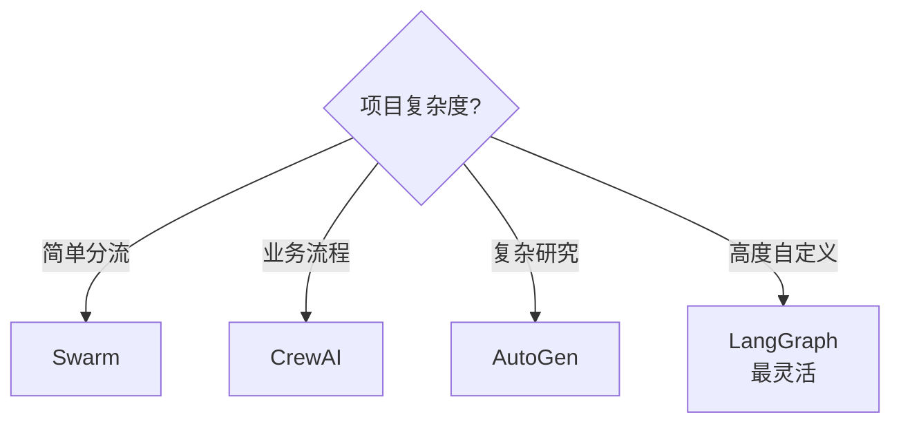

# Ch13｜多 Agent 框架对比：AutoGen / CrewAI / OpenAI Swarm

> **本章目标**：横向对比 3 个多 Agent 框架。读完后，你能根据项目需求选最合适的框架，并能用 AutoGen / CrewAI 实现一个多 Agent 系统。

## 引入：3 个框架，3 种哲学

2024 年，多 Agent 框架爆发。3 个最值得关注的：

| 框架 | 推出 | 核心思想 | 学习曲线 |
|---|---|---|---|
| **AutoGen** | 2023.8 (微软) | 对话驱动的 Agent | 中 |
| **CrewAI** | 2023.11 | 角色分工的 Crew | **低** |
| **OpenAI Swarm** | 2024.10 | 极简的 Handoff | **极低** |

**核心差异**：

- **AutoGen** = 灵活的对话，**程序员控制少**（LLM 决定下一步）
- **CrewAI** = 角色明确，**Process 控制协作**（sequential / hierarchical）
- **Swarm** = 极简的 handoff，**只有几十行核心代码**

读完本章，你将：

- 横向对比 3 个框架
- 用 AutoGen 实现 GroupChat
- 用 CrewAI 实现 Crew
- 明白各自的最佳场景

---

## 13.1 AutoGen：对话驱动

### 13.1.1 核心概念

```python
from autogen import ConversableAgent, UserProxyAgent, GroupChat, GroupChatManager


# 两个 Agent
assistant = ConversableAgent(
    name="assistant",
    llm_config={"model": "gpt-4o-mini"},
    system_message="你是一个 helpful 的助手。",
)

user_proxy = UserProxyAgent(
    name="user_proxy",
    code_execution_config={"use_docker": False},
    human_input_mode="TERMINATE",  # 让人类参与
)

# 让两个 Agent 对话
assistant.initiate_chat(
    user_proxy,
    message="帮我写一个 Python 排序函数",
)
```

### 13.1.2 GroupChat：多 Agent 群聊

```python
# 定义 3 个 Agent
researcher = ConversableAgent("researcher", llm_config=llm_config, system_message="你是研究员")
writer = ConversableAgent("writer", llm_config=llm_config, system_message="你是作家")
critic = ConversableAgent("critic", llm_config=llm_config, system_message="你是评论家")

# 群聊
groupchat = GroupChat(
    agents=[researcher, writer, critic],
    messages=[],
    max_round=10,
)
manager = GroupChatManager(groupchat=groupchat, llm_config=llm_config)

# 启动
user_proxy.initiate_chat(
    manager,
    message="研究 AI Agent 框架的最新进展，写一份报告",
)
```

### 13.1.3 选下一个说话的人

```python
def custom_speaker_selection(last_speaker, groupchat):
    """自定义选下一个说话的人"""
    if last_speaker is researcher:
        return writer
    elif last_speaker is writer:
        return critic
    elif last_speaker is critic:
        return None  # 结束
    return researcher


groupchat = GroupChat(
    agents=[researcher, writer, critic],
    speaker_selection_method="custom",
    speaker_selection_func=custom_speaker_selection,
)
```

### 13.1.4 AutoGen 的优势与劣势

**优势**：

- ✅ 灵活，**LLM 控制流程**
- ✅ 支持工具调用、代码执行
- ✅ 微软背书，长期维护

**劣势**：

- ❌ 流程**不可预测**（LLM 决定）
- ❌ 调试困难
- ❌ 代码组织松散

---

## 13.2 CrewAI：角色分工

### 13.2.1 核心概念

```python
from crewai import Agent, Task, Crew, Process


# 1. 定义 Agent
researcher = Agent(
    role="研究员",
    goal="找出关于 {topic} 的最新资料",
    backstory="你是一个有 10 年经验的研究员",
    tools=[search_tool],  # 工具
    llm=ChatOpenAI(model="gpt-4o-mini"),
)

writer = Agent(
    role="作家",
    goal="基于研究资料写一篇文章",
    backstory="你是一个资深技术作家",
    llm=ChatOpenAI(model="gpt-4o-mini"),
)


# 2. 定义 Task
research_task = Task(
    description="研究 {topic} 的最新进展",
    expected_output="3 条关键信息",
    agent=researcher,
)

writing_task = Task(
    description="基于研究写 500 字文章",
    expected_output="完整文章",
    agent=writer,
    context=[research_task],  # 依赖 researcher 的结果
)


# 3. 组合
crew = Crew(
    agents=[researcher, writer],
    tasks=[research_task, writing_task],
    process=Process.sequential,  # 顺序执行
)

# 4. 运行
result = crew.kickoff(inputs={"topic": "AI Agent"})
print(result)
```

### 13.2.2 Hierarchical Process（层级式）

```python
crew = Crew(
    agents=[researcher, writer, editor],
    tasks=[research_task, writing_task, editing_task],
    process=Process.hierarchical,  # 自动选举 manager
    manager_llm=ChatOpenAI(model="gpt-4o"),
)
```

**Manager LLM 自动分配任务**——比 sequential 灵活，比 AutoGen 可控。

### 13.2.3 CrewAI 的优势与劣势

**优势**：

- ✅ 概念清晰，**Role/Task/Crew/Process 4 件套**
- ✅ 学习曲线低
- ✅ 内置 hierarchical 模式

**劣势**：

- ❌ 灵活性不如 AutoGen
- ❌ Process 模式有限（sequential / hierarchical）

---

## 13.3 OpenAI Swarm：极简 Handoff

### 13.3.1 核心思想

**Swarm = 只有 2 个概念**：

- **Agent**：处理特定任务
- **Handoff**：把对话"交接"给另一个 Agent

### 13.3.2 完整代码

```python
from swarm import Swarm, Agent
from openai import OpenAI

client = OpenAI()
swarm = Swarm(client)


def transfer_to_sales():
    return sales_agent


def transfer_to_support():
    return support_agent


triage_agent = Agent(
    name="Triage Agent",
    instructions="你是分流 Agent，根据用户问题决定转给 sales 还是 support",
    functions=[transfer_to_sales, transfer_to_support],
)

sales_agent = Agent(
    name="Sales Agent",
    instructions="你是销售 Agent，回答产品购买问题",
)

support_agent = Agent(
    name="Support Agent",
    instructions="你是客服 Agent，回答使用问题",
)

# 运行
response = swarm.run(
    agent=triage_agent,
    messages=[{"role": "user", "content": "我想买你们的产品"}],
)
print(response.messages[-1]["content"])
```

**核心机制**：Agent 通过 `function call` 触发 `transfer_to_xxx` → 切换 Agent。

### 13.3.3 Swarm 的优势与劣势

**优势**：

- ✅ **极简**，核心代码 200 行
- ✅ 来自 OpenAI 官方
- ✅ 容易扩展

**劣势**：

- ❌ 功能少（没有 RAG / 复杂 Process）
- ❌ 仍是实验性

---

## 13.4 横向对比

### 13.4.1 5 维度对比

| 维度 | AutoGen | CrewAI | Swarm |
|---|---|---|---|
| 学习曲线 | 中 | **低** | 极低 |
| 灵活性 | **极高** | 中 | 低 |
| 可控性 | 低 | **高** | 中 |
| 生态 | 丰富 | 增长中 | 极简 |
| 文档 | 详细 | **详细** | 简略 |
| 适用 | 复杂研究 | 业务流程 | 简单分流 |

### 13.4.2 选型决策



### 13.4.3 真实数据

| 框架 | 启动到第一个 demo | 多 Agent 调试难度 | 生产案例数 |
|---|---|---|---|
| Swarm | 30 分钟 | 中 | 少 |
| CrewAI | 2 小时 | **低** | 多 |
| AutoGen | 4 小时 | **高** | 较多 |
| LangGraph | 1 天 | 中 | **多** |

---

## 13.5 源码解读：AutoGen GroupChat

### 13.5.1 核心机制

> 📖 **源码解读**：`autogen.GroupChat`
> 文件：`autogen/agentchat/groupchat.py`
> 
> **抽象目标**：让多个 Agent 在一个"群聊"中协作，自动选择下一个发言者

### 13.5.2 选人策略

```python
def select_speaker(self, last_speaker, groupchat):
    """AutoGen 默认选人策略"""
    # 1. 如果有"指定下一个"，用之
    if groupchat.next_speaker:
        return groupchat.next_speaker

    # 2. 用 LLM 选
    # 把所有 agent 列表 + 历史消息喂给 LLM
    # 让 LLM 决定下一个发言者
    messages = groupchat.messages
    agents = groupchat.agents

    # 拼 prompt
    prompt = f"以下 Agent：{[a.name for a in agents]}\n历史：{messages}\n下一个发言者是谁？"

    response = llm.invoke(prompt)
    # 解析 LLM 输出
    return self._parse_speaker(response, agents)
```

### 13.5.3 简化版实现

```python
class SimpleGroupChat:
    def __init__(self, agents, max_round=10):
        self.agents = agents
        self.max_round = max_round
        self.messages = []

    def select_next_speaker(self, last_speaker):
        """默认：轮询"""
        idx = (self.agents.index(last_speaker) + 1) % len(self.agents)
        return self.agents[idx]

    def run(self, initial_message):
        self.messages.append({"role": "user", "content": initial_message})
        current = self.agents[0]  # 第一个 agent 开始

        for round in range(self.max_round):
            response = current.generate_reply(self.messages)
            self.messages.append({"role": "assistant", "name": current.name, "content": response})
            current = self.select_next_speaker(current)
            if current is None:
                break
        return self.messages
```

---

## 13.6 实战：用 CrewAI 实现"研究员 + 作家 + 编辑"

### 13.6.1 完整代码

```python
import os
from crewai import Agent, Task, Crew, Process
from crewai_tools import SerperDevTool, WebsiteSearchTool
from langchain_openai import ChatOpenAI


# 1. 工具
search_tool = SerperDevTool(api_key=os.getenv("SERPER_API_KEY"))


# 2. 3 个 Agent
researcher = Agent(
    role="高级研究员",
    goal="找出关于 {topic} 的最新、最权威的资料",
    backstory="""你是 10 年经验的研究员，
    擅长从海量资料中提炼核心观点。""",
    tools=[search_tool],
    llm=ChatOpenAI(model="gpt-4o"),
    verbose=True,
)

writer = Agent(
    role="技术作家",
    goal="基于研究资料写出清晰、有深度的文章",
    backstory="""你是资深技术作家，
    文风：清晰、有条理、举例丰富。""",
    llm=ChatOpenAI(model="gpt-4o"),
    verbose=True,
)

editor = Agent(
    role="资深编辑",
    goal="审核文章质量，发现问题并给出修改建议",
    backstory="""你是 20 年经验的编辑，擅长发现
    事实错误、逻辑漏洞、表达不清。""",
    llm=ChatOpenAI(model="gpt-4o"),
    verbose=True,
)


# 3. 3 个 Task
research_task = Task(
    description="""研究主题：{topic}

要求：
1. 找到至少 5 条权威资料
2. 提炼 3 个核心观点
3. 引用源 URL""",
    expected_output="结构化资料清单（含 URL、核心观点、关键数据）",
    agent=researcher,
)

writing_task = Task(
    description="""基于研究资料撰写文章。

要求：
- 1500-2000 字
- 结构：引言 / 核心观点 / 案例 / 结论
- 引用所有资料来源""",
    expected_output="完整文章 markdown 文本",
    agent=writer,
    context=[research_task],
)

editing_task = Task(
    description="""审核文章质量：
1. 事实是否正确
2. 逻辑是否清晰
3. 表达是否通顺
4. 引用是否完整

如有重大问题，写出"修订后版本"；否则直接输出原文。""",
    expected_output="修订后文章或审核通过的原文",
    agent=editor,
    context=[writing_task],
)


# 4. Crew
crew = Crew(
    agents=[researcher, writer, editor],
    tasks=[research_task, writing_task, editing_task],
    process=Process.sequential,
    verbose=2,
)


# 5. 启动
result = crew.kickoff(inputs={"topic": "RAG 技术的最新进展"})
print(result)
```

### 13.6.2 性能数据

| 指标 | 数值 |
|---|---|
| 研究耗时 | ~30s |
| 写作耗时 | ~45s |
| 编辑耗时 | ~20s |
| 总耗时 | ~95s |
| 总 Token | ~25k |
| 总成本 | ~$0.15 |

---

## 13.7 小结与思考

### 3 个核心 takeaway

1. **AutoGen 灵活但难控**——LLM 决定流程，**适合研究类复杂任务**。
2. **CrewAI 角色清晰**——`Role/Task/Crew/Process` 4 件套，**业务流程首选**。
3. **Swarm 极简**——只有 Handoff，**简单分流场景**用。

### 速查表

| 框架 | 核心抽象 | 选型 |
|---|---|---|
| AutoGen | ConversableAgent / GroupChat | 复杂研究 |
| CrewAI | Agent / Task / Crew / Process | 业务流程 |
| Swarm | Agent + Handoff | 简单分流 |
| LangGraph | StateGraph | 高度自定义 |

### 思考题

- ★ 用 Swarm 实现一个 3 Agent 系统：triage → sales / support
- ★★ 用 CrewAI 实现一个"代码 review crew"：developer + reviewer + tester
- ★★★ 读 AutoGen `GroupChatManager` 源码，理解它怎么用 LLM 选下一个发言者

**Part 3 完结**。下一章（Ch14）进入 Part 4——**设计模式篇**。
