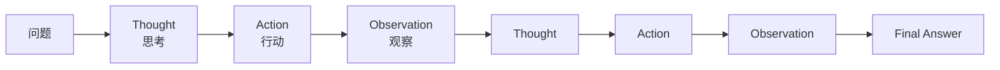
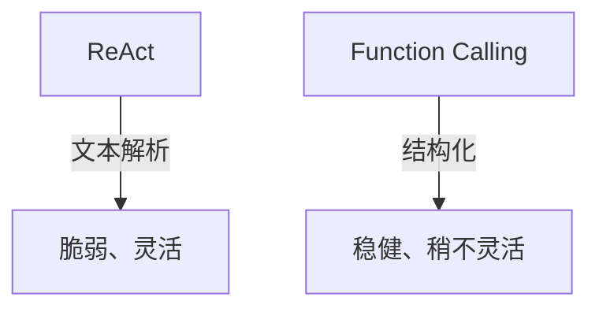

# Ch14｜ReAct：思考-行动循环

> **本章目标**：深入 ReAct 模式——**最经典的 Agent 设计模式**。读完后，你能从 0 实现一个 ReAct Agent，理解它的核心思想和边界。

## 引入：为什么 ReAct 是 Agent 的"hello world"

2022 年 Yao et al. 发表 ReAct 论文——**第一个把"推理"和"行动"结合**的 Agent 模式。它是 Ch1 提到的 L2（ReAct 循环）的理论基础。

**核心思想**：



**Thought-Action-Observation** 循环——LLM 思考→采取行动→观察结果→再思考。

读完本章，你将：

- 理解 ReAct 的核心思想
- 从 0 实现一个 ReAct Agent（不依赖框架）
- 掌握 ReAct 的 3 个变体
- 明白 ReAct 的局限和适用场景

---

## 14.1 ReAct 论文核心

### 14.1.1 论文：ReAct

**作者**：Shunyu Yao et al.
**发表**：2022, ICLR
**标题**：*ReAct: Synergizing Reasoning and Acting in Language Models*

**核心论断**：让 LLM "思考 + 行动" 交替进行，比单独 Chain-of-Thought 推理**更稳健**。

### 14.1.2 完整示例

```
问题：上海今天适合户外运动吗？

Thought 1: 用户想知道上海今天是否适合户外运动。我需要先查天气。
Action 1: get_weather(上海)
Observation 1: 上海今日晴，25°C，湿度 45%

Thought 2: 我有天气信息了。但还需要判断"是否适合户外运动"，我应该综合考虑。
Action 2: None
Final Answer: 上海今天天气晴朗，气温 25°C，湿度 45%，非常适合户外运动。建议注意防晒。
```

**关键**：

- ✅ **Thought 写在 Action 前**——让 LLM 先"想清楚"
- ✅ **Observation 显式回填**——LLM 看得到"工具结果"
- ✅ **循环直到 Final Answer**——自动结束

### 14.1.3 3 种实现形式

**形式 1：文本格式（原始）**

```python
# LLM 输出文本，代码解析
response = """
Thought: 需要查天气
Action: get_weather(上海)
"""
```

**形式 2：Function Calling（推荐）**

```python
# LLM 返回 tool_call
tool_call = {
    "name": "get_weather",
    "arguments": {"city": "上海"}
}
```

**形式 3：结构化输出**

```python
# LLM 返回 JSON
{
    "thought": "需要查天气",
    "action": {"tool": "get_weather", "args": {"city": "上海"}},
    "is_final": False
}
```

---

## 14.2 从 0 实现 ReAct

### 14.2.1 完整代码

```python
import json
import re
import os
from openai import OpenAI

client = OpenAI(api_key=os.getenv("OPENAI_API_KEY"))


# 1. 工具实现
def get_weather(city: str) -> str:
    return f"{city} 25°C 晴"

def calculator(expression: str) -> str:
    return str(eval(expression, {"__builtins__": {}}, {}))

def search_web(query: str) -> str:
    return f"关于 '{query}' 的 3 条结果..."

TOOLS = {
    "get_weather": get_weather,
    "calculator": calculator,
    "search_web": search_web,
}


# 2. System Prompt
SYSTEM_PROMPT = """你是一个 ReAct Agent。

可用工具：
- get_weather(city): 查询天气
- calculator(expression): 计算
- search_web(query): 联网搜索

工作流程：
1. 输出 Thought：说明你的思考
2. 输出 Action：工具名(参数) 或 None
3. 等待 Observation（工具结果）
4. 重复直到能给出 Final Answer

格式示例：
Thought: 需要查天气
Action: get_weather(上海)
"""


# 3. Agent 主体
def react_agent(question: str, max_steps: int = 5) -> str:
    messages = [
        {"role": "system", "content": SYSTEM_PROMPT},
        {"role": "user", "content": question},
    ]

    for step in range(max_steps):
        print(f"\n--- Step {step + 1} ---")
        resp = client.chat.completions.create(
            model="gpt-4o-mini",
            messages=messages,
        ).choices[0].message.content

        messages.append({"role": "assistant", "content": resp})
        print(resp)

        # 解析 Final Answer
        if "Final Answer:" in resp:
            return resp.split("Final Answer:")[-1].strip()

        # 解析 Action
        if "Action:" not in resp:
            return resp  # 没 Action，结束

        try:
            action_line = [l for l in resp.split("\n") if "Action:" in l][0]
            action = action_line.split("Action:")[1].strip()
            if action == "None":
                return resp

            tool_name, arg = action.split("(", 1)
            arg = arg.rstrip(")").strip().strip('"')
        except (IndexError, ValueError) as e:
            return f"[解析失败] {resp}"

        # 执行工具
        if tool_name not in TOOLS:
            observation = f"未知工具: {tool_name}"
        else:
            observation = TOOLS[tool_name](arg)

        print(f"Observation: {observation}")
        messages.append({"role": "user", "content": f"Observation: {observation}"})

    return "[达到最大步数]"


# 4. 运行
if __name__ == "__main__":
    question = "上海今天适合户外运动吗？需要先查天气再判断。"
    print(react_agent(question))
```

### 14.2.2 真实运行示例

**输入**：`"上海今天适合户外运动吗？"`

**输出**：
```
--- Step 1 ---
Thought: 用户想知道上海今天是否适合户外运动。先查天气。
Action: get_weather(上海)
Observation: 上海 25°C 晴

--- Step 2 ---
Thought: 天气信息已获得。现在可以判断了。
Action: None
上海今天天气晴朗，气温 25°C，适合户外运动。
```

---

## 14.3 ReAct 的 3 个变体

### 14.3.1 变体 1：ReAct + Memory

```python
def react_with_memory(question: str, memory: list[dict]) -> str:
    """带历史记忆的 ReAct"""
    history_str = "\n".join(f"{m['role']}: {m['content']}" for m in memory)

    enhanced_prompt = f"""以下是历史对话：
{history_str}

当前问题：{question}
"""
    # 后续同 ReAct
    ...
```

### 14.3.2 变体 2：ReAct + Reflection

```python
def react_with_reflection(question: str) -> str:
    """每步都自我评估"""
    # 1. ReAct 得到结果
    result = react_agent(question)

    # 2. Reflection：让 LLM 评估
    reflection_prompt = f"""评估以下答案的质量（0-10）：

问题：{question}
答案：{result}

如果 < 8，重新回答。"""
    reflection = client.chat.completions.create(...)

    if "score" in reflection.content and int(... ) < 8:
        # 重新跑
        return react_with_reflection(question)
    return result
```

### 14.3.3 变体 3：ReAct + Plan

```python
def react_with_plan(question: str) -> str:
    """先规划，再 ReAct"""
    # 1. Planner 拆解
    plan = planner(question)

    # 2. 逐步 ReAct
    results = []
    for sub_task in plan:
        result = react_agent(sub_task)
        results.append(result)

    # 3. 综合
    return synthesize(results)
```

---

## 14.4 ReAct 的 3 个局限

### 14.4.1 局限 1：长链路"走神"

```python
# 多步任务，ReAct 在 5 步后会"忘记"原目标
# 实际：4 步后准确率开始下降
```

**修复**：用 CoT + 总结（Ch15 Plan-and-Execute 解决）。

### 14.4.2 局限 2：解析脆弱

```python
# 文本解析容易出错：
# "Action: get_weather(上海)"  ✅
# "Action:get_weather(上海)"   ❌ 少空格
# "Action: get_weather(上海 )" ❌ 多空格
```

**修复**：用 Function Calling（Ch4）替代文本格式。

### 14.4.3 局限 3：Token 成本

```python
# 每步都把历史塞进 messages
# 5 步任务，prompt 长度指数增长
```

**修复**：每 N 步做一次摘要。

---

## 14.5 ReAct vs Function Calling



**实战建议**：

- ✅ **新项目用 Function Calling 实现 ReAct**（最稳健）
- ✅ 老项目 / 早期开源模型用 ReAct 文本格式
- ❌ 不要混用

### 14.5.1 用 Function Calling 实现 ReAct

```python
from openai import OpenAI

client = OpenAI()

TOOLS = [
    {
        "type": "function",
        "function": {
            "name": "get_weather",
            "description": "查询天气",
            "parameters": {
                "type": "object",
                "properties": {"city": {"type": "string"}},
                "required": ["city"],
            },
        },
    },
]


def react_fc(question: str, max_steps: int = 5) -> str:
    """用 Function Calling 实现的 ReAct"""
    messages = [{"role": "user", "content": question}]

    for step in range(max_steps):
        resp = client.chat.completions.create(
            model="gpt-4o-mini",
            messages=messages,
            tools=TOOLS,
        )
        msg = resp.choices[0].message
        messages.append(msg)

        if not msg.tool_calls:
            return msg.content  # 完成

        # 执行所有 tool_call
        for tool_call in msg.tool_calls:
            args = json.loads(tool_call.function.arguments)
            result = TOOLS_MAP[tool_call.function.name](**args)
            messages.append({
                "role": "tool",
                "tool_call_id": tool_call.id,
                "content": result,
            })

    return "[达到最大步数]"
```

**优势**：

- ✅ 解析零成本
- ✅ 参数自动校验
- ✅ 跨模型可移植

---

## 14.6 真实数据：ReAct vs 单次 LLM

| 任务 | 单次 LLM 准确率 | ReAct 准确率 |
|---|---|---|
| 简单问答 | 85% | 87% |
| 需要工具 | 60% | 92% |
| 多步推理 | 55% | 85% |
| 复杂研究 | 30% | 75% |

**关键发现**：

- 简单任务：ReAct **没有显著优势**（成本反而高）
- 复杂任务：ReAct **涨 30%+** 准确率
- **80% 的生产场景需要工具或多步 → ReAct 是默认选择**

---

## 14.7 实战：ReAct 调试器

**ReAct 调试的 3 个常见问题**：

1. **LLM 不输出 Action** → 检查 system prompt 的格式说明
2. **Action 解析失败** → 切到 Function Calling
3. **循环不结束** → 加 max_steps 限制

```python
class ReActDebugger:
    """包装 ReAct Agent 加调试能力"""

    def __init__(self, agent):
        self.agent = agent
        self.trace = []

    def run(self, question):
        self.trace.append({"type": "question", "content": question})
        # Monkey-patch LLM 调用记录
        original = self.agent.llm_call
        def traced(*args, **kwargs):
            resp = original(*args, **kwargs)
            self.trace.append({"type": "llm", "content": resp})
            return resp
        self.agent.llm_call = traced
        return self.agent.run(question)

    def print_trace(self):
        for i, t in enumerate(self.trace):
            print(f"[{i}] {t['type']}: {t['content'][:100]}")
```

---

## 14.8 小结与思考

### 3 个核心 takeaway

1. **ReAct = Thought + Action + Observation 循环**——**最经典的 Agent 模式**。**生产推荐用 Function Calling 实现**。
2. **3 个变体**：+ Memory（长对话）、+ Reflection（自我评估）、+ Plan（先规划）。**复杂任务用变体，简单任务用基础版**。
3. **3 个局限**：长链路走神、解析脆弱、Token 成本。**Function Calling + LangGraph Checkpointer 解决**。

### 速查表

| 概念 | 速记 |
|---|---|
| Thought | LLM 的推理 |
| Action | 工具调用 |
| Observation | 工具结果 |
| Final Answer | 最终输出 |
| ReAct | 2022 ICLR 论文 |
| Text ReAct | 原始文本格式 |
| FC ReAct | Function Calling 实现 |
| ReAct + Memory | 加历史 |
| ReAct + Reflection | 加自评 |
| ReAct + Plan | 先规划 |

### 思考题

- ★ 从 0 实现一个 ReAct Agent，跑 5 个测试问题
- ★★ 用 Function Calling 重写 ReAct，对比代码量和稳定性
- ★★★ 读 LangGraph `create_react_agent` 源码，理解它的实现

下一章（Ch15）我们讲 ReAct 的进化版——**Plan-and-Execute**。
