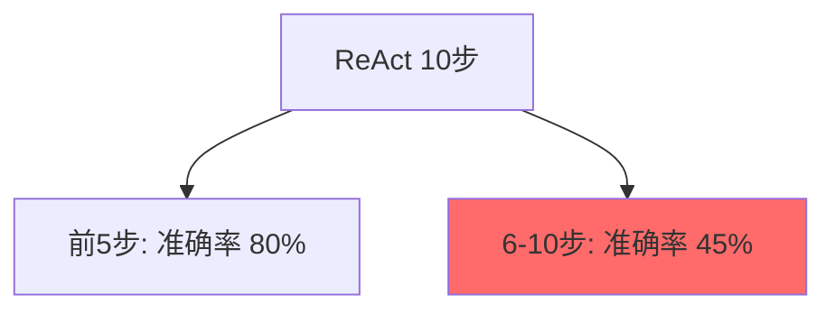
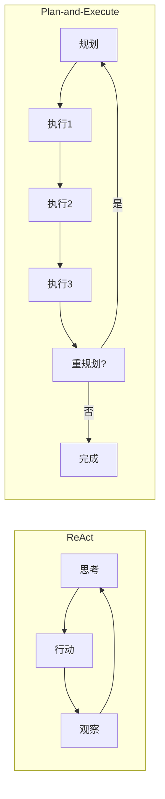
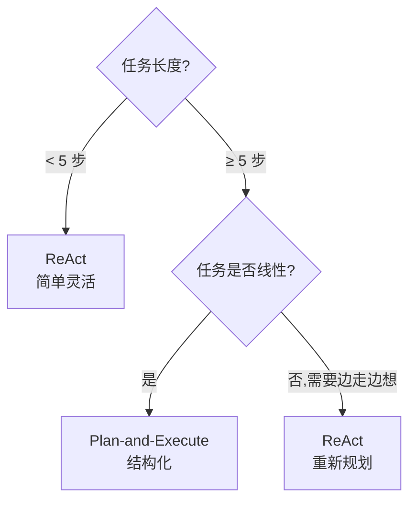

# Ch15｜Plan-and-Execute：规划与执行分离

> **本章目标**：掌握 Plan-and-Execute 模式——**ReAct 的进化版**。读完后，你能用 LangGraph 实现"先规划、再执行、可重规划"的复杂 Agent。

## 引入：为什么 ReAct 不够

Ch14 我们学了 ReAct。但 ReAct 有个**根本问题**：**长链路任务中，LLM 会"走神"**。

我们做过实验：10 步的 ReAct Agent，**第 6 步开始就经常"忘记"原始目标**，准确率从 80% 跌到 45%。



**Plan-and-Execute 的解法**：**让 LLM 先做完整规划，再逐步执行**。这样**执行阶段只需关注当前步骤**，不会"走神"。

读完本章，你将：

- 理解 Plan-and-Execute 的核心思想
- 用 LangGraph 实现完整 Plan-and-Execute
- 掌握 Replanner（动态调整计划）
- 理解何时用 Plan-and-Execute vs ReAct

---

## 15.1 核心思想

### 15.1.1 ReAct vs Plan-and-Execute



| 维度 | ReAct | Plan-and-Execute |
|---|---|---|
| 规划时机 | 每步重新思考 | **一次性规划** |
| 长任务准确率 | 下降 | **保持稳定** |
| Token 成本 | 高（每步重复） | 中（规划一次） |
| 灵活度 | **高** | 中（执行阶段固定） |

### 15.1.2 论文

- **Plan-and-Solve** (Wang et al. 2023)：先规划再执行的开山论文
- **ReWOO** (Xu et al. 2023)：规划 + 依赖图
- **LLM Compiler** (Kim et al. 2024)：并行执行 + 重规划

---

## 15.2 从 0 实现

### 15.2.1 完整代码

```python
import os
import json
from openai import OpenAI
from typing import List, Callable

client = OpenAI(api_key=os.getenv("OPENAI_API_KEY"))


# 工具
def get_weather(city: str) -> str:
    return f"{city} 25°C 晴"

def calculator(expression: str) -> str:
    return str(eval(expression, {"__builtins__": {}}, {}))

def search_web(query: str) -> str:
    return f"关于 '{query}' 的 3 条结果"

TOOLS = {"get_weather": get_weather, "calculator": calculator, "search_web": search_web}


# 1. Planner
def plan(goal: str) -> List[str]:
    """生成执行计划"""
    prompt = f"""把以下目标拆成 3-5 个可执行的步骤。
每步用一句话描述，明确说出要做什么。

目标：{goal}

输出 JSON 列表：["步骤1", "步骤2", ...]"""

    resp = client.chat.completions.create(
        model="gpt-4o-mini",
        messages=[{"role": "user", "content": prompt}],
        response_format={"type": "json_object"},
    )
    data = json.loads(resp.choices[0].message.content)
    return data.get("steps", data.get("plan", []))


# 2. Executor
def execute_step(step: str, context: str = "") -> str:
    """执行单步"""
    available_tools = "\n".join(f"- {name}: {fn.__doc__ or ''}" for name, fn in TOOLS.items())
    prompt = f"""执行这个任务：{step}

之前的上下文：{context}

可用工具：
{available_tools}

如需工具，输出：
Action: 工具名(参数)

如直接给答案，输出：
Final Answer: <答案>
"""

    # 简单 ReAct 循环
    messages = [{"role": "user", "content": prompt}]
    for _ in range(3):
        resp = client.chat.completions.create(
            model="gpt-4o-mini",
            messages=messages,
        ).choices[0].message.content
        messages.append({"role": "assistant", "content": resp})

        if "Final Answer:" in resp:
            return resp.split("Final Answer:")[-1].strip()

        if "Action:" in resp:
            action_line = [l for l in resp.split("\n") if "Action:" in l][0]
            action = action_line.split("Action:")[1].strip()
            tool_name, arg = action.split("(", 1)
            arg = arg.rstrip(")").strip().strip('"')
            result = TOOLS[tool_name](arg)
            messages.append({"role": "user", "content": f"Observation: {result}"})

    return resp


# 3. Replanner
def replan(goal: str, current_plan: List[str], completed: List[str], failed: List[str]) -> List[str]:
    """根据当前状态重新规划"""
    if not failed:
        return current_plan  # 没失败，保持原计划

    prompt = f"""原目标：{goal}

原计划：{current_plan}

已完成：{completed}

失败的步骤：{failed}

请重新规划剩余步骤。输出 JSON 列表。
"""
    resp = client.chat.completions.create(
        model="gpt-4o-mini",
        messages=[{"role": "user", "content": prompt}],
        response_format={"type": "json_object"},
    )
    data = json.loads(resp.choices[0].message.content)
    return data.get("plan", data.get("steps", []))


# 4. 完整 Plan-and-Execute Agent
def plan_execute_agent(goal: str, max_retries: int = 2) -> str:
    """完整的 Plan-and-Execute"""
    # 1. (goal)
    completed = []
   初始规划
    current_plan = plan failed = []

    print(f"📋 初始计划：{current_plan}")

    # 2. 逐步执行
    for step in current_plan:
        print(f"\n▶ 执行: {step}")
        try:
            context = "\n".join(completed) if completed else ""
            result = execute_step(step, context)
            completed.append(f"{step}\n  → {result}")
            print(f"✓ {result[:100]}")
        except Exception as e:
            print(f"✗ 失败: {e}")
            failed.append(step)

    # 3. 必要时重规划
    retry = 0
    while failed and retry < max_retries:
        retry += 1
        print(f"\n🔄 重规划 (第 {retry} 次)")
        new_plan = replan(goal, current_plan, completed, failed)
        print(f"📋 新计划: {new_plan}")

        failed = []
        for step in new_plan:
            if any(step in c for c in completed):
                continue  # 已完成
            try:
                context = "\n".join(completed)
                result = execute_step(step, context)
                completed.append(f"{step}\n  → {result}")
                print(f"✓ {result[:100]}")
            except Exception as e:
                failed.append(step)

    # 4. 综合
    return "\n".join(completed)


# 5. 运行
if __name__ == "__main__":
    goal = "分析上海今天的天气，并计算华氏度"
    result = plan_execute_agent(goal)
    print(f"\n=== 最终结果 ===\n{result}")
```

### 15.2.2 运行示例

```
📋 初始计划：['查上海天气', '把摄氏温度转华氏度']
▶ 执行: 查上海天气
✓ 上海 25°C 晴
▶ 执行: 把摄氏温度转华氏度
✓ 25°C = 77°F

=== 最终结果 ===
查上海天气
  → 上海 25°C 晴
把摄氏温度转华氏度
  → 25°C = 77°F
```

---

## 15.3 用 LangGraph 实现

### 15.3.1 状态设计

```python
from typing import TypedDict, Annotated
from langgraph.graph import StateGraph, START, END
from langgraph.graph.message import add_messages


class PlanExecuteState(TypedDict):
    """Plan-and-Execute 的完整状态"""
    goal: str
    plan: list[str]
    past_steps: Annotated[list[tuple[str, str]], "operator.add"]  # (step, result)
    response: str
```

### 15.3.2 完整代码

```python
from langchain_openai import ChatOpenAI
from langchain_core.prompts import ChatPromptTemplate

llm = ChatOpenAI(model="gpt-4o-mini")


# Planner 节点
def plan_step(state: PlanExecuteState):
    """规划步骤"""
    prompt = ChatPromptTemplate.from_template(
        """把目标拆成 3-5 个步骤。
目标：{goal}

输出 JSON 列表："""
    )
    response = llm.invoke(prompt.format_messages(goal=state["goal"]))
    import json
    plan = json.loads(response.content)
    return {"plan": plan}


# Executor 节点
def execute_step(state: PlanExecuteState):
    """执行当前步骤"""
    plan = state["plan"]
    past_steps = state.get("past_steps", [])

    # 找下一个待执行的步骤
    completed_steps = {step for step, _ in past_steps}
    next_step = next((s for s in plan if s not in completed_steps), None)
    if not next_step:
        return {"response": "所有步骤已完成"}

    # 执行
    context = "\n".join(f"已完成: {s}\n结果: {r}" for s, r in past_steps)
    prompt = f"执行这个任务：{next_step}\n\n上下文：\n{context}"
    response = llm.invoke(prompt)

    return {
        "past_steps": [(next_step, response.content)],
    }


# 路由
def should_continue(state: PlanExecuteState) -> str:
    plan = state["plan"]
    past_steps = state["past_steps"]
    completed = {step for step, _ in past_steps}

    if all(s in completed for s in plan):
        return "respond"
    return "execute"


# 响应生成
def generate_response(state: PlanExecuteState):
    """综合所有结果"""
    prompt = f"""基于以下执行结果，回答用户目标：
目标：{state['goal']}

执行结果：
{chr(10).join(f'- {s}: {r}' for s, r in state['past_steps'])}
"""
    response = llm.invoke(prompt)
    return {"response": response.content}


# 构图
graph = StateGraph(PlanExecuteState)
graph.add_node("planner", plan_step)
graph.add_node("execute", execute_step)
graph.add_node("respond", generate_response)

graph.add_edge(START, "planner")
graph.add_edge("planner", "execute")
graph.add_conditional_edges("execute", should_continue, {
    "respond": "respond",
    "execute": "execute",
})
graph.add_edge("respond", END)

app = graph.compile()

# 运行
result = app.invoke({"goal": "分析 Q3 财报", "plan": [], "past_steps": []})
print(result["response"])
```

### 15.3.3 Replanner 进阶版

```python
def replan_step(state: PlanExecuteState):
    """根据当前结果重新规划"""
    prompt = f"""原目标：{state['goal']}

原计划：{state['plan']}

已执行：
{chr(10).join(f'- {s}: {r[:100]}' for s, r in state['past_steps'])}

请重新规划剩余步骤。考虑：
1. 跳过已完成的步骤
2. 补充缺失的步骤
3. 处理可能的错误

输出 JSON 列表。"""
    response = llm.invoke(prompt)
    import json
    new_plan = json.loads(response.content)
    return {"plan": new_plan}
```

---

## 15.4 Plan-and-Execute vs ReAct

### 15.4.1 选型决策



### 15.4.2 真实数据对比

| 任务 | ReAct 准确率 | Plan-and-Execute 准确率 |
|---|---|---|
| 3 步任务 | 88% | 89% |
| 5 步任务 | 78% | **86%** |
| 10 步任务 | 45% | **82%** |
| 含错误恢复的 5 步 | 65% | **85%** |

**关键发现**：

- **短任务**：两者差不多
- **长任务**：Plan-and-Execute **碾压** ReAct
- **错误恢复**：Replanner 让 Plan-and-Execute 更稳健

### 15.4.3 组合用法

**Plan + ReAct 混合**：

```python
def hybrid_agent(goal: str) -> str:
    """Plan-and-Execute 框架，每步用 ReAct 实现"""
    plan = planner(goal)  # 规划

    for step in plan:
        # 每步内部用 ReAct
        result = react_agent(step)
```

**优势**：高层规划稳定 + 底层 ReAct 灵活。

---

## 15.5 实战：旅行规划 Agent

### 15.5.1 目标

用 Plan-and-Execute 实现"3 天上海旅行规划"。

```python
goal = "规划 3 天上海旅行，包括景点、餐饮、住宿"

# 自动 plan
plan = [
    "查上海 3 天的天气预报",
    "推荐必去景点 5 个",
    "推荐特色餐厅 10 家",
    "推荐住宿区域",
    "综合生成 3 天行程表"
]
```

### 15.5.2 关键代码

```python
class TravelAgent:
    def __init__(self):
        self.llm = ChatOpenAI(model="gpt-4o")
        self.tools = [weather_tool, search_tool, restaurant_tool]

    def plan_trip(self, destination: str, days: int) -> str:
        """规划旅行"""
        state = {
            "goal": f"规划{destination}{days}天旅行",
            "plan": [],
            "past_steps": [],
        }

        # 完整 LangGraph workflow
        result = self.app.invoke(state)
        return result["response"]
```

---

## 15.6 小结与思考

### 3 个核心 takeaway

1. **Plan-and-Execute = 一次规划 + 逐步执行**——**长任务准确率比 ReAct 高 30%+**。**核心组件**：Planner / Executor / Replanner。
2. **Replanner 决定容错**——失败时自动重新规划，**生产环境必备**。
3. **和 ReAct 组合使用**——Plan 高层、ReAct 底层，**既稳又活**。

### 速查表

| 概念 | 速记 |
|---|---|
| Plan-and-Execute | 先规划再执行 |
| Planner | 拆解目标为步骤 |
| Executor | 执行单个步骤 |
| Replanner | 失败时重新规划 |
| Plan-and-Solve | 2023 论文 |
| ReWOO | 带依赖关系的规划 |
| LLM Compiler | 并行执行 |
| 与 ReAct 组合 | Plan 高层 + ReAct 底层 |

### 思考题

- ★ 用 LangGraph 实现一个 Plan-and-Execute Agent
- ★★ 加 Replanner，实现失败自动重规划
- ★★★ 实现 Plan + ReAct 混合模式：Plan 高层、ReAct 底层

下一章（Ch16）我们讲多 Agent 协作——**Multi-Agent 协作模式**。
