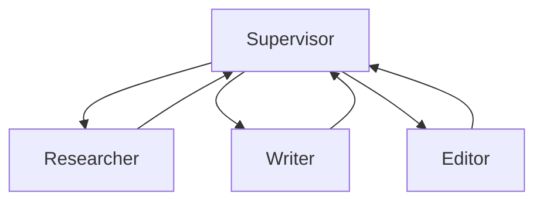
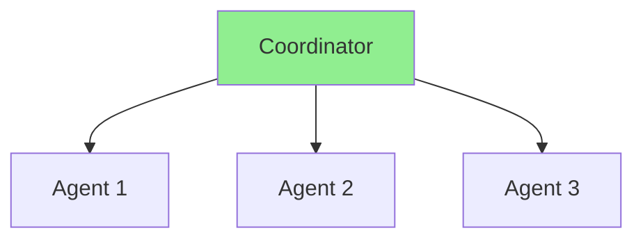
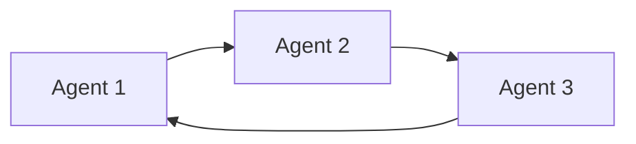
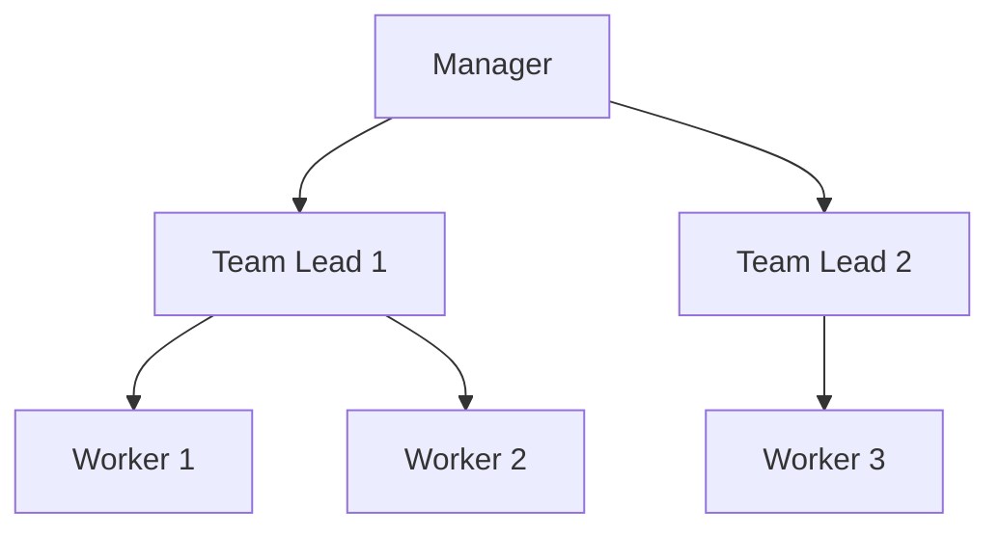
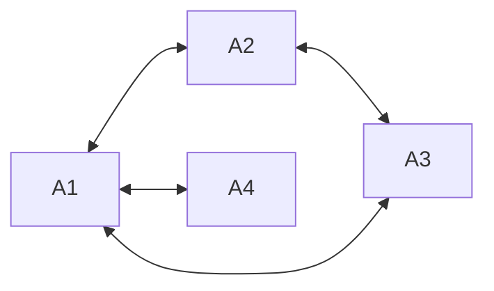
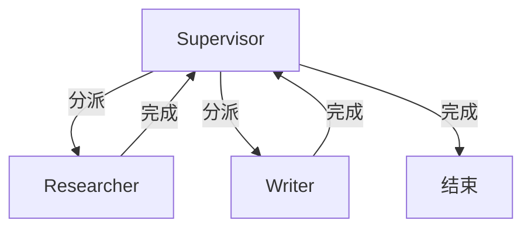

# Ch16｜Multi-Agent 协作模式

> **本章目标**：深入 Multi-Agent 协作模式——**Agent 系统的"团队管理学"**。读完后，你能设计 4 种典型拓扑，并实现 Supervisor 模式。

## 引入：为什么需要多 Agent

Ch10 讲了 LangGraph 单 Agent。但有些任务**单个 Agent 搞不定**：

- **视角单一**：单个 LLM 难以同时"做研究 + 写文章 + 审核"
- **上下文爆炸**：多步任务累计 Prompt 太长
- **错误累积**：单 Agent 长链路容易"走错就回不来"

**Multi-Agent 的解法**：**把任务拆给多个 Agent，每个 Agent 负责一块**。



读完本章，你将：

- 理解 4 种 Multi-Agent 拓扑
- 掌握 Supervisor 模式
- 理解通信机制
- 学会冲突解决

---

## 16.1 4 种协作拓扑

### 16.1.1 Star（星型）



- ✅ **集中控制**，所有 Agent 听 Coordinator 指挥
- ❌ Coordinator 是单点故障

**适用**：业务流程清晰的场景。

### 16.1.2 Ring（环形）



- ✅ **无单点故障**
- ❌ 难以"插队"或"跳过"

**适用**：流水线型任务（编辑 → 校对 → 发布）。

### 16.1.3 Hierarchical（层级）



- ✅ 模拟真实组织
- ✅ 可扩展

**适用**：大型协作（公司管理）。

### 16.1.4 Mesh（网状）



- ✅ 最灵活
- ❌ 复杂，难调试

**适用**：研究、头脑风暴类。

### 16.1.5 选型

| 拓扑 | 复杂度 | 适用 |
|---|---|---|
| Star | 低 | 业务流程 |
| Ring | 低 | 流水线 |
| Hierarchical | 中 | 复杂组织 |
| Mesh | 高 | 探索类 |

---

## 16.2 Supervisor 模式（最常用）

### 16.2.1 核心思想

**一个 Supervisor Agent** 决定：
- 下一个让谁执行
- 任务完成了吗



### 16.2.2 LangGraph 实现

```python
from typing import TypedDict, Literal
from langgraph.graph import StateGraph, START, END
from langgraph.types import Command
from langchain_core.messages import HumanMessage


# 1. State
class State(TypedDict):
    messages: list
    next_agent: str


# 2. Worker Agents
def researcher(state: State) -> Command[Literal["supervisor"]]:
    """研究员 Agent"""
    result = "研究发现：AI Agent 是..."
    return Command(
        goto="supervisor",
        update={"messages": [("assistant", f"[Researcher] {result}")]},
    )


def writer(state: State) -> Command[Literal["supervisor"]]:
    """作家 Agent"""
    result = "文章初稿：AI Agent 改变了..."
    return Command(
        goto="supervisor",
        update={"messages": [("assistant", f"[Writer] {result}")]},
    )


# 3. Supervisor
def supervisor(state: State) -> Command[Literal["researcher", "writer", "__end__"]]:
    """Supervisor：决定下一个 Agent"""
    # 用 LLM 决定
    prompt = f"""根据当前消息，决定下一步：

选项：
- researcher: 让研究员继续
- writer: 让作家写
- FINISH: 任务完成

消息：
{state['messages'][-3:]}

输出：researcher / writer / FINISH"""

    response = llm.invoke(prompt).content.strip()

    if "FINISH" in response:
        return Command(goto=END)
    return Command(goto=response)


# 4. 构图
graph = StateGraph(State)
graph.add_node("supervisor", supervisor)
graph.add_node("researcher", researcher)
graph.add_node("writer", writer)

graph.add_edge(START, "supervisor")
app = graph.compile()

# 运行
result = app.invoke({"messages": [("human", "研究 AI Agent 写一份报告")]})
print(result["messages"][-1])
```

### 16.2.3 真实运行

```
1. supervisor 决策: "researcher"
2. researcher 执行: "找到 3 条关键资料"
3. supervisor 决策: "writer"
4. writer 执行: "完成文章初稿"
5. supervisor 决策: "FINISH"
```

---

## 16.3 通信机制

### 16.3.1 共享 Message Bus

```python
# 共享一个 messages 列表
shared_state = {
    "messages": [],  # 所有 Agent 共享
}

# 每个 Agent 读历史、加自己的消息
def agent_a(state):
    history = state["messages"]
    response = llm.invoke(history)
    state["messages"].append({"role": "assistant", "name": "A", "content": response})
```

### 16.3.2 独立 Channel

```python
# 每个 Agent 有自己的"邮件箱"
channels = {
    "researcher": deque(),
    "writer": deque(),
}

def send_to(target, message):
    channels[target].append(message)

def receive(name):
    msg = channels[name].popleft()
    return msg
```

### 16.3.3 共享黑板

```python
# Blackboard 模式
blackboard = {
    "facts": {},
    "drafts": [],
    "decisions": [],
}

# Agent 读 + 写黑板
def researcher(state):
    blackboard["facts"]["latest"] = "..."
    return state
```

---

## 16.4 冲突解决

### 16.4.1 3 种冲突

1. **资源竞争**：两个 Agent 同时改一个文件
2. **决策冲突**：Supervisor 决策不一致
3. **消息循环**：A 发 B，B 再发 A，循环

### 16.4.2 解决方案

**资源竞争**：

```python
# 用 lock
import asyncio

lock = asyncio.Lock()

async def safe_write(agent, data):
    async with lock:
        # 写入共享资源
        ...
```

**决策冲突**：

```python
# Supervisor 加"决策日志"
decision_log = []

def supervisor(state):
    decision = llm.decide(...)
    decision_log.append(decision)

    # 检查是否和最近 3 步重复
    if decision_log[-3:].count(decision) >= 3:
        # 强制结束
        return Command(goto=END)

    return Command(goto=decision)
```

**消息循环**：

```python
# 限制每个 Agent 的发言次数
class MessageTracker:
    def __init__(self, max_per_agent=5):
        self.counts = defaultdict(int)
        self.max = max_per_agent

    def can_speak(self, agent):
        if self.counts[agent] >= self.max:
            return False
        self.counts[agent] += 1
        return True
```

---

## 16.5 实战："产品 + 开发 + 测试"三角协作

### 16.5.1 目标

实现 3 个 Agent：
- **Product Manager**：分析需求
- **Developer**：写代码
- **QA**：测试代码

### 16.5.2 完整代码

```python
from typing import TypedDict
from langgraph.graph import StateGraph, START, END


class State(TypedDict):
    requirement: str
    code: str
    test_results: list[dict]
    iterations: int


def product_manager(state: State) -> State:
    """PM 分析需求"""
    requirement = llm.invoke(f"分析这个需求：{state['requirement']}\n输出明确的功能点")
    return {"requirement": requirement.content}


def developer(state: State) -> State:
    """Developer 写代码"""
    code = llm.invoke(f"基于需求：{state['requirement']}\n写 Python 代码")
    return {"code": code.content}


def qa(state: State) -> State:
    """QA 测试"""
    test_result = llm.invoke(f"测试代码：\n{state['code']}\n输出通过/失败 + 原因")
    passed = "通过" in test_result.content
    return {
        "test_results": state.get("test_results", []) + [{"passed": passed, "result": test_result.content}],
        "iterations": state.get("iterations", 0) + 1,
    }


def should_continue(state: State) -> str:
    if state["iterations"] >= 3:
        return "end"
    if state["test_results"] and state["test_results"][-1]["passed"]:
        return "end"
    return "developer"  # 不通过，让 dev 重写


# 构图
graph = StateGraph(State)
graph.add_node("pm", product_manager)
graph.add_node("developer", developer)
graph.add_node("qa", qa)

graph.add_edge(START, "pm")
graph.add_edge("pm", "developer")
graph.add_edge("developer", "qa")
graph.add_conditional_edges("qa", should_continue, {
    "end": END,
    "developer": "developer",
})

app = graph.compile()
result = app.invoke({"requirement": "写一个排序函数", "iterations": 0})
print(result["code"])
```

---

## 16.6 小结与思考

### 3 个核心 takeaway

1. **Multi-Agent = 把任务拆给多个 Agent**——4 种拓扑（Star / Ring / Hierarchical / Mesh），**80% 场景用 Star + Supervisor**。
2. **Supervisor 是大脑**——**用 LLM 决定下一个 Agent**。**生产中加决策日志防循环**。
3. **通信机制选 Channel**——独立 Channel 比共享 Bus 安全，**但要实现消息路由**。

### 思考题

- ★ 用 LangGraph 实现 2 个 Agent（Researcher + Writer）的 Supervisor 模式
- ★★ 加 3 个 Agent（PM + Dev + QA）的迭代协作
- ★★★ 读 LangGraph `Command` API 源码，理解它如何实现 Agent 间跳转

下一章（Ch17）我们讲 Reflection——**让 Agent 自我评估和迭代**。
