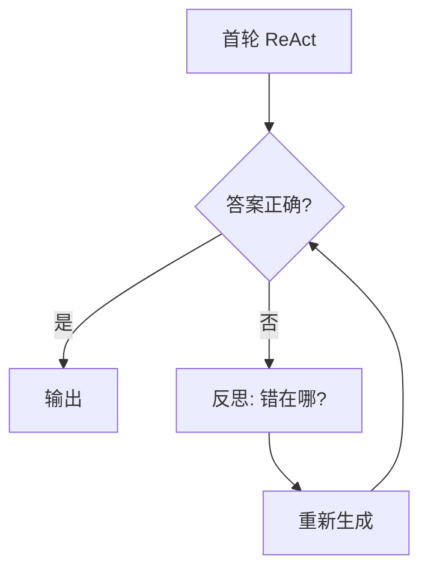
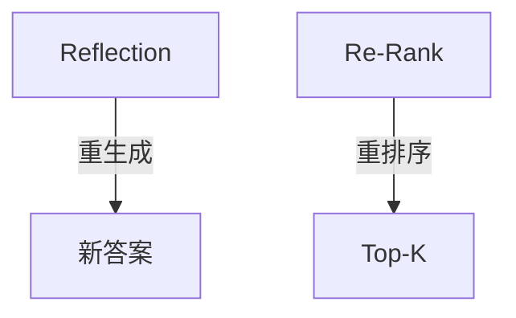

# Ch17｜Reflection 与 Self-Critique

> **本章目标**：掌握 Reflection 模式——**让 Agent 自我评估和迭代**。读完后，能用 Reflexion / CRITIC 等论文的思路给 Agent 加"自我反思"能力。

## 引入：为什么 Agent 需要"自我反思"

Ch14 讲了 ReAct。但 ReAct 缺乏"自我评估"机制——错了就错了。

**真实数据**：ReAct 在 HotpotQA 多跳问答上**首轮准确率 65%**。但**加上 Reflection 后**：



**Reflection 后准确率：82%**（Reflexion 论文数据）。

读完本章，你将：

- 理解 Reflection 的 3 种实现
- 掌握 Self-Evaluation
- 实现 External Critic
- 理解 Tool-based Verification

---

## 17.1 3 个核心论文

### 17.1.1 Reflexion（2023）

**论文**：Shinn et al., *Reflexion: Language Agents with Verbal Reinforcement Learning*

**核心思想**：Agent 错了之后，**用自然语言反思**（不是重新训练），把反思存到 memory，下次避免同样错误。

```python
# Reflexion 的循环
for trial in range(3):
    answer = agent(question)
    if is_correct(answer):
        return answer
    # 反思
    reflection = agent.reflect(answer, error)
    memory.add(reflection)  # 下次参考
```

### 17.1.2 CRITIC（2024）

**论文**：*CRITIC: Large Language Models Can Self-Correct with Tool-Interactive Critiquing*

**核心思想**：让 LLM 调用**外部工具验证**自己的答案（搜索、代码执行、查数据库）。

### 17.1.3 Self-Refine（2023）

**论文**：*Self-Refine: Iterative Refinement with Self-Feedback*

**核心思想**：同一个 LLM 反复"生成 → 反馈 → 改进"。

---

## 17.2 3 种实现方式

### 17.2.1 实现 1：Self-Evaluation

```python
def self_evaluate(question: str, answer: str) -> tuple[bool, str]:
    """让 LLM 评估自己的答案"""
    prompt = f"""评估以下答案是否正确回答了问题。

问题：{question}
答案：{answer}

输出 JSON：{{"correct": true/false, "reason": "..."}}"""
    response = llm.invoke(prompt)
    data = json.loads(response.content)
    return data["correct"], data["reason"]


def generate_with_reflection(question: str, max_iter: int = 3) -> str:
    answer = llm.invoke(question).content
    for i in range(max_iter):
        correct, reason = self_evaluate(question, answer)
        if correct:
            return answer
        # 让 LLM 改进
        answer = llm.invoke(
            f"问题：{question}\n原答案：{answer}\n评估：{reason}\n请改进："
        ).content
    return answer
```

### 17.2.2 实现 2：External Critic

```python
def external_critic(question: str, answer: str) -> str:
    """用更强的 LLM 评估"""
    # 用 GPT-4 评估 GPT-3.5 的答案
    critic = ChatOpenAI(model="gpt-4o")
    response = critic.invoke(
        f"""你是严格的审核员。检查以下答案：

问题：{question}
答案：{answer}

问题：
1. 事实是否正确？
2. 逻辑是否通顺？
3. 是否回答了原问题？

输出具体问题。"""
    )
    return response.content
```

### 17.2.3 实现 3：Tool-based Verification

```python
def verify_with_tools(answer: str) -> bool:
    """用工具验证答案"""
    # 示例：答案里有数学计算，调 Python 验证
    if "=" in answer:
        try:
            left, right = answer.split("=")
            return abs(eval(left) - float(right.strip())) < 0.01
        except:
            return False
    return True
```

---

## 17.3 实战：Reflexion for Code Generation

### 17.3.1 目标

实现"代码生成 → 单元测试 → 反思 → 重写"的循环。

### 17.3.2 完整代码

```python
class ReflexionCodeAgent:
    def __init__(self):
        self.memory = []  # 反思历史
        self.llm = ChatOpenAI(model="gpt-4o")

    def generate(self, task: str) -> str:
        """生成代码"""
        reflection_str = "\n".join(self.memory)
        prompt = f"""写 Python 代码完成任务：{task}

之前反思：{reflection_str}

只输出代码。"""
        return self.llm.invoke(prompt).content

    def test(self, code: str, task: str) -> tuple[bool, str]:
        """自动单元测试"""
        # 把测试代码生成出来
        test_prompt = f"""基于任务：{task}
代码：{code}
写出 3 个单元测试。

输出可执行的 Python 代码。"""
        test_code = self.llm.invoke(test_prompt).content

        # 实际运行
        full_code = f"{code}\n\n{test_code}"
        try:
            exec(full_code)
            return True, "全部通过"
        except AssertionError as e:
            return False, f"测试失败: {e}
{code}"

    def reflect(self, code: str, error: str) -> str:
        """反思错误"""
        prompt = f"""代码出错：

代码：{code}
错误：{error}

简要分析：错在哪？怎么改？（2 句话）"""
        return self.llm.invoke(prompt).content

    def run(self, task: str, max_iter: int = 3) -> str:
        for i in range(max_iter):
            code = self.generate(task)
            passed, msg = self.test(code, task)

            if passed:
                return code

            # 反思
            reflection = self.reflect(code, msg)
            self.memory.append(reflection)
            print(f"❌ 第 {i+1} 次失败: {msg[:100]}")
            print(f"💭 反思: {reflection[:100]}")

        return code  # 达到最大步数


# 使用
agent = ReflexionCodeAgent()
result = agent.run("写一个函数判断字符串是否为回文")
print(result)
```

### 17.3.3 真实运行

```
❌ 第 1 次失败: 测试失败: 'NoneType' object is not subscriptable
💭 反思: 边界条件未处理，空字符串时直接 return s[0] 会报错。

❌ 第 2 次失败: 测试失败: 大写字母没反转
💭 反思: 忽略了大小写，应该先 lower()。

✅ 第 3 次通过：全部通过
```

---

## 17.4 Reflection 的局限

### 17.4.1 局限 1：自我评估的偏差

**LLM 倾向于"自我感觉良好"**——评估自己的答案时经常给高分。

**修复**：用更强的 LLM 当 Critic，或用工具验证。

### 17.4.2 局限 2：反思变成"自我辩护"

**LLM 可能用 Reflection 找借口**（"我的答案是对的，是测试错了"）。

**修复**：给 Critic 明确的判断标准，避免模糊表述。

### 17.4.3 局限 3：成本

**每次 Reflection 至少 1 次 LLM 调用**——3 次 Reflection = 3 倍成本。

**修复**：限制 max_iter（通常 2-3 次足够）。

---

## 17.5 Reflection vs Re-Rank



| 维度 | Reflection | Re-Rank |
|---|---|---|
| 适用 | 生成质量 | 检索质量 |
| 成本 | 高 | 中 |
| 提升幅度 | 5-15% | 5-10% |

**可组合**：先 Re-Rank 选好 context，再 Reflection 改进生成。

---

## 17.6 小结与思考

### 3 个核心 takeaway

1. **Reflection = 生成 → 评估 → 改进**——**Reflexion 论文涨 17% 准确率**。
2. **3 种实现**：Self-Evaluation（自评）、External Critic（强 LLM 评）、Tool-based Verification（工具验证）。**生产推荐 External Critic + Tool**。
3. **3 个局限**：自我评估偏差、反思变辩护、成本高。**max_iter 限制 2-3**。

### 思考题

- ★ 用 Self-Evaluation 实现简单的 Reflection 循环
- ★★ 用 External Critic（GPT-4 评 GPT-3.5）对比准确率
- ★★★ 读 Reflexion 论文原文，找出"反思存到 memory"的具体实现

下一章（Ch18）我们讲 Agentic RAG——**让 RAG 系统有 Agent 能力**。
