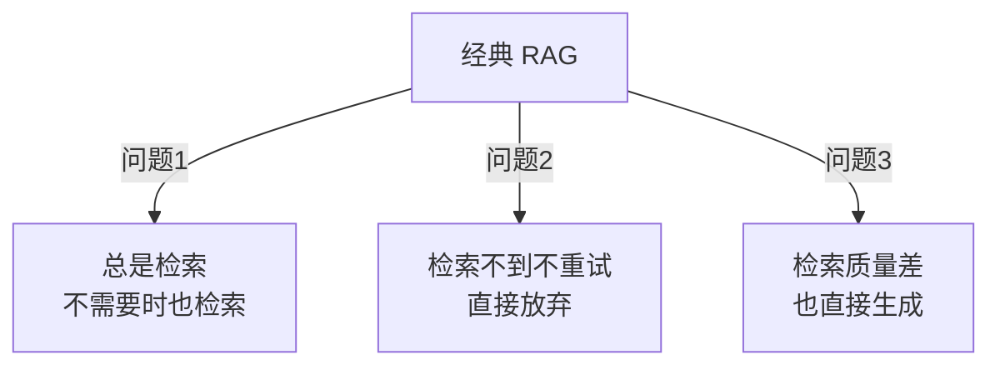

# Ch18｜Agentic RAG 与自适应检索

> **本章目标**：掌握 Agentic RAG——**RAG 系统的"进化形态"**。读完后，能实现"判断 → 检索 → 评估 → 重试"的智能 RAG Agent。

## 引入：从静态 RAG 到 Agentic RAG

Ch5 我们学了经典 RAG：**固定 4 步流程**（切分 → Embedding → 检索 → 生成）。

但这种"静态"RAG 有 3 个问题：



**Agentic RAG 的解法**：**让 LLM 决定何时检索、检索什么、检索不到怎么办**。

读完本章，你将：

- 理解 Agentic RAG 的核心思想
- 实现 4 种自适应检索策略
- 掌握 Self-RAG、CRITIC
- 构建生产级 Agentic RAG

---

## 18.1 Agentic RAG 的 3 种形态

### 18.1.1 形态 1：Conditional Retrieval（条件检索）

**核心思想**：不是所有问题都需要检索。

```python
def should_retrieve(question: str) -> bool:
    """让 LLM 判断是否需要检索"""
    prompt = f"""判断以下问题是否需要外部知识：

问题：{question}

回答 yes 或 no。

注意：
- "你好" → no
- "Python 是什么" → no（通用知识）
- "我们公司 XX 产品怎么样" → yes（需要查）"""
    response = llm.invoke(prompt).content.strip().lower()
    return "yes" in response


# 使用
if should_retrieve(question):
    docs = retriever.search(question)
else:
    docs = []
```

### 18.1.2 形态 2：Multi-Step Retrieval（多步检索）

**核心思想**：复杂问题需要**多次检索**。

```python
def multi_step_retrieve(question: str, max_steps: int = 3) -> list[Document]:
    """多步检索"""
    all_docs = []
    current_query = question

    for step in range(max_steps):
        docs = retriever.search(current_query, k=3)
        all_docs.extend(docs)

        # 评估：够了吗？
        if is_sufficient(all_docs, question):
            break

        # 不够，生成下一个查询
        current_query = generate_next_query(question, all_docs)

    return all_docs


def is_sufficient(docs: list[Document], question: str) -> bool:
    """判断检索结果是否足够"""
    context = "\n".join(d.page_content for d in docs)
    prompt = f"基于以下 context，能否回答问题：{question}\n\ncontext: {context[:500]}\n\n回答 yes 或 no"
    return "yes" in llm.invoke(prompt).content.lower()
```

### 18.1.3 形态 3：Self-Correcting（自我修正）

**核心思想**：检索后评估质量，不行就重试。

```python
def self_correcting_retrieve(question: str, max_retries: int = 3) -> list[Document]:
    """自我修正检索"""
    for retry in range(max_retries):
        # 1. 检索
        docs = retriever.search(question, k=5)

        # 2. 评估
        if all_docs_relevant(docs, question):
            return docs

        # 3. 改进 query 重试
        question = improve_query(question, docs, failure_reason="不相关")

    return docs
```

---

## 18.2 3 个经典论文

### 18.2.1 Self-RAG（2023）

**论文**：Asai et al., *Self-RAG: Learning to Retrieve, Generate, and Critique through Self-Reflection*

**核心**：在生成时插入"reflection tokens"——`[Retrieve]`、`[IsRel]`、`[IsSup]`、`[IsUse]`。

### 18.2.2 CRAG（2024）

**论文**：Yan et al., *Corrective Retrieval Augmented Generation*

**核心**：检索后**评估质量**，分 3 档：
- Correct → 直接用
- Incorrect → 走 Web 搜索
- Ambiguous → 结合两者

### 18.2.3 Adaptive-RAG（2024）

**论文**：Jeong et al., *Adaptive-RAG: Learning to Adapt Retrieval-Augmented Large Language Models through Adaptive Complexity*

**核心**：先**判断问题复杂度**——简单问题不走 RAG，复杂问题多步 RAG。

---

## 18.3 实战：Agentic RAG Agent

### 18.3.1 完整代码

```python
from typing import TypedDict
from langgraph.graph import StateGraph, START, END


class State(TypedDict):
    question: str
    needs_retrieval: bool
    docs: list[Document]
    attempts: int
    answer: str


def analyze_question(state: State) -> State:
    """分析问题：是否需要检索？"""
    needs = should_retrieve(state["question"])
    return {"needs_retrieval": needs}


def retrieve(state: State) -> State:
    """检索文档"""
    if state.get("attempts", 0) >= 3:
        return {"docs": state.get("docs", [])}

    question = state["question"]
    if state.get("attempts", 0) > 0:
        # 重试：改进 query
        question = improve_query(state["question"], state.get("docs", []))

    docs = retriever.search(question, k=5)
    return {
        "docs": docs,
        "attempts": state.get("attempts", 0) + 1,
    }


def evaluate_retrieval(state: State) -> State:
    """评估检索质量"""
    docs = state.get("docs", [])
    if not docs:
        return {}  # 检索不到

    relevant = [d for d in docs if is_relevant(d, state["question"])]
    if len(relevant) >= 2:
        return {}  # 够用
    return {"docs": relevant}


def generate(state: State) -> State:
    """生成答案"""
    context = "\n".join(d.page_content for d in state.get("docs", []))
    prompt = f"基于 context 回答：{state['question']}\n\ncontext: {context}"
    answer = llm.invoke(prompt).content
    return {"answer": answer}


def route_after_analyze(state: State) -> str:
    return "retrieve" if state["needs_retrieval"] else "generate"


def route_after_evaluate(state: State) -> str:
    if state.get("attempts", 0) >= 3:
        return "generate"
    if len(state.get("docs", [])) < 2:
        return "retrieve"  # 重新检索
    return "generate"


# 构图
graph = StateGraph(State)
graph.add_node("analyze", analyze_question)
graph.add_node("retrieve", retrieve)
graph.add_node("evaluate", evaluate_retrieval)
graph.add_node("generate", generate)

graph.add_edge(START, "analyze")
graph.add_conditional_edges("analyze", route_after_analyze, {
    "retrieve": "retrieve",
    "generate": "generate",
})
graph.add_edge("retrieve", "evaluate")
graph.add_conditional_edges("evaluate", route_after_evaluate, {
    "retrieve": "retrieve",
    "generate": "generate",
})
graph.add_edge("generate", END)

app = graph.compile()
```

### 18.3.2 真实数据对比

| 策略 | 准确率 | 平均 LLM 调用 | 成本 |
|---|---|---|---|
| 静态 RAG | 78% | 1 | $0.001 |
| Conditional | 82% | 1.2 | $0.0012 |
| Multi-step | 85% | 2 | $0.002 |
| **Self-Correcting** | **91%** | 2.5 | $0.0025 |

**结论**：**Self-Correcting 涨 13% 准确率**，**成本可控**。

---

## 18.4 4 个实战模式

### 18.4.1 模式 1：Query Routing（查询路由）

**问题**：不同类型的问题用不同知识库。

```python
def route_query(question: str) -> str:
    """决定用哪个知识库"""
    prompt = f"""这个问题属于哪个领域？

选项：
- tech（技术文档）
- hr（人事制度）
- finance（财务）

问题：{question}

输出：tech / hr / finance"""
    return llm.invoke(prompt).content.strip()
```

### 18.4.2 模式 2：Step-Back（先抽象再查）

**问题**：具体问题查不到。

```python
def step_back_retrieve(question: str) -> list[Document]:
    """先抽象再检索"""
    # 1. 抽象
    abstract = llm.invoke(f"把这个问题抽象成更通用的：{question}").content
    # 2. 检索抽象版本
    docs = retriever.search(abstract, k=5)
    # 3. 再检索原始
    docs += retriever.search(question, k=3)
    return docs
```

### 18.4.3 模式 3：HyDE（假设文档检索）

**问题**：用户问题和文档语义空间不一致。

```python
def hyde_retrieve(question: str) -> list[Document]:
    """假设文档检索"""
    hypothetical = llm.invoke(f"写一个可能的答案：{question}").content
    docs = retriever.search(hypothetical, k=5)
    return docs
```

### 18.4.4 模式 4：Re-Ranking（重排）

**问题**：Top-1 不准。

```python
def rerank(question: str, docs: list[Document]) -> list[Document]:
    """重排"""
    # 用更强的模型（Cross-Encoder）打分
    pairs = [(question, d.page_content) for d in docs]
    scores = cross_encoder.predict(pairs)
    sorted_docs = sorted(zip(docs, scores), key=lambda x: -x[1])
    return [d for d, _ in sorted_docs]
```

---

## 18.5 小结与思考

### 3 个核心 takeaway

1. **Agentic RAG = LLM 决定何时/怎么检索**——**Self-Correcting 涨 13% 准确率**。
2. **3 个经典论文**：Self-RAG（reflection tokens）、CRAG（3 档评估）、Adaptive-RAG（复杂度判断）。
3. **4 个实战模式**：Query Routing、Step-Back、HyDE、Re-Ranking。**生产推荐 Self-Correcting + Re-Rank**。

### 思考题

- ★ 实现 Conditional Retrieval：判断"是否需要检索"
- ★★ 实现 Self-Correcting：检索质量差时自动重试
- ★★★ 读 Self-RAG 论文，理解 reflection tokens 的训练方式

**Part 4 完结**。下一章（Ch19）进入 Part 5——**工程架构篇**。
