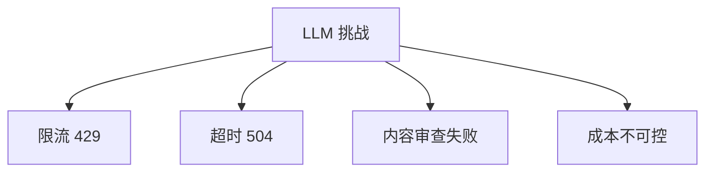

# Ch20｜高可用设计：限流、熔断、降级

> **本章目标**：掌握 LLM 应用的高可用架构。读完后，能设计 99.9% 可用性的 Agent 系统。

## 20.1 LLM 调用的 4 大挑战



**和传统 API 不同**：
- ❌ 不能简单"重试"
- ❌ 不能"无限排队"
- ❌ 不能"切到备用"

## 20.2 多模型路由

```python
class ModelRouter:
    def __init__(self):
        self.routes = {
            "simple": [("gpt-4o-mini", 0.7), ("claude-haiku", 0.3)],
            "complex": [("gpt-4o", 0.6), ("claude-3.5-sonnet", 0.4)],
        }

    def select(self, task_type: str) -> str:
        models = self.routes[task_type]
        weights = [w for _, w in models]
        return random.choices([m for m, _ in models], weights)[0]
```

## 20.3 熔断器

```python
from tenacity import retry, stop_after_attempt, wait_exponential


@retry(
    stop=stop_after_attempt(3),
    wait=wait_exponential(min=1, max=10),
    retry=retry_if_exception_type(RateLimitError),
)
def call_llm_with_retry(messages):
    return client.chat.completions.create(...)
```

## 20.4 降级策略

```python
def call_with_fallback(messages):
    try:
        return call_gpt4o(messages)
    except RateLimitError:
        return call_gpt4o_mini(messages)  # 降级到小模型
    except Exception:
        return "服务暂时不可用，请稍后重试"  # 静态降级
```

## 20.5 限流

```python
import asyncio
from asyncio import Semaphore

# 限制并发 LLM 调用
llm_semaphore = Semaphore(10)

async def call_with_limit(messages):
    async with llm_semaphore:
        return await call_llm(messages)
```

## 20.6 小结

**高可用 4 招**：**多模型路由 + 熔断 + 降级 + 限流**。**每招都是防线，缺一不可**。
