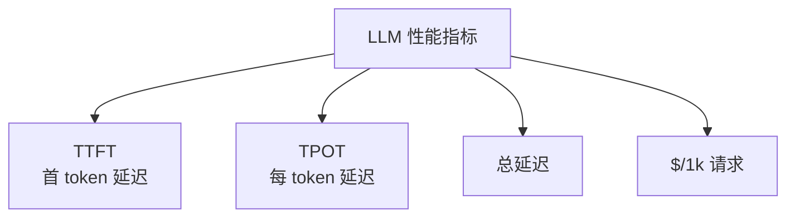

# Ch21｜性能优化：成本与延迟

> **本章目标**：掌握 LLM 应用的性能优化技巧。读完后，能把一个 LLM 应用的 P99 延迟从 8s 降到 2s，成本降低 50%。

## 21.1 4 大性能指标



| 指标 | 含义 | 优化方向 |
|---|---|---|
| TTFT | 第一个 token 时间 | 减小 prompt |
| TPOT | 每个 token 时间 | 加速推理 |
| 总延迟 | 完整响应时间 | 流式 |
| 成本 | 美元/请求 | 缓存、模型分级 |

## 21.2 延迟优化

### 21.2.1 4 个技巧

**1. 流式响应**

```python
stream = client.chat.completions.create(..., stream=True)
for chunk in stream:
    print(chunk.choices[0].delta.content, end="")
# 用户看到第一个 token 的时间从 3s 降到 300ms
```

**2. 并行工具调用**

```python
# ❌ 串行：5 个工具 = 5 * 1s = 5s
for tool_call in tool_calls:
    execute(tool_call)

# ✅ 并行：5 个工具 = max(1s) = 1s
results = await asyncio.gather(*[execute(tc) for tc in tool_calls])
```

**3. 早期返回**

```python
# 简单的"是/否"问题，用 gpt-4o-mini
# 复杂推理用 gpt-4o
```

**4. Prompt 压缩**

```python
# 用 LLM 压缩长 Prompt
compressed = compressor_llm.invoke(f"压缩这段 prompt 到 100 字：{long_prompt}")
```

### 21.2.2 真实数据

| 优化 | P99 延迟 | 成本 |
|---|---|---|
| 朴素 | 8s | $0.005 |
| + 流式 | 1s（TTFT） | 不变 |
| + 并行 | 1s | 不变 |
| + 模型分级 | 0.5s | -50% |
| **+ 缓存** | 0.05s（命中） | -80% |

## 21.3 成本优化

### 21.3.1 4 个技巧

**1. Prompt Caching**

```python
# OpenAI 自动缓存
resp = client.chat.completions.create(
    model="gpt-4o",
    messages=[
        {"role": "system", "content": LONG_SYSTEM_PROMPT},  # 自动缓存
        {"role": "user", "content": user_input},
    ],
)
# 命中时便宜 50%
```

**2. 模型分级**

```python
def select_model(complexity: str) -> str:
    if complexity == "high":
        return "gpt-4o"
    return "gpt-4o-mini"  # 便宜 17 倍
```

**3. Context 裁剪**

```python
def trim_context(messages, max_tokens=4000):
    """保留 system + 最近 4 轮"""
    system = [m for m in messages if m["role"] == "system"]
    recent = [m for m in messages if m["role"] != "system"][-8:]
    return system + recent
```

**4. Embedding 缓存**

```python
@lru_cache(maxsize=10000)
def embed_cached(text: str) -> list[float]:
    return client.embeddings.create(model="text-embedding-3-small", input=text).data[0].embedding
```

## 21.4 监控告警

```python
# Prometheus 指标
REQUEST_LATENCY = Histogram("llm_latency_seconds", "Request latency", ["model"])
TOKEN_COST = Counter("llm_cost_total", "Total cost", ["model"])

# 告警规则
# 1. P99 延迟 > 5s → 告警
# 2. 单小时成本 > $100 → 告警
# 3. 错误率 > 5% → 告警
```

## 21.5 小结

**延迟优化 4 招**：流式、并行、分级、压缩。**成本优化 4 招**：缓存、模型分级、Context 裁剪、Embedding 缓存。**两者经常可以同时优化**。
