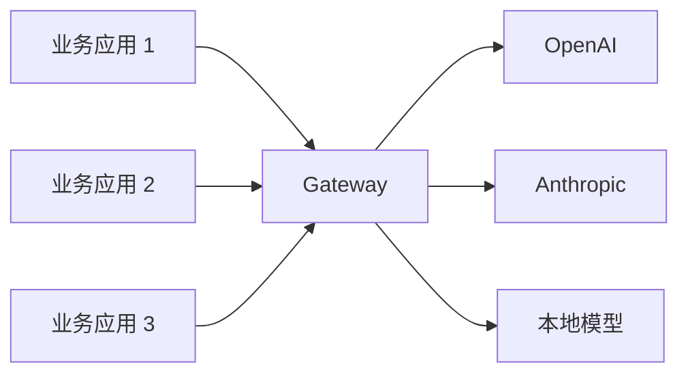
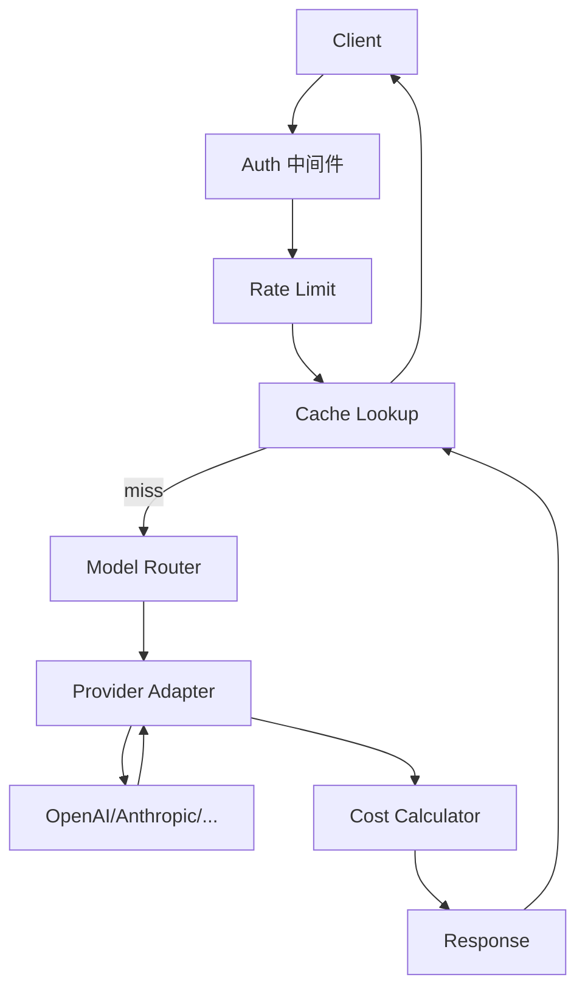

# Ch24｜LLM 网关设计

> **本章目标**：掌握 LLM 网关的设计和实现。读完后，能从 0 搭建一个生产级 LLM Gateway。

## 24.1 为什么需要 LLM Gateway



**4 大核心价值**：

1. **统一鉴权**：一个 API Key 管理所有 LLM
2. **路由**：按 tenant / 成本 / 延迟智能路由
3. **缓存**：相同请求直接返回
4. **可观测**：所有调用集中埋点

## 24.2 核心能力

### 24.2.1 路由（Router）

```python
class ModelRouter:
    def select(self, tenant_id: str, complexity: str) -> str:
        # 按 tenant 配置 + 复杂度选择
        ...
```

### 24.2.2 缓存

```python
class SemanticCache:
    def get(self, query: str) -> dict | None:
        # 1. 精确匹配（Redis）
        exact = redis.get(f"cache:{hash(query)}")
        if exact:
            return json.loads(exact)

        # 2. 语义匹配（向量库）
        # 找到相似度 > 0.95 的历史请求
        return None
```

### 24.2.3 限流

```python
class RateLimiter:
    def check(self, tenant_id: str) -> bool:
        # Token bucket
        key = f"rl:{tenant_id}"
        current = redis.incr(key)
        if current == 1:
            redis.expire(key, 60)  # 1 分钟窗口
        return current <= self.limit[tenant_id]
```

### 24.2.4 Fallback

```python
async def call_with_fallback(messages):
    for model in [primary, secondary, tertiary]:
        try:
            return await call_model(model, messages)
        except Exception:
            continue
    raise Exception("All models failed")
```

## 24.3 完整架构



## 24.4 4 个关键指标

| 指标 | 目标 |
|---|---|
| P99 延迟 | < 500ms |
| 缓存命中率 | > 30% |
| 月度成本节省 | > 40% |
| 可用性 | > 99.9% |

## 24.5 选型对比

| 方案 | 优势 | 适合 |
|---|---|---|
| 自建 | 灵活 | 大型公司 |
| Portkey | 易用 | 中型公司 |
| OpenRouter | 多模型 | 个人 / 小团队 |
| Cloudflare AI Gateway | 全球加速 | 全球业务 |
| Helicone | 集成 | 快速集成 |

## 24.6 实战：FastAPI + Redis 网关

完整代码见 `agent-book-code/projects/28_llm_gateway/`（Ch28 详细讲）。

## 24.7 小结

**LLM Gateway = 路由 + 缓存 + 限流 + 降级**。**所有 LLM 应用的"统一入口"**。**生产必备**。
