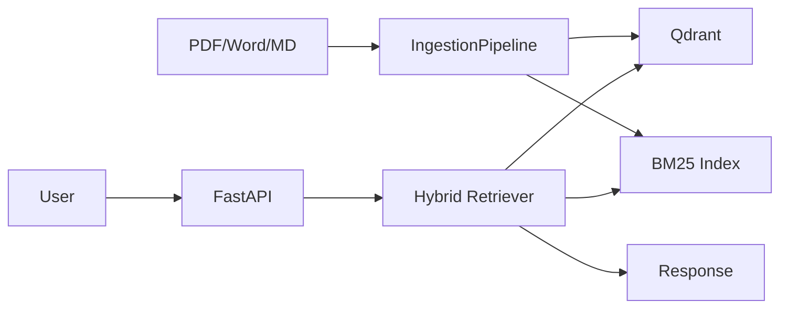

# Ch26｜项目二：企业级 RAG 知识库

> **本章目标**：从 0 搭建一个支持多格式文档、多租户、增量更新的生产 RAG 系统。

## 26.1 项目目标

构建支持以下特性的企业 RAG 系统：

- ✅ 多格式：PDF / Word / Markdown
- ✅ 多租户隔离
- ✅ 增量更新
- ✅ 混合检索（BM25 + 向量）
- ✅ 评估接入 CI

## 26.2 技术栈

| 组件 | 选型 |
|---|---|
| 框架 | LlamaIndex |
| 向量库 | Qdrant |
| 检索 | BM25 + 向量 + RRF |
| 后端 | FastAPI |
| 评估 | RAGAS |

## 26.3 完整架构

## 26.4 核心代码

完整代码见 `agent-book-code/ch26/` 和 `agent-book-code/projects/26_rag_kb/`。

## 26.5 验收指标

| 指标 | 目标 |
|---|---|
| 检索 Recall@5 | > 0.85 |
| 生成 Faithfulness | > 0.90 |
| 1000 文档摄入 | < 5 分钟 |
| 端到端 P99 | < 3s |

## 26.6 小结

**企业 RAG = 文档摄入 + 向量化 + 混合检索 + 评估**。**多租户必须用 tenant_id 过滤**。
