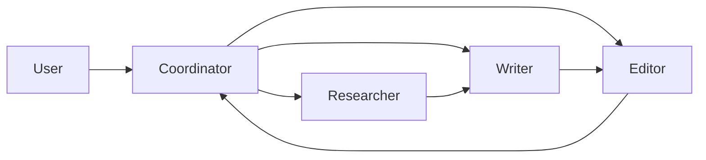

# Ch27｜项目三：多 Agent 研究助手

> **本章目标**：从 0 搭建一个由 4 个 Agent 协作的研究助手，自动完成"选题 → 调研 → 写作 → 审核"。

## 27.1 项目目标

构建一个 4 Agent 协作系统：

**4 个 Agent**：

- **Researcher**：搜索资料、整理文献
- **Writer**：基于资料撰写文章
- **Editor**：审核、修改、润色
- **Coordinator**：协调三者

## 27.2 技术栈

| 组件 | 选型 |
|---|---|
| 框架 | CrewAI（多 Agent 协作） |
| 状态管理 | LangGraph Checkpointer |
| 可观测 | Langfuse |
| 后端 | FastAPI + PostgreSQL |

## 27.3 完整代码

完整代码见 `agent-book-code/ch27/` 和 `agent-book-code/projects/27_research_assistant/`。

## 27.4 验收指标

| 指标 | 目标 |
|---|---|
| 研究深度评分 | > 4/5 |
| 人机协作延迟 | < 2s |
| 任务可中断恢复 | ✅ |

## 27.5 小结

**多 Agent 协作 = 角色分工 + 通信 + 状态持久化**。**Coordinator 是大脑，3 个 Worker 是手脚**。
