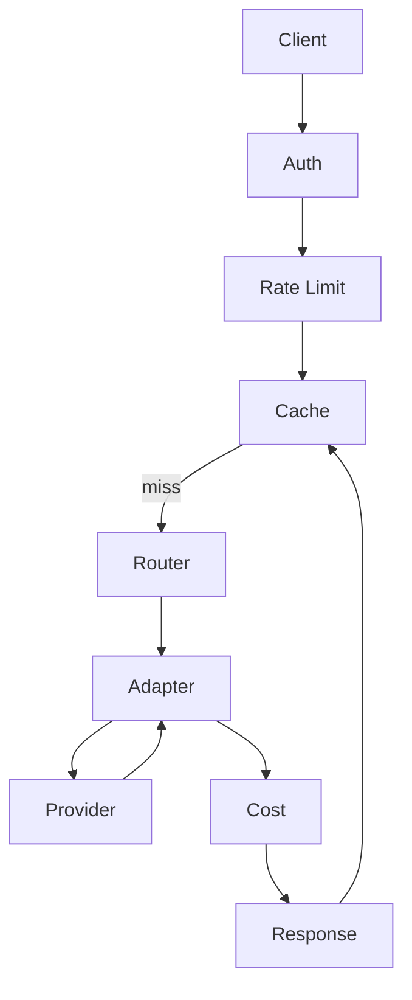

# Ch28｜项目四：生产级 LLM 网关

> **本章目标**：从 0 搭建一个支持 10+ 模型、多租户配额、语义缓存、全链路可观测的 LLM 网关。

## 28.1 项目目标

构建一个 OpenAI 兼容的 LLM API Gateway：

- ✅ 多模型路由（OpenAI / Anthropic / 本地）
- ✅ 多租户配额
- ✅ 语义缓存
- ✅ 灰度发布
- ✅ 全链路可观测

## 28.2 技术栈

| 组件 | 选型 |
|---|---|
| HTTP | FastAPI |
| 缓存 | Redis + Qdrant（语义） |
| 限流 | Redis Token Bucket |
| 审计 | PostgreSQL |
| 追踪 | OpenTelemetry + Langfuse |

## 28.3 完整架构

## 28.4 核心代码

完整代码见 `agent-book-code/projects/28_llm_gateway/`。

## 28.5 验收指标

| 指标 | 目标 |
|---|---|
| P99 延迟 | < 500ms |
| QPS | 200+ |
| 可用性 | 99.9% |
| 缓存命中率 | > 30% |
| 成本节省 | > 40% |

## 28.6 小结

**LLM 网关 = 路由 + 缓存 + 限流 + 降级 + 可观测**。**所有 LLM 应用的统一入口**。

**Part 6 完结**。下一章（Ch29）进入 Part 7——**前沿与展望**。
