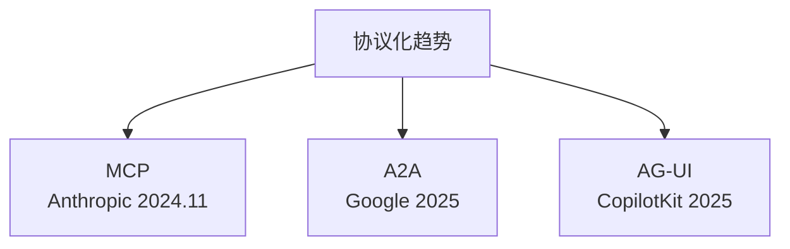
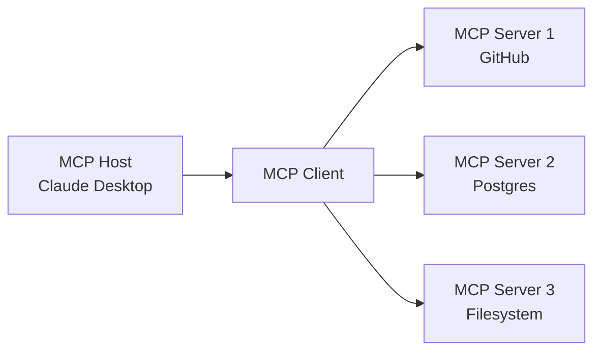
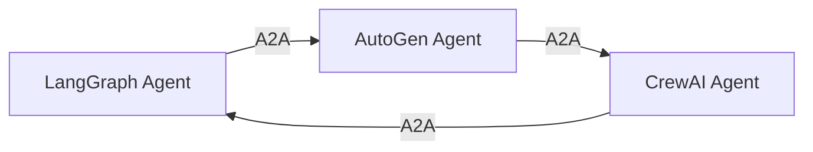
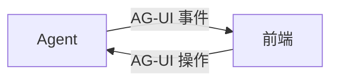

# Ch29｜协议与生态：MCP、A2A、AG-UI

> **本章目标**：理解 LLM 生态的协议化趋势。读完后，能讲清 MCP/A2A 解决什么问题，并能选型。

## 29.1 为什么需要协议

2024 年之前，LLM 应用生态是"碎片化"的：

- 每个框架有自己的工具调用格式
- 每个 Agent 框架有自己的协作协议
- 工具接入每个应用都要重写

**2024 年下半年，3 大协议相继发布**：



## 29.2 MCP（Model Context Protocol）

### 29.2.1 核心思想

MCP 是 Anthropic 2024 年 11 月发布的**开放协议**，标准化 LLM 与工具/数据源的连接。



**和 Function Calling 的区别**：

| 维度 | Function Calling | MCP |
|---|---|---|
| 范围 | 单次调用的格式 | 完整的 LLM-工具生态 |
| 协议 | OpenAI/Anthropic 私有 | 开放标准 |
| 工具接入 | 每个应用重写 | 一次开发，多处使用 |
| 状态 | 无状态 | 支持长连接 |

### 29.2.2 MCP 的 3 个角色

**Host**：跑 LLM 的应用（Claude Desktop、IDE）
**Client**：Host 内部的 MCP 客户端
**Server**：提供工具的服务（GitHub、Postgres）

### 29.2.3 简单 MCP Server

```python
from mcp.server import Server
from mcp.types import Tool, TextContent

server = Server("my-tools")


@server.tool()
async def get_weather(city: str) -> list[TextContent]:
    """查询天气"""
    return [TextContent(type="text", text=f"{city} 25°C")]


# 启动
import asyncio
asyncio.run(server.run())
```

### 29.2.4 生态现状

截至 2025 年底，已有 100+ MCP Server：

- **官方**：GitHub、Postgres、Filesystem、Slack
- **社区**：Puppeteer、Brave Search、Notion、Linear
- **云厂商**：AWS、Cloudflare、GCP 都有官方支持

## 29.3 A2A（Agent-to-Agent）

### 29.3.1 核心思想

Google 在 2025 年发布的 Agent 通信协议——让**不同框架的 Agent** 能互相协作。



**解决的问题**：

- ❌ LangGraph Agent 和 AutoGen Agent 之前不能直接通信
- ✅ A2A 标准化了 Agent 间的发现、调用、状态传递

### 29.3.2 核心概念

- **Agent Card**：Agent 的"名片"（能力、接口）
- **Task**：一个工作单元
- **Artifact**：任务产生的结果

## 29.4 AG-UI（Agent-UI）

### 29.4.1 核心思想

CopilotKit 在 2025 年发布的**前端交互协议**——标准化 Agent 和前端 UI 的通信。



**事件类型**：

- `text_message`：增量文本
- `tool_call`：工具调用可视化
- `state_update`：状态更新
- `confirm`：用户确认

## 29.5 3 大协议对比

| 维度 | MCP | A2A | AG-UI |
|---|---|---|---|
| 范围 | LLM ↔ 工具 | Agent ↔ Agent | Agent ↔ 前端 |
| 推出 | Anthropic | Google | CopilotKit |
| 成熟度 | 高 | 中 | 低 |
| 生态 | 100+ Server | 早期 | 早期 |

## 29.6 选型建议

| 场景 | 协议 |
|---|---|
| 接外部工具/数据源 | **MCP** |
| 跨框架 Agent 协作 | A2A |
| Agent 前端 UI | AG-UI |

## 29.7 小结

**协议化 = LLM 生态的"标准化"**。**MCP 是当下最值得投入**。**A2A 和 AG-UI 还在早期，但方向明确**。
