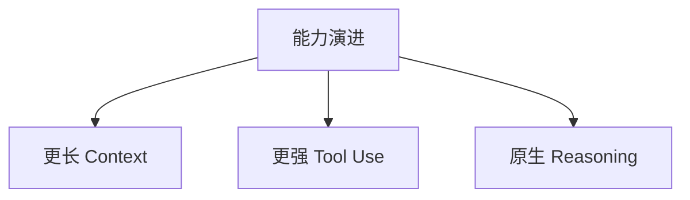
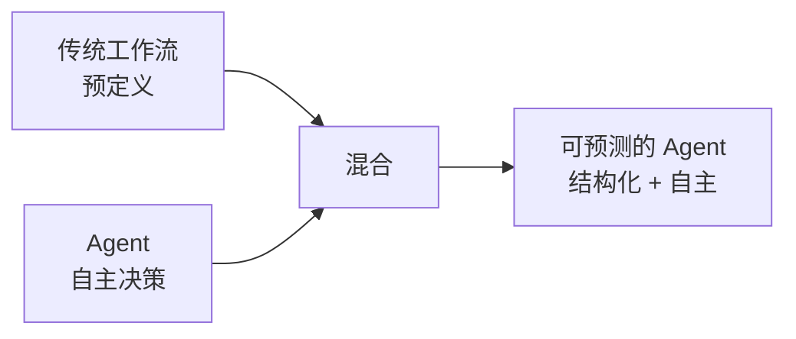
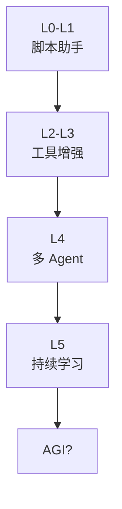
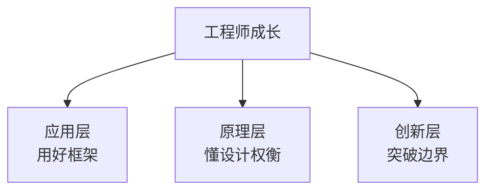

# Ch30｜未来趋势与思考

> **本章目标**：展望 LLM Agent 领域的未来趋势。读完后，能对技术发展有清晰判断，做好职业规划。

## 30.1 能力演进：3 个方向

### 30.1.1 更长 Context

**时间线**：

- 2023：GPT-4 8k → 32k
- 2024：Claude 200k、Gemini 1M
- 2025：Gemini 2M
- 2026：4M–10M（传闻）

**影响**：

- ✅ 减少"信息丢失"问题
- ❌ Lost in the Middle 仍然存在
- ❌ 成本增加

### 30.1.2 更强 Tool Use

**2024 → 2025 的关键进步**：

- ✅ 模型能"理解"复杂工具描述
- ✅ 自主选择最优工具
- ✅ 多步工具调用的准确率提升

**2026 趋势**：

- 工具调用**完全融入训练**（不再靠 Prompt）
- 模型能"自动发现"工具
- 工具调用**Token 消耗下降**

### 30.1.3 原生 Reasoning

**关键产品**：

- OpenAI o1 / o3（Reasoning 模型）
- DeepSeek R1
- Claude 3.7 Extended Thinking

**影响**：

- ✅ 复杂推理任务（数学、代码）准确率大幅提升
- ❌ Token 消耗 5-10x
- ✅ 与 Tool Use 结合，开启"思考 + 行动"新范式

## 30.2 Agent 与工作流的融合

**未来 5 年的趋势**：

- **80% 的 Agent 走向"结构化自主"**——不是完全自主，也不是完全固定
- **关键决策点用 LLM**，常规流程用代码
- **人类在关键节点介入**（HITL 成为标配）

## 30.3 AGI 之路：弱 Agent → 强 Agent → 自主智能体

**每个阶段的突破点**：

- **L0-L1 → L2**：Function Calling（MCP）
- **L2 → L3**：StateGraph（结构化）
- **L3 → L4**：Multi-Agent 协议（A2A）
- **L4 → L5**：长期记忆 + 自我反思

## 30.4 工程师的成长

### 30.4.1 3 个能力层

| 层级 | 能力 | 行动 |
|---|---|---|
| 应用层 | 用 LangChain / LangGraph | 跑通 Demo |
| 原理层 | 读源码、懂设计 | 写 1 个框架 |
| 创新层 | 发现新问题 | 发 Paper / 开源项目 |

### 30.4.2 5 个"必读"领域

1. **LLM 基础**：Transformer 架构、Attention、预训练
2. **Agent 模式**：ReAct、Plan-Execute、Reflection
3. **RAG 优化**：Embedding、Re-Rank、Agentic RAG
4. **工程架构**：可观测、高可用、网关
5. **安全与评估**：Prompt Injection、RAGAS

### 30.4.3 持续学习资源

| 资源 | 适合 |
|---|---|
| ArXiv 论文 | 跟进前沿 |
| 官方文档 | 落地实现 |
| GitHub Trending | 看新项目 |
| X / Twitter | 行业动态 |
| LangChain / LlamaIndex 博客 | 实战案例 |

## 30.5 写给读者的话

10 年前，"全栈工程师"是热门——会前端、后端、数据库就能拿 offer。

5 年前，"云原生工程师"是新潮——会 Kubernetes、Service Mesh 就稀缺。

**今天，"Agent 工程师"是新一代**——**懂 LLM + Agent 模式 + 工程化**的人才极度稀缺。

**学完本书，你已经走在前列**——你理解了：

- ✅ LLM 能力的边界
- ✅ Agent 系统的 4 大挑战
- ✅ 5 大框架的源码设计
- ✅ 5 大设计模式
- ✅ 6 大工程架构主题
- ✅ 4 个实战项目

**接下来**：

- 🎯 **用起来**——把本书的代码跑一遍
- 🎯 **改起来**——把 1 个项目改成自己的业务
- 🎯 **读源码**——深入 LangChain / LangGraph 源码
- 🎯 **做贡献**——给开源项目提 PR
- 🎯 **持续学**——关注 MCP、A2A 等新协议

## 30.6 一句话总结

> **LLM Agent 的本质：让 LLM 做擅长的事，把不擅长的事交给工具，把决策放在合适的自主性等级上，把所有不确定性变成可观测、可灰度、可回滚的工程问题。**

---

**全书完**。

感谢你读到这里——Agent 时代才刚刚开始，**你是这个时代的早期建设者**。
